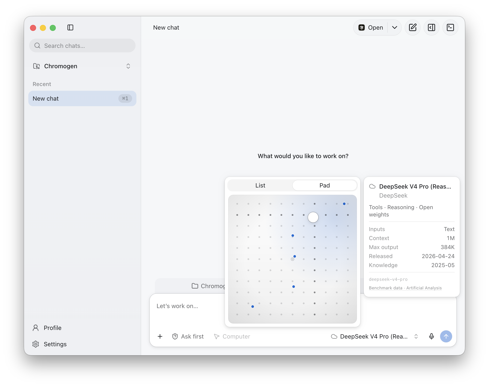

# Aiden Agent

<p align="center">
  
</p>

<p align="center">
  A native-feeling macOS workspace for chatting with local or hosted AI models and safely working inside the folders you choose.
</p>



## Why Aiden

- **Workspace aware.** Chat inside folder-backed projects with scoped file, search, edit, command, Git, review, and terminal tools.
- **Bring your models.** Connect hosted providers or local Ollama and LM Studio endpoints, with a personal spatial Model Pad for the models you use.
- **Permission first.** Choose Full, Ask, or No Access per workspace. Mutating Computer Use actions always require a separate approval.
- **Mac native.** Use light and dark appearances, native menus and shortcuts, encrypted credential storage, local Parakeet transcription, and optional Apple Foundation Models chat titles.
- **Extensible.** Add Agent Skills, MCP servers, attachments, Exa search, and local or cloud voice providers.

## Privacy and trust

Aiden stores chats, settings, workspace metadata, and downloaded speech models locally. Provider credentials and MCP OAuth sessions are encrypted with macOS secure storage. The renderer is sandboxed, has no direct Node.js access, and communicates with Electron through an allowlisted bridge.

Network access happens only when the selected feature needs it: hosted models receive the conversation content sent to them, cloud transcription receives selected audio, Exa receives search queries, remote MCP servers receive tool requests, and model downloads contact their upstream host. A fully local session can use a local model, on-device voice, no remote MCP servers, and web search disabled.

Computer Use is an opt-in beta with a global switch, a separate per-chat switch, macOS permission checks, exact target binding, and one-use approval for every mutation. See the [Computer Use security design](docs/computer-use-integration.md) for the complete boundary.

## Architecture

```text
React renderer
    │ allowlisted context bridge
    ▼
Electron preload
    │ typed IPC and notifications
    ▼
Electron main process
    ├── Pi agent and model adapters
    ├── workspace-scoped tools, Git, review, and terminal
    ├── encrypted credentials and local JSON stores
    ├── MCP, attachments, search, and voice
    └── signed native helpers for Apple models and Computer Use
```

Core technologies include Electron 43, React 19, TypeScript, Vite, Tailwind CSS, TanStack Router and Query, Radix UI, the Pi agent runtime, Swift, and Rust.

## Development

### Requirements

- macOS
- Node.js 22.19 or newer and npm
- Rust and Cargo
- A full Xcode 26 or newer for the Apple Foundation Models helper
- An Apple Development or Developer ID Application identity for packaged builds

### Run locally

```bash
npm install
npm run dev
```

The development launcher prepares a cached, ad-hoc-signed Aiden runtime so macOS displays **Aiden Agent** instead of Electron while preserving development-only paths and behavior. Native builds discover the newest compatible full Xcode without changing the machine-wide `xcode-select` setting; `DEVELOPER_DIR` remains available as a per-command override.

### Verify changes

```bash
npm test
npm run test:native
npm run type-check
npm run lint
npm run build
```

### Package the app

```bash
npm run package
npm run package:verify
```

Distribution builds use `npm run dist` and require Developer ID signing plus notarization. The release pipeline fails closed, verifies the app, DMG, and ZIP, and publishes updater metadata only with the matching verified artifacts. Read [macOS releases and automatic updates](docs/releasing.md) before enabling publication.

The checked-in models.dev snapshot is refreshed only through `npm run models:refresh` or the guarded distribution path. Artificial Analysis credentials and data are never bundled; users explicitly fetch suggestions into an encrypted, device-local cache.

## Project status

Aiden Agent is a beta macOS release, starting at version 0.27.0. Public binary distribution is prepared but remains disabled until the signing, notarization, release-repository, and protected-environment setup in [the release guide](docs/releasing.md) is complete.

This source repository does not currently include a public license. Add an explicit `LICENSE` before presenting the project as open source or accepting outside contributions.

## Documentation

- [Release and automatic-update guide](docs/releasing.md)
- [Computer Use architecture and safety boundary](docs/computer-use-integration.md)
- [Product and interface principles](PRODUCT.md)
- [Provider integration plan](docs/pi-provider-integration-plan.md)
