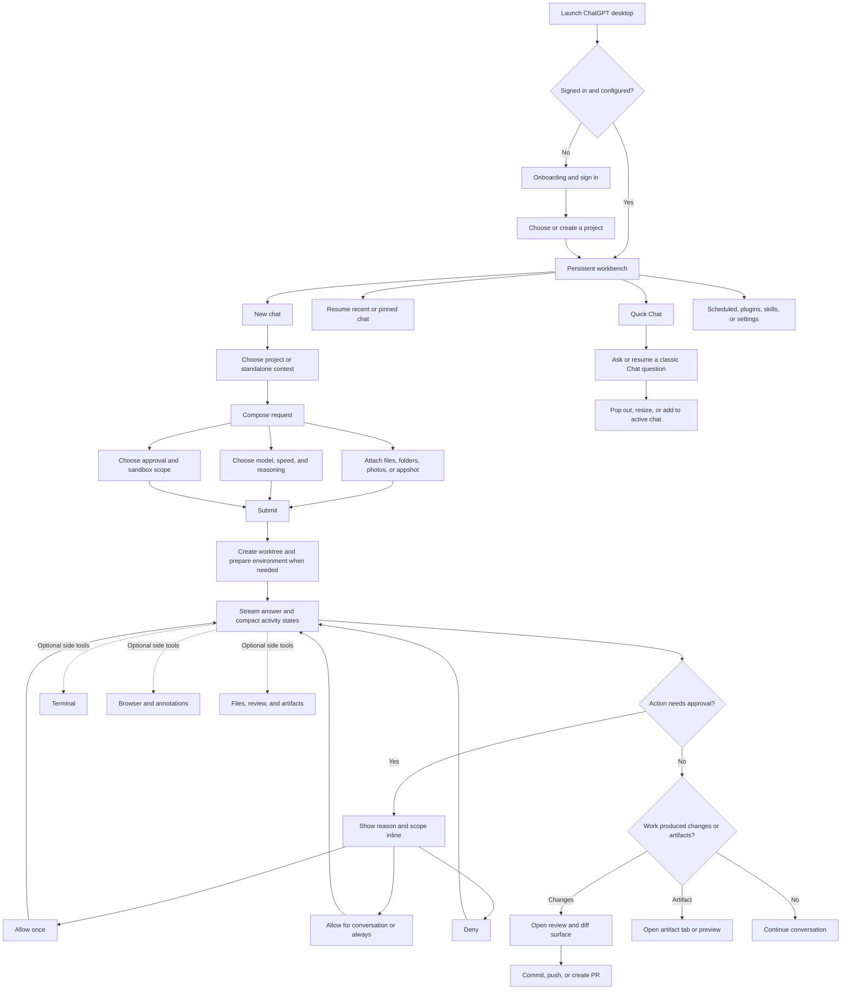

# ChatGPT / Codex Desktop UI Inspiration for Aiden

Research date: 2026-07-18

## Scope and confidence

This audit covers the installed `/Applications/ChatGPT.app`, build `26.715.31925` (`com.openai.codex`). Although the app is displayed as ChatGPT, its package and renderer identify it as the current ChatGPT-branded Codex desktop product. The findings therefore mix classic Chat, Codex agent, project, review, browser, and terminal flows.

Evidence used:

- Signed bundle metadata and entitlements.
- The Electron package and compiled renderer inside `Contents/Resources/app.asar`.
- Renderer labels, command registrations, accessibility copy, layout tokens, and motion CSS.
- Aiden's current React component system, composer, approvals, split view, terminal, and settings implementation.

Interactive companion: [`chatgpt-ui-element-specimen.html`](./chatgpt-ui-element-specimen.html). It recreates the recommended button, field, menu, composer, approval, toast, and dialog states in light and dark mode so hover, press, focus, elevation, and motion can be evaluated directly.

The app could not be live-controlled because the local automation layer blocks inspection of its own `com.openai.codex` host. Flow connections below are therefore inferred from shipped routes, controls, states, and labels; motion values and element geometry are directly present in the shipped renderer CSS.

The local `/Users/sambitbiswas/projects/ghidra-mcp` checkout is healthy source-wise but is not operational on this Mac: Ghidra is not installed, the localhost server is not running, and preflight stops on missing Maven. Ghidra would mainly expose the native Electron shell and embedded frameworks. The product UI is React/CSS inside `app.asar`, so renderer inspection is the higher-value source for this task.

## Product structure

The desktop app uses a stable workbench rather than page-by-page navigation:

- A persistent left sidebar for new chat, search, projects, recent chats, scheduled work, plugins, and skills.
- A central thread surface with a restrained toolbar and a bottom composer.
- Optional working surfaces for browser, artifacts, review/diff, and terminal.
- Settings as a separate organized surface, while frequently changed context stays beside the composer.
- A smaller Quick Chat path that can be resized, popped out, or added back into the active agent chat.

The central UX principle is: **keep the conversation stable while tools and context appear around it.** The user does not repeatedly leave the thread to inspect progress, approve an action, review a file, or open a terminal.

## User-flow map

## UI element inventory

| Element | Shipped behavior | Inspiration for Aiden |
|---|---|---|
| Sidebar | Persistent, collapsible navigation with search, projects, recents, and secondary destinations. Overflow is softened with header/footer fade masks. | Keep Aiden's sidebar conversation-first. Add search, pin/archive, and soft scroll-edge masks before adding more destinations. |
| Composer | One rounded control plane combines prompt, attachments, project, permission, model, voice, and send. Context remains adjacent but visually subordinate. | Aiden already has the right structure. Tighten hierarchy so workspace/branch/location form one quiet context line and permission/model remain compact controls. |
| Project picker | Supports local projects, new remote projects, standalone chats, and changing the active project. | Preserve Aiden's simpler folder workspace model. Make changing workspace clearly create or move to a new chat when context cannot safely mutate in place. |
| Permission picker | Short current-state label opens descriptions of approval behavior. Full Access gets a consequence-focused confirmation. | High-value adaptation. Add concise descriptions and a real Full Access warning before changing scope. |
| Approval card | Inline with the conversation; includes the reason and scoped choices such as Allow once, broader allow, and Deny. | Upgrade Aiden's current Allow/Deny card to show tool, reason, and scope. Start with Allow once / Deny; add broader scopes only when the backend can enforce them. |
| Activity states | Worktree creation, environment setup, and conversation start expose running, complete, skipped, and failed states. | Replace a single vague tool-status line with compact, persistent state rows for multi-step local work. Avoid turning every tool call into a verbose log. |
| Review surface | File diffs lead directly to commit, push, branch creation, and PR creation. | Strong later-stage feature for Aiden. Keep review beside the thread, not in a modal. |
| Terminal | A thread-adjacent panel is toggled without leaving context. | Aiden already has this. Match panel easing and keep the closed drawer unmounted, as currently implemented. |
| Browser / artifact panels | Optional tabs/panels appear for browsing, annotations, images, documents, and previews. | Use the same shell pattern if Aiden adds file preview or review. Do not create a different layout primitive for every tool. |
| Model picker | A compact trigger expands to speed, power/reasoning, advanced options, and reset. | Borrow progressive disclosure, not the full control density. Aiden's provider/model picker should stay searchable and explain capability differences only when relevant. |
| Quick Chat | Lightweight side chat supports recent history, pop-out, resizing, and adding context to the active agent chat. | Useful only if Aiden later separates low-cost Q&A from workspace agents. Do not add it while both paths would behave the same. |
| Command system | New chat, search, model/project picker, permissions, terminal, review, browser, settings, and navigation all have command registrations and keyboard routes. | Add a small command palette once Aiden has enough stable actions to justify it. Reuse existing shortcuts rather than creating parallel behavior. |
| Settings | Deep configuration is grouped outside the thread, while model/project/permission stay at the point of action. | Continue Aiden's current settings split. Keep consequences and privacy boundaries in descriptions, not duplicated headings. |
| Toasts | Brief, top-offset status feedback; success and failure copy is action-specific. | Use for completed background actions and recoverable failures, never as the only record of an approval or destructive action. |
| Loading | Shimmer/skeleton treatments are used for content and generated assets; button actions still use compact progress indicators. | Use skeletons for delayed lists and model catalogs. Avoid shimmer on ordinary static labels. |

## Motion and transition inventory

The shipped motion system has two main timings:

- `150ms` basic transition for hover, focus, compact menus, and small state changes.
- `300ms` relaxed transition for panels and larger geometry changes.

Core easing curves:

- Enter: `cubic-bezier(.19, 1, .22, 1)`.
- Snappy enter: `cubic-bezier(.23, 1, .32, 1)`.
- Standard ease-out: `cubic-bezier(0, 0, .2, 1)`.

| Motion | Shipped treatment | Aiden adaptation |
|---|---|---|
| Panel open/close | `flex-grow` and `max-width` over `300ms`; transitions are disabled during drag. | Keep Aiden's `300ms` sidebar motion. Apply the same rule to future review/preview panels and disable easing while resizing. |
| Compact popover | Fade plus `translateY(-4px)` and `scale(.98)` to rest over `150ms`. | Use for menus and small contextual surfaces. It is quieter than a large zoom. |
| Model dropdown | Fade and `scale(.98 → 1)` over `320ms` with a short delay. | Reserve this slightly slower entrance for the model picker only; normal menus should stay near `150–200ms`. |
| Centered content swap | Enter over `260ms` from 8px lower and `.98` scale; exit over `180ms` with a smaller movement. | A good asymmetric pattern for major mode/content changes, but unnecessary for routine settings navigation. |
| Attachment/status chip | `280ms` entrance from 8px left and 4px down, with a tiny overshoot. | Borrow the directional entrance but remove the overshoot for Aiden: opacity plus `translate(-4px, 2px)` is enough. |
| Toast | Fade and 4px downward-to-rest movement around `250ms`; exit fades. | Appropriate for Aiden background completion and error notices. |
| Annotation/editor surface | Fade, 4px rise, and `.96 → 1` scale over the basic duration. | Reuse for a future review comment or inline edit surface, not for full dialogs. |
| Loading text | A slow, stepped shimmer; generated assets use low-contrast pulsing. | Use only when it communicates active generation. Freeze to a static state under reduced motion. |
| Scroll edges | Scroll-driven mask fades rather than animated shadows or separators. | Add to Aiden's sidebar and long menus; the existing composer/footer fade already points in this direction. |
| Reduced motion | Panel, chip, toast-adjacent, shimmer, editor, and specialty animations are disabled or flattened. | Keep every new motion behind `prefers-reduced-motion`. Do not replace motion with a hidden initial state. |

## Shadow and interactive-state inventory

The installed renderer defines a restrained elevation ladder rather than giving every control a floating shadow:

| Role | Reference recipe | Recommended Aiden treatment |
|---|---|---|
| Hairline | `0 0 0 .5px` at roughly 10% black | Optical edge for glass buttons, menus, toasts, and overlays. |
| Control rest | `0 1px 2px -1px` at roughly 8% black | Neutral/glass buttons only; flat ghost buttons receive none. |
| Control hover | `0 2px 4px -1px` at roughly 10% black | Pair with a small surface-contrast increase over `150ms`. |
| Control pressed | Compact inset `0 1px 2px` | Communicate depression without bounce, scale, or layout movement. |
| Popover | Hairline + `0 3px 7.5px` + a very low-opacity `0 0 20px` ambient shadow | Menus and approval surfaces; keep both shadow layers subtle. |
| Toast | Hairline + `0 4px 12px` near 10% black | Transient feedback only. |
| Dialog | Hairline + `0 16px 32px -8px` near 30% black | Modal interruption; strengthen black opacity in dark mode instead of increasing blur. |

State behavior:

- **Hover:** increase surface contrast by about 4%, move from control-rest to control-hover elevation, and preserve geometry.
- **Pressed:** darken the surface and switch to an inset shadow. Do not translate or bounce the control.
- **Keyboard focus:** add a visible 3px accent halo at 24–30% opacity outside the existing edge.
- **Disabled:** retain shape and label but reduce the entire control to roughly 42–50% opacity; remove pointer interaction.
- **Primary hover:** slightly brighten/darken the accent according to theme and move only one compact elevation step.
- **Ghost hover:** add a low-contrast background without a shadow.
- **Popover open:** fade with `translateY(-4px)` and `.98 → 1` scale over `150ms`.
- **Reduced motion:** remove entrance transforms and keep the final visible state.

### Specific Aiden motion note

Aiden's shared dialogs currently animate from `scale(.8)` to `scale(1)` in `180ms`. The installed ChatGPT/Codex build generally uses `.96–.98` starting scale with a 4–8px offset for comparable overlays. Aiden's current motion is much more visible. Test a quieter `.96` or `.98` entrance before treating the `0.8` zoom as settled; keep the centered origin and reduced-motion behavior.

## Prioritized inspiration list

### Now: polish existing Aiden flows

1. **Permission clarity at the composer.** Add one-line behavior descriptions and a consequence-focused Full Access confirmation.
2. **Scoped inline approvals.** Show the tool and reason, then offer an explicit one-time Allow and Deny. Broader scopes should appear only when enforcement exists.
3. **Quieter dialog motion.** Prototype `.96/.98 → 1` instead of `.8 → 1`, with a 4px rise and `180ms` ease-out.
4. **Sidebar search and conversation states.** Add search, pin, and archive before adding new navigation categories.
5. **Scroll-edge masks.** Use subtle masks in the sidebar, menus, and long settings regions to reduce hard chrome.
6. **Consistent state language.** Give setup and tool activity clear running, completed, skipped, and failed labels.

### Next: extend the workbench

7. **Thread-adjacent review panel.** Show changed files and diffs without navigating away from the conversation.
8. **Commit flow from review.** Generate/edit a commit message, select branch behavior, and keep push/PR as explicit next steps.
9. **Small command palette.** Start with new chat, search chats, workspace, model, permission, terminal, settings, and sidebar toggle.
10. **Unified panel primitive.** Reuse the same resizable shell for terminal, review, file preview, and future browser/artifact surfaces.
11. **Compact activity timeline.** Persist only milestones that help the user understand where agent work is blocked or complete.

### Later, only if the product earns it

12. **Quick Chat.** Add only if it has a genuinely different cost, privacy, or tool-access model from an Aiden workspace chat.
13. **Artifact tabs.** Add when Aiden can preview meaningful generated documents, images, or structured files inside the app.
14. **Browser annotation.** Valuable for visual web work, but it is a separate product capability, not UI polish.
15. **Onboarding checklist.** Keep it short and setup-oriented: provider, workspace, permission, and optional voice. Hide it permanently once complete.

## Patterns not to copy

- The ChatGPT / Work / Codex mode switch. Aiden has one clear product promise and should not fragment it prematurely.
- The full density of the shipped sidebar. Aiden should keep conversations and workspace navigation primary.
- Particle bursts, icon spins, shakes, and specialty browser animations. They are tied to narrow features and would read as decorative in Aiden.
- A `12px` blurred full-screen curtain for ordinary navigation. It is visually heavy and obscures spatial continuity.
- Every model-power and speed control. Aiden should expose only differences users can understand and act on.
- Promotional prompt suggestions in the empty thread. Aiden's product brief correctly prefers a quiet, task-first empty state.
- Persistent shimmer on ordinary text. Loading motion should be local, temporary, and stateful.
- Broad permission choices that the runtime cannot precisely enforce.

## Suggested visual contract for Aiden

- Type: system sans, `14px` base, `12px` secondary, `18–20px` compact headings.
- Toolbar: approximately `40–46px`, with icon buttons no larger than `32–36px` unless they are the primary action.
- Conversation measure: keep the existing `max-w-3xl` family; wide code/diff content may escape into a review surface.
- Sidebar: preserve the current `220–340px` range and `300ms` width transition.
- Composer: one continuous rounded surface; context strip attached, not a separate card.
- Elevation: hairline or a compact shadow, not both at high intensity.
- Motion: `150–200ms` for controls, `250–300ms` for panels, translate no more than `4–8px`, and scale entrances from `.96–.98`.
- Color: restrained neutrals, with accent reserved for the selected state, primary action, focus, and consequential status.
- Feedback: inline for approvals and durable task state; toast for transient completion or recoverable failure.

## Recommended first implementation slice

The best first slice is narrow and coherent:

1. Tighten shared dialog motion.
2. Add Full Access confirmation copy.
3. Expand the approval card to show the tool name and a clearer one-time decision.
4. Add sidebar chat search and archive/pin states.
5. Add scroll-edge masks and verify light/dark plus reduced motion.

This improves trust, navigation, and perceived polish without importing ChatGPT's larger product complexity.
