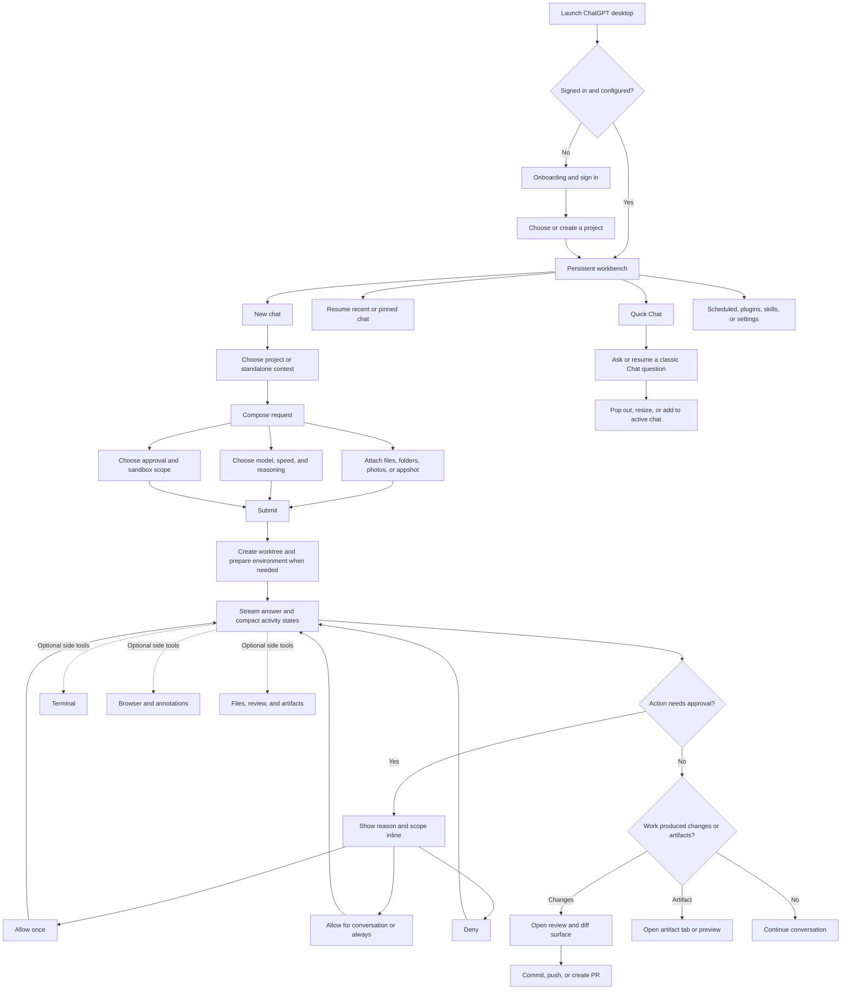

# ChatGPT / Codex Desktop UI Inspiration for Aiden

Research date: 2026-07-18

## Scope and confidence

This audit covers the installed `/Applications/ChatGPT.app`, build `26.715.31925` (`com.openai.codex`). Although the app is displayed as ChatGPT, its package and renderer identify it as the current ChatGPT-branded Codex desktop product. The findings therefore mix classic Chat, Codex agent, project, review, browser, and terminal flows.

Evidence used:

- Signed bundle metadata and entitlements.
- The Electron package and compiled renderer inside `Contents/Resources/app.asar`.
- Renderer labels, command registrations, accessibility copy, layout tokens, and motion CSS.
- Aiden's current React component system, composer, approvals, split view, terminal, and settings implementation.

Interactive companion: [`chatgpt-ui-element-specimen.html`](./chatgpt-ui-element-specimen.html). It recreates the recommended button, field, menu, composer, approval, toast, and dialog states in light and dark mode so hover, press, focus, elevation, and motion can be evaluated directly.

The app could not be live-controlled because the local automation layer blocks inspection of its own `com.openai.codex` host. Flow connections below are therefore inferred from shipped routes, controls, states, and labels; motion values and element geometry are directly present in the shipped renderer CSS.

The reviewed [`ghidra-mcp`](https://github.com/bethington/ghidra-mcp) checkout was healthy source-wise but was not operational during the audit: Ghidra was not installed, the localhost server was not running, and preflight stopped on missing Maven. Ghidra would mainly expose the native Electron shell and embedded frameworks. The product UI is React/CSS inside `app.asar`, so renderer inspection was the higher-value source for this task.

## Product structure

The desktop app uses a stable workbench rather than page-by-page navigation:

- A persistent left sidebar for new chat, search, projects, recent chats, scheduled work, plugins, and skills.
- A central thread surface with a restrained toolbar and a bottom composer.
- Optional working surfaces for browser, artifacts, review/diff, and terminal.
- Settings as a separate organized surface, while frequently changed context stays beside the composer.
- A smaller Quick Chat path that can be resized, popped out, or added back into the active agent chat.

The central UX principle is: **keep the conversation stable while tools and context appear around it.** The user does not repeatedly leave the thread to inspect progress, approve an action, review a file, or open a terminal.

## User-flow map

## UI element inventory

| Element | Shipped behavior | Inspiration for Aiden |
|---|---|---|
| Sidebar | Persistent, collapsible navigation with search, projects, recents, and secondary destinations. Overflow is softened with header/footer fade masks. | Keep Aiden's sidebar conversation-first. Add search, pin/archive, and soft scroll-edge masks before adding more destinations. |
| Composer | One rounded control plane combines prompt, attachments, project, permission, model, voice, and send. Context remains adjacent but visually subordinate. | Aiden already has the right structure. Tighten hierarchy so workspace/branch/location form one quiet context line and permission/model remain compact controls. |
| Project picker | Supports local projects, new remote projects, standalone chats, and changing the active project. | Preserve Aiden's simpler folder workspace model. Make changing workspace clearly create or move to a new chat when context cannot safely mutate in place. |
| Permission picker | Short current-state label opens descriptions of approval behavior. Full Access gets a consequence-focused confirmation. | High-value adaptation. Add concise descriptions and a real Full Access warning before changing scope. |
| Approval card | Inline with the conversation; includes the reason and scoped choices such as Allow once, broader allow, and Deny. | Upgrade Aiden's current Allow/Deny card to show tool, reason, and scope. Start with Allow once / Deny; add broader scopes only when the backend can enforce them. |
| Activity states | Worktree creation, environment setup, and conversation start expose running, complete, skipped, and failed states. | Replace a single vague tool-status line with compact, persistent state rows for multi-step local work. Avoid turning every tool call into a verbose log. |
| Review surface | File diffs lead directly to commit, push, branch creation, and PR creation. | Keep review beside the thread, not in a modal. Aiden implements working-tree and merge-base comparison, snapshot-checked commits, and an explicit non-force push; hosted PR creation remains separate. |
| Terminal | A thread-adjacent panel is toggled without leaving context. | Aiden already has this. Match panel easing and keep the closed drawer unmounted, as currently implemented. |
| Browser / artifact panels | Optional tabs/panels appear for browsing, annotations, images, documents, and previews. | Use the same shell pattern if Aiden adds file preview or review. Do not create a different layout primitive for every tool. |
| Model picker | A compact trigger expands to speed, power/reasoning, advanced options, and reset. | Borrow progressive disclosure, not the full control density. Aiden's provider/model picker should stay searchable and explain capability differences only when relevant. |
| Quick Chat | Lightweight side chat supports recent history, pop-out, resizing, and adding context to the active agent chat. | Useful only if Aiden later separates low-cost Q&A from workspace agents. Do not add it while both paths would behave the same. |
| Command system | New chat, search, model/project picker, permissions, terminal, review, browser, settings, and navigation all have command registrations and keyboard routes. | Add a small command palette once Aiden has enough stable actions to justify it. Reuse existing shortcuts rather than creating parallel behavior. |
| Settings | Deep configuration is grouped outside the thread, while model/project/permission stay at the point of action. | Continue Aiden's current settings split. Keep consequences and privacy boundaries in descriptions, not duplicated headings. |
| Toasts | Brief, top-offset status feedback; success and failure copy is action-specific. | Use for completed background actions and recoverable failures, never as the only record of an approval or destructive action. |
| Loading | Shimmer/skeleton treatments are used for content and generated assets; button actions still use compact progress indicators. | Use skeletons for delayed lists and model catalogs. Avoid shimmer on ordinary static labels. |

## Environment sidebar state model

The shipped ChatGPT/Codex renderer establishes two related but distinct surfaces beside a stable conversation: a compact floating `Environment` summary and larger work surfaces for Review or Files. The summary's `Changes` row opens Review, its execution row distinguishes local/cloud targets, its branch row opens branch/worktree controls, and its later rows lead into commit/push and GitHub comparison workflows. Aiden keeps that separation: Environment is a detached top-right status card, while Review and Files share one persistent, resizable work surface. The tables below separate directly evidenced behavior from the additional production states Aiden needs under loading, empty, error, narrow-window, and concurrent-file-change conditions.

### Shell and layout states

| State | User sees | Interaction contract |
|---|---|---|
| Closed | Conversation uses the full workbench width; the toolbar toggle remains available. | Both surfaces are hidden from focus and accessibility navigation. `⌘⇧E` or the toolbar button always opens the Environment summary first. |
| Summary opening / closing | The compact card fades from 4px above and `.98` scale over `180ms`. | It does not resize, dim, or make the conversation inert. Motion is removed under Reduce Motion. |
| Environment summary open | A rounded top-right card shows working changes, local execution, the active branch, commit/push, and compare. | `Changes` deep-links into Review; the header action can open Files or comparison. Local is static until Aiden has a real second execution target; unsupported Git actions do not appear as dead rows. |
| Expanded work surface opening / closing | The right edge expands or retracts over the relaxed `300ms` panel timing. | Width, opacity, and geometry move together; the transition is flattened under Reduce Motion. |
| Review open | Review is selected in the expanded surface and the conversation stays mounted. | Tab, width, and open state persist. Focus enters the selected tab; the Summary control returns to the detached card without losing work. |
| Files open | Files is selected; its tree and editor occupy the same shell used by Review. | Switching tabs does not discard an editor draft. Review can deep-link a changed file into Files. |
| Resizing | A one-pixel boundary gains hover/focus emphasis while the user drags or uses arrow keys. | Easing is disabled during pointer drag. Arrow keys resize by 16px, Shift+Arrow by 40px, Home/End reach bounds. |
| Inline wide-window | Conversation and the expanded Review/Files surface are sibling columns. | Used only when the content region can preserve a useful conversation measure beside the saved panel width; the summary card always floats. |
| Overlay narrow-window | Expanded Review/Files becomes a right-side sheet over a dimmed, inert conversation. | Its width is bounded to the window; Escape, backdrop click, or Close dismisses it and restores focus. The compact summary remains non-modal at every width. |
| No workspace | A quiet explanation fills whichever Environment surface is open. | The user is directed to choose a local workspace; no dead tree, diff, or editor controls appear. |
| No Access | The active Environment surface explains that local file access is disabled. | It does not silently widen permission. The composer remains the place to change workspace access. |
| Loading | Shape-matched skeleton rows appear in the active view. | Static labels do not shimmer, inactive tabs do not keep polling, and controls expose disabled/loading states. |
| Recoverable error | An inline error keeps the panel and workspace context visible. | Retry is local to the failed list, diff, file, or save operation; a last good snapshot stays visible when possible. |

### Overview states

| State | Visual treatment | Notes |
|---|---|---|
| Working changes | `Changes` carries exact green additions and red deletions, aligned with tabular figures. | The accessible label also includes the changed-file count; color is never the only signal. |
| Partial line totals | Known `+ / −` totals remain visible with a binary/partial indicator. | Copy explains how many binary or otherwise uncounted files are excluded instead of presenting incomplete totals as complete. |
| Clean | A compact check and `Clean`, not `+0 −0`. | The row still opens Review so the completion state has a clear destination. |
| Changes loading | The row geometry stays fixed and only its trailing metadata becomes a skeleton. | The summary card and Review share one query snapshot rather than running contradictory polling loops. |
| Changes unavailable | A small error state replaces the trailing totals. | If a prior snapshot exists, it remains visible with a stale-warning message. |
| Local | Static `Local` with `Runs on this Mac` or `Isolated worktree`. | No chevron appears while Aiden has no second execution target. Workspace access remains visible without duplicating the composer permission control. |
| Branch ready | Current branch plus local tracking facts opens the existing branch/worktree menu. | The trigger and menu are shared with the composer rather than reimplemented. |
| Branch unavailable | Not-Git, unborn, detached, loading, checked-out-elsewhere, pending, and failure states remain explicit. | Branch mutations are blocked during generation and while the Files editor has a dirty or saving draft. |
| Commit or push | One row opens two explicit actions rather than chaining them. | Commit freezes the reviewed working-tree snapshot. Push freezes the selected local commit plus named remote and destination; completing one never silently performs the other. |
| Commit ready | `Commit changes` is available when Review has working changes. | Opening it freezes the reviewed snapshot, asks for a message, and makes `Staged changes only` versus `All current changes` explicit. Git hooks and normal signing configuration remain enabled. |
| Commit unavailable | The row remains explanatory for conflicts, detached HEAD, missing Git identity, oversized/unsupported snapshots, and nested workspaces. | Aiden never widens a nested workspace to repository scope. A changed content snapshot is rejected before staging or committing. |
| Commit running / failed | The dialog stays modal while Git runs, pins the originating workspace, and reports the command-specific failure inline. | Aiden locks the real index, builds the reviewed tree in an isolated index, and advances the branch only if its expected ref still matches. Failure leaves the real index unchanged and requires an explicit Review refresh before retry. |
| Commit outcome unknown | The dialog remains in an alert state that says Aiden could not determine whether the branch advanced; it never claims that no commit was created. | The real index stays unchanged. Refresh Review and inspect the branch before retrying so an ambiguous timeout cannot create a duplicate commit. |
| Commit complete | The dialog closes, Review/branch queries refresh, and a concise toast names the subject and branch. | Push is not implied or chained. Post-commit hook or reconciliation trouble is reported as a warning after the successfully created local commit, never as a false failure. |
| Push ready | The dialog names the remote and destination branch, with an optional upstream toggle. | Aiden freezes both the local branch identity and commit hash, then uses an explicit refspec with `--no-force`, no recursive submodule push, no implicit fetch, and normal pre-push hooks/authentication. Ahead/behind labels are explicitly last-fetched local-ref facts. |
| Push unavailable | The action explains no remote, unborn/detached branch, nested workspace, in-progress Git operation, or stale branch state. | Aiden does not widen a nested workspace into a repository-level remote mutation and does not invent a remote or destination. |
| Push running / rejected | The modal and workspace remain locked; non-fast-forward, hook, authentication, and network errors stay inline. | The remote name and destination remain editable after an explicit local-state refresh. Exact-remote reconciliation is reserved for ambiguous timeout or cancellation; an ordinary hook/auth rejection never becomes a false success. |
| Push outcome unknown | The alert directs the user to inspect the remote before retrying. | After timeout/abort Aiden uses `ls-remote` only to reconcile the exact destination ref; that is not a fetch and does not update local tracking refs. |
| Push complete | The dialog closes and a toast names `remote/branch`; upstream-setting trouble is a separate warning. | If Git confirms the exact remote ref after a timeout, the result is success-with-warning rather than a false failure. |
| Compare branch | A dedicated row opens Review in Compare mode. | Targets are exact local branches or last-fetched remote-tracking refs. No selection triggers a network fetch. |

### Review panel states

| State | Visual treatment | Notes |
|---|---|---|
| Not a Git repository | Centered explanatory empty state. | Files remains usable; Review does not imply that Git must be initialized. |
| Clean working tree | Compact success mark with “Working tree is clean.” | This is a meaningful completion state, not an empty-list failure. |
| Changes loading | File-row skeletons followed by diff-line skeletons after selection. | List and selected diff load independently. |
| Changed files | Bounded file list with status glyph, basename, parent path, and `+ / −` counts. | Selection uses the normal Aiden list state; staged and unstaged facts remain available to assistive output. |
| Modified | `M` status and a unified line diff. | A file may be staged, unstaged, or both; the combined view compares the current worktree to `HEAD`. Repository-configured external diff and text-conversion commands stay disabled while rendering. |
| Added / untracked | `A` or `?` with green additions. | Untracked text receives a synthetic `/dev/null → file` patch rather than disappearing from Review. |
| Deleted | `D` with the removed lines. | “Open file” is unavailable because no current file exists. |
| Renamed / copied | `R` or `C`, with the previous path shown before the current path. | The diff request includes both pathspecs so rename context is retained. |
| Conflicted | `U` in the destructive semantic color. | Review exposes the conflict without pretending Aiden has resolved it. |
| Binary | File stays in the change list; the viewer explains that no text diff exists. | The app never decodes arbitrary binary data into the renderer. |
| Large / truncated | A persistent notice sits above the bounded diff. | Truncation is explicit and never presented as a complete patch. |
| Diff loading / failed | The selected-file header remains stable while the body shows skeletons or Retry. | Working diffs carry the reviewed content snapshot and validate it before and after patch generation. A file that changed between status and diff reports a recoverable stale-state error instead of mixing a new patch with old counts. |
| Refresh failed after success | Last snapshot remains with a small warning strip. | Users keep their place instead of losing the entire review to a transient Git failure. |
| Changes / Compare modes | A compact nested tab switches between the working tree and branch comparison. | Both reuse the same bounded file list and unified diff viewer without replacing the conversation. |
| Compare target selection | The current branch is paired with an explicit local or “Last fetched” target. | Upstream is preferred, then the default branch, then another available ref. Remote targets are labeled as cached local facts. |
| Compare loading / failed | Target geometry stays stable while merge-base, divergence, file list, and diffs load. | Missing or moving refs, stale snapshots, and unrelated histories get recoverable errors; no fallback fetch occurs. |
| Compare identical | A success state distinguishes identical history from different history with the same merge-base tree. | `↑ahead ↓behind` remains visible so empty file differences never imply identical commits. |
| Compare diverged | Ahead/behind counts sit above merge-base-scoped files and diffs. | Files show `merge-base..HEAD`, while counts use `target...HEAD`; target-only changes are represented by behind count rather than mixed into the current-branch patch. |
| Compare binary / truncated | The existing binary and bounded-diff states apply unchanged. | Per-file requests carry expected HEAD, target, and merge-base hashes so list and patch snapshots cannot mix. |

### Files panel and editor states

| State | Visual treatment | Notes |
|---|---|---|
| Indexing | Indented tree-row skeletons. | Indexing is bounded to 4,000 entries, skips generated/vendor directories, and never walks an escaping symlink. |
| Tree ready | Collapsible hierarchy with directories first and a compact search field. | Search matches workspace-relative paths; safe in-workspace file symlinks are visibly marked. |
| Empty workspace | Instructional empty state. | Manual Refresh is present; no decorative suggestions are added. |
| Search has no result | “No matching files” inside the tree region. | The editor and any current draft stay intact. |
| Truncated index | Persistent footer explains the 4,000-entry boundary. | Collection is breadth-first and skips generated `.build` trees so a large early directory cannot hide ordinary root files; search truthfully states that it covers only the bounded index. |
| File loading | Editor-shaped line skeletons. | The path header stays stable so spatial context is not lost. |
| Editor ready / clean | Monospaced full-file editor, line-number gutter, optional wrap, and disabled Save. | Native textarea undo/redo, selection, scrolling, and keyboard behavior remain available. |
| Dirty | “Edited” appears and Save becomes available. | Drafts survive tab switches, moving back to the detached summary, and closing/reopening Environment. |
| Saving | “Saving…” replaces the status and Save is disabled. The editor is temporarily read-only and file navigation waits. | `⌘S` and the Save button use the same version-checked operation; its response cannot replace keystrokes or a different file selected during the save. |
| Saved | Brief inline “Saved” plus a completion toast. | The file index refreshes so size and modification metadata can reconcile. |
| Save failed | Error strip remains adjacent to the editor without erasing the draft. | The user can continue editing, retry, or deliberately reload. |
| Changed on disk | Save is refused with a specific concurrency message. | Aiden never overwrites a newer on-disk version silently. Reload requires a destructive-discard confirmation. |
| Switch file while dirty | Destructive-discard alert before selection changes. | Cancel keeps the current editor and draft exactly as-is. |
| Binary / invalid UTF-8 | File-unavailable state with the concrete reason. | Binary bytes are not coerced into replacement characters. |
| Too large / too many lines | File-unavailable state names the bounded editor limitation. | The external-editor control in the main toolbar remains the escape hatch for larger files. |
| Missing / deleted during session | Recoverable file-unavailable state and Retry. | The tree can be refreshed without discarding unrelated drafts. |
| Narrow editor detail | Below the shell's 540px width threshold, the tree becomes a list screen; selecting a file moves to the editor with a Back control. | The authoritative panel width drives this state. Focus moves to the detail header and returns to the prior file row or search field on Back; dirty Back still requires explicit discard. |
| Workspace or app lifecycle while dirty | Workspace changes, Settings navigation, Close, Quit, Reload, and Force Reload all preserve the current editor until the user decides. | Ordinary navigation requires save/discard first. Native close/reload gets a destructive-discard prompt; an in-progress save or Git mutation can only remain open until it reconciles. |

## Motion and transition inventory

The shipped motion system has two main timings:

- `150ms` basic transition for hover, focus, compact menus, and small state changes.
- `300ms` relaxed transition for panels and larger geometry changes.

Core easing curves:

- Enter: `cubic-bezier(.19, 1, .22, 1)`.
- Snappy enter: `cubic-bezier(.23, 1, .32, 1)`.
- Standard ease-out: `cubic-bezier(0, 0, .2, 1)`.

| Motion | Shipped treatment | Aiden adaptation |
|---|---|---|
| Panel open/close | `flex-grow` and `max-width` over `300ms`; transitions are disabled during drag. | Keep Aiden's `300ms` motion for expanded Review/Files only; the Environment summary uses the compact-popover motion and never changes conversation width. |
| Compact popover | Fade plus `translateY(-4px)` and `scale(.98)` to rest over `150ms`. | Use for menus and small contextual surfaces. It is quieter than a large zoom. |
| Model dropdown | Fade and `scale(.98 → 1)` over `320ms` with a short delay. | Reserve this slightly slower entrance for the model picker only; normal menus should stay near `150–200ms`. |
| Centered content swap | Enter over `260ms` from 8px lower and `.98` scale; exit over `180ms` with a smaller movement. | A good asymmetric pattern for major mode/content changes, but unnecessary for routine settings navigation. |
| Attachment/status chip | `280ms` entrance from 8px left and 4px down, with a tiny overshoot. | Borrow the directional entrance but remove the overshoot for Aiden: opacity plus `translate(-4px, 2px)` is enough. |
| Toast | Fade and 4px downward-to-rest movement around `250ms`; exit fades. | Appropriate for Aiden background completion and error notices. |
| Annotation/editor surface | Fade, 4px rise, and `.96 → 1` scale over the basic duration. | Reuse for a future review comment or inline edit surface, not for full dialogs. |
| Loading text | A slow, stepped shimmer; generated assets use low-contrast pulsing. | Use only when it communicates active generation. Freeze to a static state under reduced motion. |
| Scroll edges | Scroll-driven mask fades rather than animated shadows or separators. | Add to Aiden's sidebar and long menus; the existing composer/footer fade already points in this direction. |
| Reduced motion | Panel, chip, toast-adjacent, shimmer, editor, and specialty animations are disabled or flattened. | Keep every new motion behind `prefers-reduced-motion`. Do not replace motion with a hidden initial state. |

## Shadow and interactive-state inventory

The installed renderer defines a restrained elevation ladder rather than giving every control a floating shadow:

| Role | Reference recipe | Recommended Aiden treatment |
|---|---|---|
| Hairline | `0 0 0 .5px` at roughly 10% black | Optical edge for glass buttons, menus, toasts, and overlays. |
| Control rest | `0 1px 2px -1px` at roughly 8% black | Neutral/glass buttons only; flat ghost buttons receive none. |
| Control hover | `0 2px 4px -1px` at roughly 10% black | Pair with a small surface-contrast increase over `150ms`. |
| Control pressed | Compact inset `0 1px 2px` | Communicate depression without bounce, scale, or layout movement. |
| Popover | Hairline + `0 3px 7.5px` + a very low-opacity `0 0 20px` ambient shadow | Menus and approval surfaces; keep both shadow layers subtle. |
| Toast | Hairline + `0 4px 12px` near 10% black | Transient feedback only. |
| Dialog | Hairline + `0 16px 32px -8px` near 30% black | Modal interruption; strengthen black opacity in dark mode instead of increasing blur. |

State behavior:

- **Hover:** increase surface contrast by about 4%, move from control-rest to control-hover elevation, and preserve geometry.
- **Pressed:** darken the surface and switch to an inset shadow. Do not translate or bounce the control.
- **Keyboard focus:** add a visible 3px accent halo at 24–30% opacity outside the existing edge.
- **Disabled:** retain shape and label but reduce the entire control to roughly 42–50% opacity; remove pointer interaction.
- **Primary hover:** slightly brighten/darken the accent according to theme and move only one compact elevation step.
- **Ghost hover:** add a low-contrast background without a shadow.
- **Popover open:** fade with `translateY(-4px)` and `.98 → 1` scale over `150ms`.
- **Reduced motion:** remove entrance transforms and keep the final visible state.

### Specific Aiden motion note

Aiden's shared dialogs currently animate from `scale(.8)` to `scale(1)` in `180ms`. The installed ChatGPT/Codex build generally uses `.96–.98` starting scale with a 4–8px offset for comparable overlays. Aiden's current motion is much more visible. Test a quieter `.96` or `.98` entrance before treating the `0.8` zoom as settled; keep the centered origin and reduced-motion behavior.

## Prioritized inspiration list

### Now: polish existing Aiden flows

1. **Permission clarity at the composer.** Add one-line behavior descriptions and a consequence-focused Full Access confirmation.
2. **Scoped inline approvals.** Show the tool and reason, then offer an explicit one-time Allow and Deny. Broader scopes should appear only when enforcement exists.
3. **Quieter dialog motion.** Prototype `.96/.98 → 1` instead of `.8 → 1`, with a 4px rise and `180ms` ease-out.
4. **Sidebar search and conversation states.** Add search, pin, and archive before adding new navigation categories.
5. **Scroll-edge masks.** Use subtle masks in the sidebar, menus, and long settings regions to reduce hard chrome.
6. **Consistent state language.** Give setup and tool activity clear running, completed, skipped, and failed labels.

### Next: extend the workbench

7. **Thread-adjacent review panel.** Implemented: show bounded working-tree changes and unified diffs without navigating away from the conversation.
8. **Environment overview.** Implemented as a detached status/launcher card: it shares Review state, shows honest local-only execution, reuses branch controls, and protects unsaved editor drafts without resizing the conversation.
9. **Commit flow from review.** Implemented: snapshot-checked current-branch commits use an isolated index plus an expected-ref update, hold worktree HEAD and its exact branch ref through real-index finalization, support staged-only or all-current selection, run normal hooks/signing, and preserve indeterminate outcomes.
10. **Explicit push and branch comparison.** Implemented: named remote/destination push uses an immutable commit refspec with no force or implicit fetch; Compare uses exact local/last-fetched refs, merge-base diffs, divergence facts, and frozen per-file snapshots.
11. **Small command palette.** Start with new chat, search chats, workspace, model, permission, terminal, settings, and sidebar toggle.
12. **Unified work-surface primitive.** Implemented for Review, Compare, and the full Files editor. Environment deliberately remains a separate compact card; future wide preview/artifact tools should reuse the expanded surface.
13. **Compact activity timeline.** Persist only milestones that help the user understand where agent work is blocked or complete.

### Later, only if the product earns it

14. **Quick Chat.** Add only if it has a genuinely different cost, privacy, or tool-access model from an Aiden workspace chat.
15. **Artifact tabs.** Add when Aiden can preview meaningful generated documents, images, or structured files inside the app.
16. **Browser annotation.** Valuable for visual web work, but it is a separate product capability, not UI polish.
17. **Onboarding checklist.** Keep it short and setup-oriented: provider, workspace, permission, and optional voice. Hide it permanently once complete.

## Patterns not to copy

- The ChatGPT / Work / Codex mode switch. Aiden has one clear product promise and should not fragment it prematurely.
- The full density of the shipped sidebar. Aiden should keep conversations and workspace navigation primary.
- Particle bursts, icon spins, shakes, and specialty browser animations. They are tied to narrow features and would read as decorative in Aiden.
- A `12px` blurred full-screen curtain for ordinary navigation. It is visually heavy and obscures spatial continuity.
- Every model-power and speed control. Aiden should expose only differences users can understand and act on.
- Promotional prompt suggestions in the empty thread. Aiden's product brief correctly prefers a quiet, task-first empty state.
- Persistent shimmer on ordinary text. Loading motion should be local, temporary, and stateful.
- Broad permission choices that the runtime cannot precisely enforce.

## Suggested visual contract for Aiden

- Type: system sans, `14px` base, `12px` secondary, `18–20px` compact headings.
- Toolbar: approximately `40–46px`, with icon buttons no larger than `32–36px` unless they are the primary action.
- Conversation measure: keep the existing `max-w-3xl` family; wide code/diff content may escape into a review surface.
- Sidebar: preserve the current `220–340px` range and `300ms` width transition.
- Composer: one continuous rounded surface; context strip attached, not a separate card.
- Elevation: hairline or a compact shadow, not both at high intensity.
- Motion: `150–200ms` for controls, `250–300ms` for panels, translate no more than `4–8px`, and scale entrances from `.96–.98`.
- Color: restrained neutrals, with accent reserved for the selected state, primary action, focus, and consequential status.
- Feedback: inline for approvals and durable task state; toast for transient completion or recoverable failure.

## Recommended first implementation slice

The best first slice is narrow and coherent:

1. Tighten shared dialog motion.
2. Add Full Access confirmation copy.
3. Expand the approval card to show the tool name and a clearer one-time decision.
4. Add sidebar chat search and archive/pin states.
5. Add scroll-edge masks and verify light/dark plus reduced motion.

This improves trust, navigation, and perceived polish without importing ChatGPT's larger product complexity.

## Production follow-through — 2026-07-19

The first implementation slice is now reflected in production Aiden:

- Shared controls use a theme-aware elevation ladder with consistent rest, hover, pressed, focus, and disabled states.
- Dialogs and popovers use the quieter motion recipes, with transforms removed under reduced motion.
- Full Access has consequence-focused confirmation copy; Ask First approvals identify the tool and expose only Deny and Allow once.
- Tool activity distinguishes running, finished, failed, and blocked outcomes, and permission or workspace changes cancel active and initializing generations.
- Sidebar and long-content regions use scroll-position-aware fades; compact navigation isolates focus, closes in layers with Escape, and restores the prior focus target.
- Settings, terminal, composer context, editor/branch/model pickers, copy controls, and attachment actions now share the same focus and interaction language.

Pin/archive remains deliberately deferred: search already exists, while durable pin/archive behavior needs persistence and product semantics beyond a visual-polish pass. A compact Environment card now floats independently over the top-right of the thread, while Review and the Files editor use a persisted, resizable work surface beside it. Review includes clean/not-repo/loading/error/binary/truncated working-tree states plus local/last-fetched merge-base comparison; Files includes a bounded symlink-safe index, search, narrow-window detail navigation, full text editing, dirty/save/error states, `⌘S`, and optimistic concurrency so an external edit is never silently overwritten. Snapshot-checked local commits and explicit normal pushes are implemented; hosted PR creation, command-palette, and artifact surfaces remain later work.
