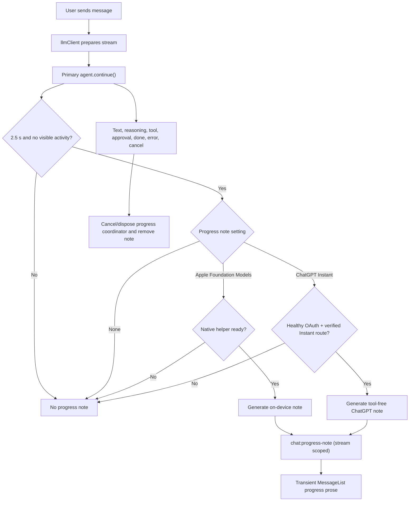

# Generation Progress Notes Plan

Status: implementation plan only
Date: 2026-07-25
Related: `docs/pi-provider-integration-plan.md`, Apple Foundation Models title integration, ChatGPT/Codex Pi-native OAuth

## Outcome

When a chat model has begun a generation but Aiden has not yet shown meaningful activity, Aiden can display one short, useful acknowledgement of the user's request. It prevents a long silent interval without pretending to expose the primary model's private reasoning.

The note appears only after **2.5 seconds** of otherwise-silent generation. It is temporary: it is removed as soon as the primary response, exposed reasoning, tool activity, approval, terminal outcome, or cancellation arrives.

The user explicitly chooses its source in Settings:

| Setting | Behavior | Network boundary |
| --- | --- | --- |
| **None** | Never create a progress note. | None |
| **Apple Foundation Models** | Generate the note with the on-device system model, when the native helper reports ready. | On-device only |
| **ChatGPT · GPT-5.5 Instant** | Generate the note through the user's healthy ChatGPT/Codex sign-in, when Aiden has verified an Instant-capable Codex route. | Sends the bounded current request to ChatGPT |

The default is **Apple Foundation Models**, preserving the original on-device behavior. ChatGPT is an explicit opt-in, never an automatic fallback from Apple.

## Non-goals

- Exposing chain-of-thought or claiming to know what the primary model is doing internally.
- Writing a second assistant message to the transcript, chat store, exported conversation, or later model context.
- Adding Apple Foundation Models to the composer model picker.
- Reusing `chatTitleProviderId`; titles and progress notes have different privacy and routing decisions.
- Falling back between Apple and ChatGPT after the user selects a route. A selected but unavailable route yields no note.
- Sending workspace files, terminal output, tool arguments/results, attachments, system prompts, or whole chat history to the ChatGPT progress call.

## Current state

1. The Foundation Models helper protocol is version 1 and supports only `availability` and `generateTitle`. Its main-process connection already has macOS/Apple-silicon/OS gates, status caching, bounded private file exchange, timeouts, cancellation, and packaging/signing.
2. First-turn auto-title generation begins after `llmClient.start()` succeeds. Manual **Rename with Apple** shares the same native helper but is explicitly user initiated.
3. `llmClient` owns generation start, Pi stream events, tool/approval activity, completion, owner invalidation, workspace cancellation, and application shutdown. It is the authoritative place to cancel a pending progress note.
4. The renderer subscribes to stream-scoped IPC notifications before it invokes `chat:start`; `ChatPane` owns transient stream state; `MessageList` already composes transcript, activity feed, streamed response, and the thinking indicator.
5. ChatGPT/Codex sign-in is the Pi-native `openai-codex` provider. Its snapshot reports both OAuth health and the concrete models installed in the current Pi catalog.
6. The current `@earendil-works/pi-ai@0.80.10` catalog exposes `gpt-5.5`, but does **not** expose a verified `gpt-5.5-instant` model id. It must not be mislabeled as Instant. OpenAI documents `chat-latest` for the public API, but that does not prove it is accepted by the ChatGPT OAuth/Codex backend Aiden uses.

## Product decisions

### Truthful copy

The helper is not allowed to narrate hidden thought or claim actions it cannot observe. It produces a short statement of the immediate intended next step, grounded only in the current user request.

Example:

> Got it — I’m mapping the local-provider path and the startup state that can account for the delay.

Prompt rules for both providers:

1. First person, one sentence, 12–28 words, plain text.
2. State an intended next step, not a completed action.
3. Do not mention Apple, ChatGPT, a model, an instruction, hidden reasoning, or the note itself.
4. Do not claim to have read files, run commands, searched the web, verified facts, or used tools.
5. Reject empty, oversized, control-character, or multi-paragraph output.

### Timing and suppression

The timer starts just before the primary `agent.continue()` call, after preparation succeeded and the stream is active.

At 2.5 seconds, the coordinator may request a note only when all of these are true:

- no primary text delta has arrived;
- no exposed reasoning delta has arrived;
- no tool activity or approval has become visible;
- local-model monitoring is not visibly reporting **Model loading…**;
- the generation still belongs to the same owner and is not stopping/cancelled.

`thinking_start` alone does **not** suppress the note: the generic Thinking indicator is not the explanatory acknowledgement this feature supplies. Conversely, a real tool step is a more accurate progress signal and does suppress it.

The provider call has a short deadline (target: 3 seconds) and is attempted at most once per stream. A late result is discarded rather than flashed into a settled or switched chat.

### Selection persistence and unavailable routes

Add a separate persisted setting:

```ts
export type GenerationProgressProviderId =
  | "none"
  | "apple-foundation-models"
  | "chatgpt-instant";

interface AppSettings {
  generationProgressProviderId?: GenerationProgressProviderId;
}
```

- Missing value defaults to `apple-foundation-models`.
- Preserve a selected `chatgpt-instant` value after logout or a catalog downgrade, but show **ChatGPT sign-in or GPT-5.5 Instant is required** in Settings and emit no note until it becomes usable again.
- Keep the Apple choice on unsupported/disabled/preparing Macs, display its existing readiness detail, and emit no note until it becomes ready.
- Validate the enum in the main-process settings handler; renderer types are convenience only, never the authority.

## ChatGPT Instant capability gate

This gate protects the exact user promise: selecting **ChatGPT · GPT-5.5 Instant** must never secretly call ordinary `gpt-5.5`, the selected chat model, or another provider.

### Required contract

Create a main-process resolver that returns one of:

```ts
type ChatGPTInstantAvailability =
  | { ready: true; modelId: string; modelLabel: "GPT-5.5 Instant" }
  | { ready: false; reason: "signed_out" | "needs_attention" | "instant_not_advertised" };
```

It must:

1. Read the existing Codex provider snapshot and require `configured === true` and `needsAttention === false`.
2. Select only an upstream Pi model explicitly identified as GPT-5.5 Instant. The matching rule and id must be owned by the Pi/Codex catalog contract, not an Aiden guess.
3. Treat `chat-latest` as a candidate only after a Pi release exposes it for `openai-codex` **and** an authenticated local smoke test confirms the ChatGPT backend accepts it for this short, tool-free request.
4. Fail closed: when the current dependency cannot prove an Instant model, return `instant_not_advertised`, disable the option for new selection, and do nothing at runtime.

### Dependency decision before implementation

Phase 0 must identify a reviewed `@earendil-works/pi-ai` release that exposes the Instant route through `openai-codex`, then update the paired Pi dependencies together only after API/transport compatibility review. If no compatible Pi release exists, this feature ships with **None** and **Apple Foundation Models** only; it must not substitute `gpt-5.5`.

The ChatGPT invocation is a provider-owned, one-shot, tool-free request. It must use the Codex service's encrypted OAuth credential handling and status reporting rather than duplicating OAuth or exposing credentials to the renderer.

## Architecture



### Main process

Add a `GenerationProgressService` (prefer a small pure core plus an Electron-facing coordinator).

Per `streamId`, it owns:

- timer, abort controller, owner/document identity, and generation intent;
- whether meaningful activity has arrived;
- whether it has emitted or has been settled;
- the provider invocation and short deadline;
- cancellation on all current `llmClient` lifecycle paths.

Suggested public operations:

```ts
arm(input: { streamId; chatId; latestUserMessage; owner }): void;
markVisibleActivity(streamId, kind: "text" | "reasoning" | "tool" | "approval" | "loading"): void;
settle(streamId, reason: "done" | "error" | "cancelled" | "owner_invalidated"): void;
shutdown(): void;
```

`llmClient` calls `markVisibleActivity` before it sends the corresponding renderer event, ensuring an already-started provider request cannot publish after the real interaction becomes visible. `cancel`, `cancelWorkspace`, `abortAll`, owner invalidation, preparation failure, and the completion `finally` all call `settle`.

### Apple Foundation Models extension

Extend the existing versioned helper rather than add another native integration:

1. Bump the protocol version and add `generateProgressNote`.
2. Add a structured native result (`progressNote`) and strict TypeScript/Swift parsing that accepts the result only for the matching method.
3. Rename the native service to a general Foundation Models service while retaining its title and rename entry points.
4. Add a progress-specific `@Generable` schema and low-token deterministic generation options.
5. Keep the existing private `0700` exchange directory, `0600` files, bounded request/response sizes, LaunchServices launch, timeout, cancellation marker/PID cleanup, availability cache, and packaged nested-app signing.
6. Generalize the connection's `titleOnly` metadata into explicit capabilities (for example `titles` and `progressNotes`) so Settings copy remains correct.

Foundation Models is single-flight at the Aiden layer. Priority is:

1. Manual **Rename with Apple**;
2. user-visible progress note;
3. background first-turn title.

A progress note may cancel/defer an in-flight automatic title, but never interrupts a manual rename. This avoids relying on undocumented concurrent `LanguageModelSession` behavior.

### ChatGPT provider path

Add the short generation method to `CodexProviderService` (or a closely owned service) so it can reuse Pi's model transport, encrypted OAuth, cancellation, and `needsAttention` state.

The input is a bounded sanitized representation of only the latest user message:

- maximum 2 KB UTF-8 after truncation;
- textual content only; attachments become a neutral marker such as `[Attachment omitted]`;
- no workspace path, system prompt, chat history, tool traces, or file content;
- no persisted prompt content in logs, usage records, or errors.

Record aggregate local usage only (`source: "generation-progress"`, provider/model id, local/remote, completed/failed/cancelled); retain the existing policy that usage storage contains no prompt content.

### Renderer and IPC

Add a distinct stream-scoped notification:

```ts
interface ChatProgressNote {
  streamId: string;
  text: string;
}
// channel: "chat:progress-note"
```

`startGeneration` subscribes before invoking `chat:start`, filters by `streamId`, and disposes alongside its existing stream listeners.

`ChatPane` owns `progressNote: string | null` and clears it on every start/reset/delta/reasoning/tool/approval/status-loading/done/error/cancel/chat-switch path. It passes the value to `MessageList`, which renders it after prior transcript messages and before the live activity feed.

Render it as assistant prose, not a stored message bubble. It fades in/out with the existing quiet motion contract, disappears without waiting for stream handoff, respects Reduce Motion, and announces once through a polite status region without moving focus.

## Settings UX

Expand the existing Apple Foundation Models card into a **Background helpers** section while retaining its current availability badge and refresh action.

Add a **Progress note provider** selector:

| Value | Label | Helper text / availability |
| --- | --- | --- |
| `none` | None | No interim acknowledgement is generated. |
| `apple-foundation-models` | Apple Foundation Models | On this Mac; uses the existing readiness detail. |
| `chatgpt-instant` | ChatGPT · GPT-5.5 Instant | Sends only the current request to ChatGPT; available after a healthy sign-in and verified Instant route. |

Details:

- The ChatGPT option is disabled for a new selection when unavailable. Reuse the existing ChatGPT/Codex settings card's sign-in/manage path rather than creating another OAuth flow.
- If a stored ChatGPT choice becomes unavailable, show inline status and retain the value so the user can fix sign-in or deliberately change it.
- State plainly that the note is temporary and does not become part of the conversation.
- Do not overload the title-provider selector, whose **Automatic** route intentionally has different fallback semantics.

## Files and phases

### Phase 0 — Contracts and capability proof

1. Freeze copy, timing, default, and no-cross-provider-fallback policy from this plan.
2. Inspect/upgrade the paired Pi dependencies only if the upstream `openai-codex` catalog exposes the verified Instant route.
3. Run an authenticated, manually authorized local smoke test for the exact model id and tool-free request. Do not commit credentials, raw requests, or responses.
4. Add the `ChatGPTInstantAvailability` resolver plus deterministic fixtures for absent, signed-out, attention-required, and ready states.

**Exit gate:** Aiden can prove an Instant model id usable through its ChatGPT/Codex OAuth transport. If not, keep the ChatGPT option unavailable and do not begin Phase 3's remote route.

### Phase 1 — Native contract and safe generators

Files:

- `native/apple-foundation-models/Sources/AidenFoundationModelsCore/Protocol.swift`
- `native/apple-foundation-models/Sources/AidenFoundationModelsCore/FoundationModelsTitleService.swift` (rename/refactor as appropriate)
- `native/apple-foundation-models/Sources/AidenFoundationModelsHelper/main.swift`
- `main/services/foundation-models-connection-core.ts`
- `main/services/foundation-models-connection.ts`
- Foundation Models TypeScript and Swift tests

Tasks:

1. Add the protocol method/result, input/output bounds, error mapping, and availability behavior.
2. Add `generateProgressNote` with cancellation and a shorter timeout than titles.
3. Implement native single-flight scheduling and the priority rule with background titles/manual rename.
4. Generalize capability metadata and current settings copy.

**Exit gate:** A ready supported Mac can create a validated progress note; unready/unsupported/failing cases remain silent and clean up their exchanges.

### Phase 2 — Generation coordinator and selected routes

Files:

- new `main/services/generation-progress-core.ts`
- new `main/services/generation-progress.ts`
- `main/services/llm-client.ts`
- `main/services/codex-provider.ts`
- `main/services/types.ts`
- `main/services/usage-accounting.ts`, `main/services/usage-store*.ts` as required
- focused tests for coordinator, Codex availability, and lifecycle integration

Tasks:

1. Implement timer, state machine, cancellation, late-result rejection, and one-note cap.
2. Wire all `llmClient` lifecycle events before renderer sends.
3. Route `none`, Apple, and ChatGPT Instant exactly as selected.
4. Add bounded prompt builders/sanitizers and aggregate-only usage recording.

**Exit gate:** Fake-clock tests prove no note for fast/visible/loading/cancelled turns and exactly one safe note for a slow silent eligible turn.

### Phase 3 — Settings, IPC, and temporary surface

Files:

- `main/handlers/providers.ts`
- `main/services/config-store.ts`
- `main/services/types.ts`
- `renderer/lib/types.ts`, `renderer/lib/ipc.ts`, `renderer/lib/queries.ts`
- `renderer/preload.ts` and IPC-contract tests
- `renderer/components/settings/providers-settings.tsx`
- `renderer/main/chat-pane.tsx`
- `renderer/components/message-list.tsx`
- renderer tests for IPC, stream state, and accessibility/motion

Tasks:

1. Persist and validate the new selection; migrate missing values to Apple at read time without a noisy config rewrite.
2. Surface Apple readiness and ChatGPT Instant availability in the selector.
3. Add `chat:progress-note`, pre-start subscription, stream filtering, and cleanup.
4. Render temporary prose in the conversation's live area; never append it to `chatStore`.

**Exit gate:** All three choices behave correctly in the UI, including an expired ChatGPT sign-in and an unsupported Mac.

### Phase 4 — Hardening and release verification

1. Run native Swift tests, focused TypeScript/renderer suites, type-check, lint, and the full test suite.
2. Validate the packaged nested Foundation Models helper and macOS signing path.
3. Manual matrix: fast reply, long silent reply, tool-first reply, exposed reasoning, local cold start, stop at every phase, chat/workspace switch, app quit, Apple unavailable, Apple ready, ChatGPT signed out, ChatGPT Instant unavailable, ChatGPT Instant ready, light/dark, Reduce Motion, and VoiceOver.
4. Verify aggregate usage never includes request content and ChatGPT request logging is sanitized.

## Test matrix

| Area | Required cases |
| --- | --- |
| Foundation protocol | valid availability/title/progress responses; wrong method/field; malformed JSON; bounds; unavailable; cancellation; timeout |
| Coordinator | 2.5-second boundary; one emission; fast text; reasoning; tool; approval; loading; done/error; user stop; owner invalidation; workspace cancellation; shutdown; late provider result |
| Settings | enum validation; default; persisted unavailable ChatGPT choice; unavailable Apple choice; UI disabled/description states |
| ChatGPT | signed out; needs attention; catalog lacks Instant; verified Instant; model unavailable does not poison OAuth health; abort request |
| Renderer | subscription before start; stream isolation; note is not persisted; clear/fade paths; scroll; light/dark; Reduce Motion; one polite announcement |
| Regression | chat-title routing, manual Rename with Apple, local loading status, Codex sign-in/out, normal chat streaming, activity feed |

## Acceptance criteria

1. A slow, otherwise-silent eligible generation shows at most one concise temporary note after roughly 2.5 seconds.
2. No note survives the first real activity, completion, error, cancellation, chat switch, workspace change, or app shutdown.
3. `None` performs no provider work; Apple performs no network work; ChatGPT performs no work before explicit selection and verified OAuth/Instant capability.
4. The transcript, exported chat, future prompts, and `chatStore` never contain the note.
5. Aiden never claims GPT-5.5 Instant unless the installed Pi/Codex contract and authenticated backend both support the exact route.
6. Native helper packaging/signing and all existing title behavior remain intact.
