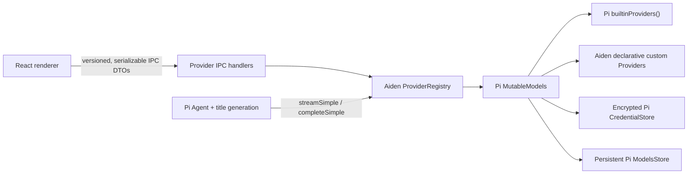

# Pi Provider Integration Plan

Status: implementation plan only
Date: 2026-07-19
Pi source audited: [`earendil-works/pi`](https://github.com/earendil-works/pi) at `3da591ab`
Target reviewed Pi release: `0.80.10`

## Outcome

Aiden should make Pi's `Models` collection the only authority for chat providers, models, authentication, catalog refresh, and streaming. It should not add more entries to Aiden's seven-item preset array.

At the reviewed Pi version, the correct listing pattern is:

```ts
import { builtinModels } from "@earendil-works/pi-ai/providers/all";

const models = builtinModels({ credentials, modelsStore });
const providers = models.getProviders();
const allModels = models.getModels();
const availableModels = await models.getAvailable();
```

The three collections have intentionally different product meanings:

- `getProviders()` lists every registered provider, configured or not. Settings uses this.
- `getModels()` lists every last-known model, configured or not. Provider detail uses this.
- `getAvailable()` lists only models whose provider authentication is usable. The composer uses this.

Pi currently registers 36 built-in chat providers through `builtinProviders()` and `builtinModels()` (`packages/ai/src/providers/all.ts:77-125`). This includes dynamic Radius, which a static generated-catalog call can omit. Aiden must not use the deprecated `/compat` `getProviders()` export.

"Plug-and-play" means that a provider registered in Pi's `builtinProviders()` appears after Aiden deliberately upgrades and verifies the Pi package. Pi does not scan arbitrary source files or infer arbitrary vendor protocols from the internet.

## Why the current implementation cannot just expose more providers

| Current behavior                                                        | Evidence                                                       | Consequence                                                                                              |
| ----------------------------------------------------------------------- | -------------------------------------------------------------- | -------------------------------------------------------------------------------------------------------- | -------------------------------------------- | -------------------------------------------------------------------------- |
| Aiden seeds seven providers once                                        | `main/services/config-store.ts:30-118`                         | New Pi providers never appear on existing installs.                                                      |
| Provider protocol is only `"openai"` or `"anthropic"`                   | `main/services/types.ts:3-19` and `renderer/lib/types.ts:4-16` | Most Pi provider transports cannot be represented.                                                       |
| Aiden fabricates model metadata                                         | `main/services/model-runtime.ts:19-35`                         | Every model becomes text-only, non-reasoning, zero-cost, 128K/8192.                                      |
| Streaming uses two `/compat` adapters                                   | `main/services/model-runtime.ts:4-20`                          | OpenAI Responses, Codex, Google, Vertex, Bedrock, Mistral, Radius, and mixed-API providers are bypassed. |
| Discovery always calls `baseUrl + /models`                              | `main/services/models.ts:14-42`                                | Static, OAuth, ambient-auth, and provider-specific catalogs fail.                                        |
| Credentials are one encrypted string                                    | `main/services/secrets.ts:8-65`                                | OAuth, provider-scoped environment values, locked refresh, and generic login cannot work.                |
| Usability is `hasKey                                                    |                                                                | !needsKey`                                                                                               | `renderer/components/model-picker.tsx:33-35` | Environment, OAuth, AWS, ADC, keyless-local, and re-login states are lost. |
| Previous assistant messages are relabeled as the current provider/model | `main/services/llm-client.ts:59-72`                            | Cross-provider history and reasoning/signature continuity are unreliable.                                |
| Pi packages resolve to `0.80.6`                                         | `package-lock.json:750-790`                                    | The provider-owned auth/availability/refresh contract added in `0.80.8` is unavailable.                  |

Pi's runtime already solves the missing pieces:

- provider objects own auth, model listing, filtering, refresh, and stream behavior (`packages/ai/src/models.ts:66-120`);
- a `Models` collection owns provider lookup, availability, login/logout, refresh, and request auth (`packages/ai/src/models.ts:127-186`);
- model records carry API, endpoint, reasoning, thinking levels, modalities, costs, limits, headers, and compatibility flags (`packages/ai/src/types.ts:705-731`);
- credentials are type-tagged and mutated through a serialized `CredentialStore` (`packages/ai/src/auth/types.ts:13-88`);
- generic login supports text, secret, select, manual-code, browser URL, device code, info, and progress events (`packages/ai/src/auth/types.ts:111-155`).

## Architecture decision

Use public `@earendil-works/pi-ai` directly. Do not add the full `@earendil-works/pi-coding-agent` package in this project.

The direct integration gives Aiden:

- all Pi built-in providers and their native stream implementations;
- provider-owned API-key, OAuth, and ambient authentication;
- credential-specific model availability;
- dynamic model refresh and provider-scoped catalog storage;
- a safe `createProvider()` seam for declarative custom endpoints.

The full coding-agent runtime adds `models.json`, executable configuration commands, CLI extension loading, and remote overlays, but it also expands the packaged dependency and arbitrary-code surface. Those features do not belong in the initial desktop provider migration.

Apple Foundation Models remains a separate macOS-only connection for chat-title metadata. It is not registered as a Pi chat provider, never appears in the composer model picker, and does not change Pi's ownership of conversational model streaming. Main-process title routing may choose that native connection before the Pi-backed selected chat model, according to the user's title-provider setting and current native availability.



## Product and security boundaries

1. Every Pi built-in is visible in Provider Settings, even when it is not configured.
2. Only models returned by Pi availability checks are selectable for a new request.
3. Built-in provider protocol/auth behavior is Pi-owned and cannot be mutated by renderer input.
4. Custom endpoints are declarative and initially support the four Pi-documented custom API families:
   - `openai-completions`
   - `openai-responses`
   - `anthropic-messages`
   - `google-generative-ai`
5. Custom authentication supports no-auth local servers, API/bearer keys, and named secret headers. It does not execute `!commands` or arbitrary JavaScript.
6. Native/executable third-party providers require a separate signed/trusted plugin design. They are not loaded from user-selected files in this work.
7. Chat providers and image-generation providers stay separate. Pi's image registry is not added to the chat picker.
8. Voice transcription remains an explicit OpenAI/Google/local feature. Listing a chat provider does not claim it can transcribe audio.
9. Provider objects, auth functions, headers, credentials, and tokens remain in Electron main and never cross preload.

### Current no-auth compatibility boundary

LM Studio, Ollama, and a model server reached over Tailscale are not API-key providers by default. Aiden must not ask for, store, or transmit an API key unless the user explicitly changes that endpoint to API-key authentication.

The installed Pi `0.80.6` package currently requires a non-empty value when constructing its OpenAI-compatible transport, even though the OpenAI SDK can suppress its generated bearer header. Aiden therefore keeps a fixed process-only compatibility token inside the main process and passes `Authorization: null` last in the request headers. The endpoint receives no `Authorization` or `x-api-key` header. Direct `/models` discovery never receives the compatibility token. The adjacent Pi source now has first-class `auth: "none"` support; upgrade Aiden to that release once it is published instead of retaining this compatibility layer indefinitely.

Tailscale is a network path, not an authentication method. A Tailnet template starts with no authentication, but the user may opt into an API key if that server requires one; Aiden must never infer or alter the auth mode from a `.ts.net` hostname.

## Target backend contracts

### Provider registry

Add `main/services/provider-registry.ts` as a process-wide service initialized after Electron is ready.

Responsibilities:

- construct `builtinModels({ credentials, modelsStore })` exactly once;
- register saved custom providers after built-ins;
- expose provider/model snapshots and lookups;
- expose `checkAuth`, `login`, `logout`, `refresh`, `streamSimple`, and `completeSimple`;
- validate that provider/model selections resolve before a message is sent;
- retain one immutable snapshot generation and publish changes after auth, refresh, or custom-provider mutation;
- let in-flight agents retain their captured model/provider while changes affect the next request.

Custom provider IDs must be namespaced, for example `custom:<uuid>`, and cannot silently replace a Pi built-in. A custom endpoint for an existing vendor is a distinct provider entry.

### Serializable IPC DTOs

Define DTOs in both main and renderer without importing runtime provider objects across the process boundary.

```ts
type ProviderOrigin = "builtin" | "custom";
type ProviderState = "ready" | "setup_required" | "refreshing" | "stale" | "needs_attention";

interface ProviderSummary {
  id: string;
  name: string;
  origin: ProviderOrigin;
  state: ProviderState;
  authMethods: Array<{
    type: "api_key" | "oauth";
    name: string;
    loginLabel?: string;
    canLogin: boolean;
  }>;
  auth?: {
    type: "api_key" | "oauth";
    source?: string;
  };
  modelCount: number;
  availableModelCount: number;
  refreshable: boolean;
  local: boolean;
  baseUrl?: string;
  error?: string;
}

interface ModelSummary {
  providerId: string;
  id: string;
  name: string;
  api: string;
  available: boolean;
  vision: boolean;
  reasoning: boolean;
  contextWindow: number;
  maxTokens: number;
}
```

Do not expose provider headers, provider-scoped environment values, credential payloads, or auth-derived endpoint URLs. Sanitize displayed custom base URLs so embedded user info or query credentials never reach logs or React.

### Pi credential store

Add `main/services/pi-credential-store.ts` implementing Pi's complete `CredentialStore` contract.

Requirements:

- store the full `Credential` payload, not only a key string;
- encrypt each credential with Electron `safeStorage` before disk write;
- make `list()` return only `{ providerId, type }`;
- serialize `modify()` per provider and serialize file read-modify-write globally;
- use temp-file plus atomic rename and mode `0600`;
- preserve the current credential when the modifier returns `undefined`;
- preserve expired OAuth credentials when refresh fails, allowing re-login;
- fail closed when secure storage is unavailable or ciphertext cannot be decrypted;
- never log plaintext, tokens, keys, secret prompts, or decrypted structures.

Keep `main/services/secrets.ts` temporarily for non-Pi secrets such as Exa and as a one-release legacy provider-key migration shim.

### Pi models store

Add `main/services/pi-models-store.ts` implementing `ModelsStore`.

Requirements:

- key entries by provider ID;
- persist model snapshots and `checkedAt` separately from credentials;
- support cache-only restoration during startup;
- delete a custom provider's catalog when the provider is removed;
- retain the previous catalog when refresh fails;
- use atomic writes and return structured provider-specific errors.

Startup policy:

1. build the registry and call cache-only refresh with network disabled;
2. publish the restored snapshot immediately;
3. in the background, refresh configured dynamic providers with a 15-second abort budget;
4. manual refresh passes `force: true`;
5. abort startup/manual refresh on app shutdown or explicit cancellation.

Pi `0.80.10` refreshes configured dynamic providers together and returns an error map. A per-provider Refresh button may trigger the global dynamic refresh, then display only that provider's result until Pi exposes a public scoped refresh.

### Declarative custom providers

Add `main/services/custom-providers.ts` and persist only custom definitions in the config store.

```ts
interface CustomProviderDefinition {
  id: string;
  name: string;
  api: "openai-completions" | "openai-responses" | "anthropic-messages" | "google-generative-ai";
  baseUrl: string;
  auth: "none" | "api_key" | "bearer" | "secret_header";
  secretHeaderName?: string;
  modelSource: "manual" | "openai_models_endpoint";
  models: CustomModelDefinition[];
}
```

Build providers through Pi `createProvider()` and top-level static imports from the relevant `@earendil-works/pi-ai/api/*` modules. Do not use inline imports.

For discovery-capable endpoints, implement `fetchModels` so Pi handles in-flight de-duplication and stored dynamic overlays. A generic `/models` request remains only a custom endpoint feature; it is not used for Pi built-ins.

Manual/custom models must include or derive Pi's required metadata. Use user-entered metadata first, the release-bundled capability snapshot second, and conservative documented defaults last. That snapshot is refreshed only by the release pipeline, never from the running app. Pi is authoritative for every request-critical field on built-ins.

## Migration plan

Run a versioned, idempotent migration before constructing the new registry.

### Provider ID mapping

| Legacy Aiden ID | Pi ID                | Migration behavior                                                               |
| --------------- | -------------------- | -------------------------------------------------------------------------------- |
| `openai`        | `openai`             | Preserve credential and selection. Ignore the legacy short model array.          |
| `anthropic`     | `anthropic`          | Preserve credential and selection. Ignore the legacy short model array.          |
| `gemini`        | `google`             | Copy credential, chat/settings selection, voice reference, and pins to `google`. |
| `deepseek`      | `deepseek`           | Preserve credential and selection.                                               |
| `moonshot`      | `moonshotai`         | Copy credential, chat/settings selection, and pins to `moonshotai`.              |
| `lmstudio`      | `custom:<stable-id>` | Convert to a keyless local custom provider with dynamic `/models` discovery.     |
| `ollama`        | `custom:<stable-id>` | Convert to a keyless local custom provider with dynamic `/models` discovery.     |

### Data handling

1. Write a pre-migration backup and a migration journal under Electron `userData`.
2. Copy legacy provider key strings into encrypted `{ type: "api_key", key }` credentials.
3. Do not delete the old provider-key file during the first release containing this migration.
4. Detect untouched seeded preset records by exact legacy defaults; replace them with Pi built-ins.
5. Convert edited built-in endpoints into explicit custom providers so changes are not lost and Pi's canonical built-in remains intact.
6. Convert existing custom `kind` values to `openai-completions` or `anthropic-messages`.
7. Preserve manual model IDs with conservative metadata and mark them as custom.
8. Remap chat metadata, last-used settings, renderer model selection, pinned models, and cloud voice configuration.
9. If both old and new credentials exist, keep the new credential and report the skipped legacy copy without revealing values.
10. On any failure, leave the old files intact, record a non-secret diagnostic, and let the user retry.

Renderer `localStorage` migration must cover:

- `aiden-agent.providerId`;
- `aiden-agent.model`;
- each `providerId::model` entry in `aiden-agent.pinnedModels`.

New provider/model defaults should be persisted in backend settings. Local storage may cache UI state but must not be the authority.

## IPC and auth flow

Replace key-specific provider IPC with a provider-owned flow.

### Invoke channels

- `providers:list`
- `providers:listModels`
- `providers:refresh`
- `providers:auth:start`
- `providers:auth:respond`
- `providers:auth:cancel`
- `providers:logout`
- `providers:custom:save`
- `providers:custom:remove`
- `providers:custom:testDiscovery`

### Notification channels

- `providers:auth:prompt`
- `providers:auth:event`
- `providers:auth:done`
- `providers:auth:error`
- `providers:catalog-updated`

Add every notification explicitly to the preload allowlist.

The renderer creates an auth flow ID and subscribes before starting, matching the chat stream pattern. Main maps Pi's `AuthInteraction` to prompt/event DTOs.

Auth session rules:

- bind the flow to the initiating `webContents`;
- permit one outstanding prompt at a time;
- give each prompt a separate prompt ID;
- support secret, text, select, and manual-code responses;
- forward info/progress/device-code events without secrets;
- open only parsed `http:` or `https:` auth links through Electron;
- reject renderer responses for another flow/window;
- abort on cancel, window destruction, timeout, or application shutdown;
- clear pending resolver functions in every terminal path;
- invalidate provider/model queries only after main publishes the new snapshot.

`checkAuth()` proves configuration, not network connectivity. Do not label it "Connected." Dynamic catalog refresh is a valid connectivity check. Any optional test generation must be explicit that it can incur provider usage.

## Runtime integration

### Agent generation

Replace the fabricated `resolveModelRuntime()` path with registry lookup:

1. resolve the exact Pi model by provider ID and model ID;
2. reject unknown or unavailable selections before accepting the request;
3. pass the exact Pi model into `Agent`;
4. set `streamFn` to the registry's Pi `models.streamSimple` wrapper;
5. stop manually resolving/passing raw API keys;
6. pass the chat ID as the Pi session ID where supported;
7. preserve Pi's provider-specific API, headers, auth, compatibility, and mixed-model dispatch.

Use `model.input.includes("image")` for vision decisions. Keep the release-bundled capability snapshot only for supplemental fields Pi lacks, such as open-weight status, release date, or a tool-capability hint; never fetch that metadata at runtime.

If a model lacks reliable tool support metadata, make the behavior explicit: either expose it as chat-only and withhold workspace tools, or label support unknown and surface a clear provider error. Do not silently advertise every listed model as a fully capable coding agent.

### Chat titles

Route title generation through the same registry and `completeSimple()`. It must use the same auth and provider behavior as chat, keep the existing timeout/fallback semantics, and never create a second credential path.

### Message provenance

At minimum, persist `providerId`, `api`, and `model` on each assistant message. Use those fields when reconstructing Pi history instead of stamping every previous message with the current selection.

Prefer a versioned canonical Pi message payload alongside display text so future work can preserve response IDs, thinking/signature blocks, usage, and tool history. Existing text-only messages remain readable and receive a documented legacy fallback.

### Voice

Cloud transcription remains a separate capability. Resolve OpenAI/Google API-key auth through the new credential layer, map legacy `gemini` settings to `google`, and reject OAuth-only credentials that are not valid for the transcription endpoint. Keep Parakeet unchanged.

## Renderer plan

### Provider settings

Replace the flat seven-row list with a searchable catalog grouped by state:

- Ready;
- Available from environment;
- Setup required;
- Needs attention;
- Custom endpoints.

Each provider row must have a generic presentation fallback. Provider-specific icons, help text, or categories are optional overlays; a newly added Pi provider must still render and function without an Aiden switch case.

Provider details show:

- Pi provider name and safe endpoint summary;
- authentication methods advertised by the provider;
- configured source such as stored credential, environment, AWS profile, ADC, or OAuth;
- total and available model counts;
- last refresh/stale/error state;
- setup, re-login, logout, and refresh actions.

Use one generic auth dialog for all Pi prompts, including Bedrock/Vertex multi-field setup and browser/device OAuth.

### Model picker

- source rows from available model DTOs, not `hasKey/needsKey`;
- group by provider and keep pinned models first;
- remove stale pins after migration or provider removal;
- allow provider-scoped search/filtering;
- virtualize long result lists such as OpenRouter/gateway catalogs;
- show model name, provider, local/cloud state, vision, reasoning, context, and any chat-only warning;
- keep the selected historical model visible when it is unavailable, with a reconnect/reselect action.

### Chat-aware selection

- new chats start with the backend-persisted last-used available model;
- existing chats restore their saved provider/model;
- changing a chat's model updates chat metadata immediately;
- an unavailable saved provider is not silently replaced on an existing chat;
- fallback selection applies only to a brand-new chat with no explicit model;
- the empty state links directly to provider setup when no available models exist.

A full onboarding route is optional. A blocking first-run provider setup panel is sufficient if it detects already configured ambient credentials and does not trap existing users.

## Detailed implementation phases

### Phase 0 - Dependency and contract gate

Files:

- `package.json`
- `package-lock.json`
- new provider contract test

Tasks:

1. Pin `@earendil-works/pi-ai` and `@earendil-works/pi-agent-core` to the same exact reviewed version, initially `0.80.10`.
2. Refresh the lockfile without lifecycle scripts.
3. Import `@earendil-works/pi-ai/providers/all` from the installed artifact.
4. Assert unique provider IDs, expected sentinel providers, auth semantics, and the reviewed inventory size.
5. Verify the package artifact contains generated provider catalogs; the Pi source checkout alone currently cannot execute the import without generation.
6. Define the versioned DTO and custom-provider schemas before UI changes.

Exit gate: a Node test can enumerate the installed Pi provider registry, including Radius, without Aiden presets or network access.

### Phase 1 - Durable stores and migration harness

Files:

- new `main/services/pi-credential-store.ts`
- new `main/services/pi-models-store.ts`
- new `main/services/provider-config-store.ts`
- new `main/services/provider-migration.ts`
- `main/services/secrets.ts`
- `main/services/data-store.ts` or a new atomic persistence primitive

Tasks:

1. Implement and unit-test `CredentialStore` and `ModelsStore`.
2. Add atomic persistence, locking/serialization, `0600`, and corrupt-file diagnostics.
3. Add fixtures for untouched presets, edited presets, custom endpoints, old credentials, chats, settings, and pins.
4. Implement a dry-run migration report and idempotent apply path.
5. Preserve backup/journal/rollback data without exposing secret values.

Exit gate: concurrent credential updates, OAuth refresh mutation, corrupt ciphertext, and every legacy provider mapping are covered by tests.

### Phase 2 - Registry and custom-provider composition

Files:

- new `main/services/provider-registry.ts`
- new `main/services/custom-providers.ts`
- `main/services/types.ts`
- `main/services/config-store.ts`

Tasks:

1. Construct the long-lived Pi registry with injected stores.
2. Register built-ins, then namespaced declarative custom providers.
3. Produce secret-free provider/model snapshots.
4. Add cache restore, background refresh, force refresh, coalescing, and immutable snapshot notifications.
5. Replace provider presets with custom definitions and app preferences only.

Exit gate: Aiden can list all Pi built-ins plus Ollama/LM Studio/custom providers, and failure in one custom provider does not remove healthy built-ins.

### Phase 3 - Provider auth IPC

Files:

- new `main/services/provider-auth-flow.ts`
- `main/handlers/providers.ts`
- `renderer/preload.ts`
- `renderer/lib/ipc.ts`
- `renderer/lib/types.ts`
- `renderer/lib/queries.ts`

Tasks:

1. Implement flow-bound generic prompts and events.
2. Add login/logout/refresh/custom CRUD validation in main.
3. Remove renderer authority over built-in origin, deletion, auth mode, and protocol.
4. Add cancellation, timeout, URL validation, and window ownership checks.
5. Add notification/query invalidation after snapshot changes.

Exit gate: mocked API-key, select, manual-code, browser OAuth, and device-code flows complete or cancel without a credential crossing IPC.

### Phase 4 - Route inference through Pi

Files:

- `main/services/model-runtime.ts`
- `main/services/llm-client.ts`
- `main/services/chat-title.ts`
- `main/handlers/chat.ts`
- `main/services/models.ts`
- `main/services/models-catalog.ts`

Tasks:

1. Replace synthetic model creation with exact registry lookup.
2. Route Agent and title streams through Pi `Models`.
3. Use Pi modality/reasoning/limit metadata.
4. Use a release-generated capability snapshot only for supplemental display metadata; never contact models.dev at runtime.
5. Validate model availability in main before persisting/sending.

Exit gate: OpenAI uses Responses, Google uses Generative AI, Bedrock uses Converse, and a mixed-API provider keeps each model's native API in tests.

### Phase 5 - Settings and model-selection UX

Files:

- `renderer/components/settings/providers-settings.tsx`
- replace/refactor `renderer/components/settings/provider-editor.tsx`
- new `renderer/components/settings/provider-auth-dialog.tsx`
- `renderer/components/model-picker.tsx`
- `renderer/lib/use-model-selection.ts`
- `renderer/main/chat-pane.tsx`
- `renderer/main/chat-layout.tsx`

Tasks:

1. Build searchable provider states and generic auth UI.
2. Split built-in setup from declarative custom endpoint editing.
3. Switch the model picker to available model DTOs and add virtualization.
4. Make model selection chat-aware and backend-persisted.
5. Preserve inaccessible historical selections with a recovery state.

Exit gate: all reviewed providers render with no provider-specific UI code required, long catalogs remain responsive, and keyboard/screen-reader paths work.

### Phase 6 - Provenance and voice compatibility

Files:

- `main/services/types.ts`
- `renderer/lib/types.ts`
- `main/services/chat-store-core.ts`
- `main/services/llm-client.ts`
- `main/services/transcription.ts`
- `renderer/components/settings/voice-settings.tsx`

Tasks:

1. Version chat persistence and store provider/API/model provenance.
2. Rehydrate legacy and new messages correctly across provider switches.
3. Resolve supported transcription keys through the new credential layer.
4. Keep OAuth/chat availability distinct from transcription support.

Exit gate: switching providers does not rewrite historical message provenance, and existing OpenAI/Google/local voice choices survive migration.

### Phase 7 - Packaging, rollout, and cleanup

Tasks:

1. Run focused tests, full Aiden tests, type-check, lint, and production build.
2. Package the app and smoke the externalized `providers/all` import plus lazy OAuth modules.
3. Test offline startup with cached dynamic catalogs.
4. Manually canary one API-key provider, one OAuth provider, one ambient provider when available, and one local custom endpoint.
5. Confirm no credentials appear in renderer payloads, logs, crash diagnostics, or source maps.
6. Keep legacy credential/config files for one release, then remove the compatibility shim only after migration telemetry/manual validation.
7. Document the Pi upgrade checklist so a future provider addition requires only dependency review, contract tests, packaging smoke, and optional presentation metadata.

Exit gate: the packaged application enumerates the installed Pi registry, current Aiden users retain credentials/custom endpoints/selections, and at least one provider from each supported auth/runtime category works.

## Test matrix

| Area               | Required coverage                                                                                                                             |
| ------------------ | --------------------------------------------------------------------------------------------------------------------------------------------- |
| Provider inventory | 36 reviewed built-ins, unique IDs, Radius included, unknown future provider generic fallback                                                  |
| API dispatch       | OpenAI Responses, OpenAI Completions, Anthropic Messages, Google, Vertex, Bedrock, Mistral, Pi Messages, mixed providers                      |
| Availability       | stored API key, environment key, keyless local, AWS profile/chain, Google ADC, OAuth, expired OAuth, auth error                               |
| Credential store   | list/read/modify/delete, concurrent modifies, single OAuth refresh, atomic write, corrupt ciphertext, unavailable `safeStorage`, no plaintext |
| Auth flow          | secret, text, select, manual code, auth URL, device code, progress, cancellation, timeout, window close, invalid URL                          |
| Dynamic models     | cache-only startup, background refresh, force refresh, stale-on-failure, partial provider errors, abort, removal cleanup                      |
| Custom providers   | four API families, no-auth, bearer key, secret header, manual models, `/models`, invalid schema/URL, ID collision                             |
| Migration          | seven presets, aliases, edited preset, custom provider, existing new credential, chats, settings, voice, selection, pins, retry/idempotency   |
| Runtime            | exact Pi model object, Agent stream through Models, title completion through Models, no manual key injection, session ID                      |
| History            | legacy text-only messages, new provenance, provider switch, unavailable historical provider                                                   |
| Renderer           | provider state groups, auth dialogs, errors, long catalog virtualization, stale pin cleanup, keyboard and accessibility                       |
| Packaging          | generated catalogs included, external package resolution, lazy OAuth load, offline launch, signed/unpacked smoke                              |

Use Pi's faux provider and local HTTP fakes in automated tests. No test should require real provider credentials, paid tokens, or public network access.

## Pull request sequence

Keep this as a sequence of reviewable changes rather than one cross-stack rewrite:

1. **PR 1 - Pi version and runtime contract tests**
2. **PR 2 - Encrypted credential/models stores and migration fixtures**
3. **PR 3 - ProviderRegistry, built-ins, and custom-provider composition**
4. **PR 4 - Generic auth IPC and provider snapshot DTOs**
5. **PR 5 - Agent/title routing through Pi Models**
6. **PR 6 - Provider Settings and scalable model picker**
7. **PR 7 - Chat-aware selection, provenance, and voice migration**
8. **PR 8 - Packaged smoke tests, migration rollout, and legacy cleanup schedule**

Each PR should keep old behavior available until its replacement is covered by tests. The first user-visible provider catalog should not ship until generation, credentials, migration, and packaged-runtime paths all use the same Pi registry.

## Definition of done

- Settings lists every provider returned by the installed Pi registry.
- A future Pi built-in appears after a reviewed Pi dependency upgrade without a new Aiden preset or protocol switch statement.
- The composer lists only Pi-available models and remains responsive with gateway-sized catalogs.
- Requests use the selected Pi model's native API, provider stream, auth, headers, and metadata.
- API-key, OAuth, ambient, and keyless-local setup paths are represented honestly.
- Existing keys, custom providers, chats, pins, voice settings, and selections migrate without silent loss.
- Provider credentials and auth payloads never cross the preload boundary.
- One provider failure does not prevent other providers from listing or working.
- Automated tests use faux/local providers, and the packaged app passes provider enumeration and lazy-auth smoke tests.

## Investigation papercuts

- Aiden declares Pi `^0.80.6`, but its lockfile resolves `0.80.6`; the required provider auth/refresh contract changed in `0.80.8`.
- Aiden duplicates provider contracts in main and renderer and has no focused provider integration tests.
- The Pi source checkout omits generated `packages/ai/src/providers/data/*.json`, so direct source execution of `builtinProviders()` fails. Runtime inventory must be verified from a built/published package or after Pi catalog generation.
