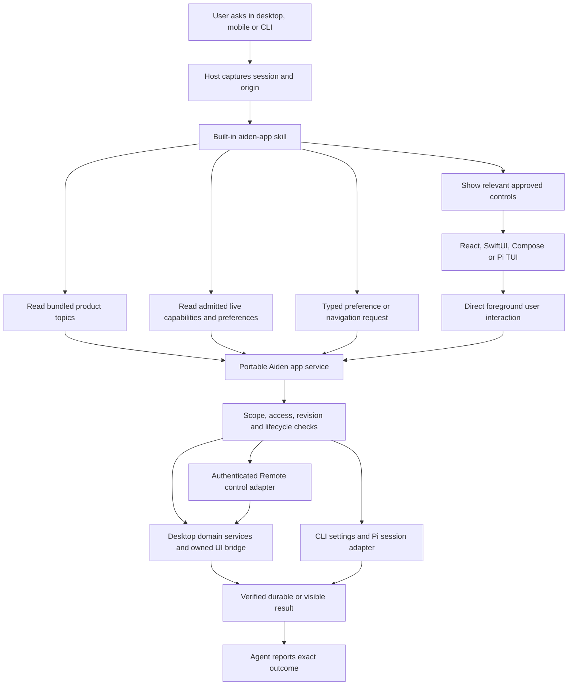

# Built-in Aiden knowledge and app actions

Status: **Implemented MVP; local validation complete, PR/hosted validation in progress. Release hardware acceptance remains open.**
Date: 2026-10-03.
Baseline: Aiden main `3f86d41af16ea653e907606fb2952d3f67b2dd6e` (0.52.0); desktop and CLI Pi pins remain 0.87.1.
Pi reference: `/Users/sambitbiswas/projects/opp/pi`, `a276dabe57911253350bffb93cb7d7aff6a73261`; stable published target **1.0.0**, tag `a13d35a742`.
Related evidence: [all-PR improvement audit](aiden-pr-improvement-audit-20261003.md), [interactive chat controls and json-render research](aiden-chat-controls-json-render-research.md), [Assistant plan](aiden-assistant-plan.md), [CLI plan](aiden-cli-plan.md), [multi-host plan](desktop-multi-host-control-plan.md).

Scope update 2026-10-03: the user requested actual settings controls inside the conversation, using json-render where appropriate, with iOS and Android support. This revision makes portable interactive panels part of the MVP; it supersedes the initial local-only mutation scope and optional result-card treatment. The bounded MVP has now been implemented on the pinned Pi 0.87.1 public APIs, with exact json-render 0.21.0 core/React and scoped Zod 4.3.6. The pending Pi 1.0 stack remains independent.

## Implemented contract and evidence

- Offline installed help and immutable `aiden-app` skill; owned tools provide product help, current control/runtime facts, inert topic cards, closed desktop navigation with a document-bound acknowledgement, and supported preference writes. Attended desktop/Assistant and Remote chat surfaces receive the appropriate owned tools; bots, scheduled work, Telegram and delegated children gain no app mutations.
- The shipped inert descriptor is `AppControlPanel` (`version`, `id`, `topic`, `fallback`, optional original `workspaceId`) in assistant `appPanels`; exact schema lives in `renderer/shared/app-controls.ts` and Remote OpenAPI. Desktop constructs its own flat json-render spec from a fresh host projection. Native clients construct native controls from the same bounded rows. Arbitrary generated layouts, actions, watches and HTML execution have no administration bridge.
- Initial controls: desktop theme mode, chat width, Reduce Motion, global/workspace Memory, Web Search and global Skills; CLI uses its real terminal theme plus global Memory/Web Search. Unsupported CLI gates are disabled with reasons. Enablement and Ask policy use foreground confirmation; Safe permits exact reversible presentation changes and disablement. Disabled fails closed. Workspace file permissions remain independent.
- State/value-and-policy revisions prevent conflicting changed values. Intent/receipt persistence prevents replaying uncertain effects; operation IDs are canonicalized independent of JSON key order. Checking an operation repeats its original POST with the same ID and returns the durable receipt, rather than introducing a second receipt endpoint. Unknown intents never expire silently. The 500-record/30-day confirmed retention bound is explicit.
- Domain commits preserve appearance previews, provider routing, workspace cancellation barriers and skill revocation/cancellation. Workspace ownership is rechecked inside persistence after cancellation; panel scope is never retargeted after moving a chat. Export/copy keeps readable fallback and strips interactive descriptors.
- Remote revision 19 adds separately negotiated `app-controls:read/respond`, `chat-ui-panels-v1`, explicit owner-enabled negotiation and two typed card routes. Owner consent starts off in device-local Settings. Memory retains workspace read/manage grants. Old clients receive text; models in Remote chats can show inert cards but cannot read or mutate host preferences through a model tool.
- CLI uses Pi's public UI selectors/theme API. The 0.87.1 public main entry does not accept a built-in skill resource loader; `/aiden-app` and `skill_aiden_app` are the immutable owned fallback, respecting `--no-skills`. `/aiden-settings`, `/help-aiden` and explicit `aiden app help/status/get/set` administration use the actual agent directory. Headless agent writes are denied; Memory/Web Search enablement rebuilds tools on the next CLI process. These controls do not administer an open desktop or add a controls bridge to the CLI Remote daemon.
- Local evidence: desktop build/type checks/lint; real Electron model-to-panel flow with no file access, confirmation, persistence, replay and no inference from clicks; registered behavioral control/navigation/skill/domain/Remote/export tests; CLI build/type check and 62 tests; full native Android JVM/lint/build and iOS simulator suites. Physical iPhone/iPad/Android paired-host interaction and signed installed-release acceptance remain release gates. The implementation does not claim these hardware checks happened.
- Scope 0 (the independently owned Pi upgrade) and H (model/session/schedule/run/attention/Live actions) remain separate follow-ups. A–F are implemented for the supported vocabulary; G's automated evidence is complete and hardware/release evidence remains open.

## Intended experience

Aiden should explain its own shipped features accurately and perform supported app changes from a normal conversation. It should show the relevant real toggles, pickers and setup controls inside chat, so users can configure features without navigating deep settings. This works in a folderless desktop chat, a folder-backed chat with no file access, paired iOS/Android chats and an interactive CLI session. Answers distinguish product capabilities from the tools, configuration and permissions available in the current session.

Examples:

| User request | Required behavior |
| --- | --- |
| “What can this app do?” | Give a short Aiden overview from bundled product documentation, then offer relevant capabilities available on this platform. Do not describe unmerged PRs as shipped. |
| “How does the agent work?” | Explain the selected model, host tool loop, workspace access, approvals, context/compaction, skills and optional memory. Distinguish local app execution from network inference. |
| “Can you see my other chats?” | Explain scope from current capabilities. Do not imply transcript access merely because the app has a sidebar or a chat list. |
| “Switch to dark mode.” | Set the desktop appearance mode, update the visible window, persist it, and report the verified value. In CLI, use a supported terminal theme and state its persistence scope. |
| “Make this chat wider.” | Change the desktop chat-width preference. CLI explains that this is a desktop preference and offers its own supported layout options. |
| “Turn memory off for this workspace.” | Resolve the exact workspace from host context; update its memory gate without deleting facts. Confirm the effective result and scope. |
| “How does memory work? Show its settings here.” | Explain memory and show current global/workspace controls inline. A click changes the real setting through its domain service, without another model turn; supported phones render native controls. |
| “Show appearance options.” | Show a compact theme/width group for the chosen target. Phones distinguish their own preferences from the paired host; unsupported desktop-only controls are omitted with truthful guidance. |
| “Turn web search off.” | Change the current host's Web Search enable flag, preserve routes/credentials, revoke subsequent search calls and report the effective state. |
| “Show me provider settings.” | Navigate the originating desktop window to Providers, or show the CLI's actual setup commands. Opening the page must not initiate login or a fetch. |
| “Enable Computer Use.” | Explain readiness and open the existing consent/setup flow. Preserve platform, feature, global and per-chat gates. Linux remains unsupported until its separate admission work ships. |
| “Change the model.” | Discover configured models and ask which one when unspecified. Apply an exact selection to the named session only after the later model-action slice ships; no invented provider/model names. |
| “What features are coming next?” | Say the installed help covers shipped features. Do not read local developer plans or contact GitHub unless the user separately asks for repository research. |

The first release should deliver product knowledge, live capability reads, interactive appearance/Memory/Web Search panels, supported Skills controls, and navigation to existing setup. Desktop and both native clients share settings semantics; CLI uses a Pi-native TUI adapter. Direct requests can still use admitted typed actions without a redundant click. Wider app administration follows as separate, typed capabilities.

## Research findings

### What Pi actually does

Pi's self-knowledge is a documentation section in its default system prompt. It points to the installed README, documentation and examples, and instructs the model to read them when asked about Pi, its SDK, extensions, skills or TUI. This is not a universal tool that clicks or configures Pi. Supplying a custom prompt bypasses that default section, so an embedding application must add its own product knowledge deliberately. See the [stable system-prompt source](https://github.com/earendil-works/pi/blob/v1.0.0/packages/coding-agent/src/core/system-prompt.ts).

Pi advertises skill names/descriptions and loads their detailed instructions on demand. Explicit `/skill:name` invocation is a separate path. Skills are instructions/resources; executable authority comes from host tools and extensions. See [stable skills documentation](https://github.com/earendil-works/pi/blob/v1.0.0/packages/coding-agent/docs/skills.md).

The stable extension API provides `registerTool`, `registerCommand`, lifecycle events, resource discovery, `getSettings`, active-tool inventory, session model/thinking setters, and UI theme methods. `getSettings()` returns a copy of merged effective settings. It is not a generic mutation API. `setModel` and `setThinkingLevel` change the session without changing defaults for new sessions. `ctx.ui.setTheme` can fail when there is no UI; persistent settings still need the relevant host manager. See [stable extension declarations](https://github.com/earendil-works/pi/blob/v1.0.0/packages/coding-agent/src/core/extensions/types.ts) and [extension guide](https://github.com/earendil-works/pi/blob/v1.0.0/packages/coding-agent/docs/extensions.md).

Pi 1.0's codemode reduces prompt size and supports tool discovery/composition and non-chat model operations. These capabilities are already adapted in Aiden's pending upgrade stack. App actions should be normal admitted tools callable directly and, where supported, through that existing codemode pipeline. They must not require codemode, an external MCP server, browser automation or OS accessibility permission. See [Pi 1.0 release](https://github.com/earendil-works/pi/releases/tag/v1.0.0).

### What Aiden already has and what is missing

| Existing seam | Finding | Plan consequence |
| --- | --- | --- |
| `main/services/response-format-guidance.ts` | Normal desktop chat's base identity says “You are Pi.” The pending Pi stack does not change this. | Identify the product as Aiden and explain Pi as its engine only when relevant. |
| `main/services/chat-system-prompt.ts` | Adds actual workspace, skills, browser and device guidance; no Aiden product knowledge source. | Add a compact product-help entry point, conditional on real admitted tools. |
| `main/services/assistant/system-prompt.ts` | Has conditional guidance for `get_settings`/`set_setting`, but current tool assembly does not implement them. | Reuse the truthful-tool principle; replace speculative old settings tasks with this implementation plan. |
| `main/services/tools.ts` | Supports folderless ambient tools and positive allowlists for Assistant, automations and children. | Register app tools independently of folder access, preserving restricted lane allowlists. |
| `main/services/skill-registry*.ts` | Configured/workspace/global sources, deterministic collisions, fingerprinted invocation leases, model/user policy and global off switch. No built-in source. | Add first-class built-in ownership and deliberate compatibility; do not install a writable user copy on first launch. |
| `main/handlers/providers.ts` | Settings writes also broadcast appearance changes, revoke skill authority, refresh Telegram commands and update Parakeet idle policy. | Extract domain services before adding agent mutations; calling `configStore.setSettings` alone is insufficient. |
| `main/handlers/phase2.ts` | Web Search already has a versioned mutation seam and owner-fenced snapshot handling. | Reuse that application behavior, preserving routes and credentials. |
| `main/handlers/chat-computer-use-setting.ts` | Computer Use requires readiness, owner fencing and run admission; disable revokes Live before persistence. | Keep its specific contract. Sensitive enablement cannot use a raw boolean setter. |
| `packages/cli/scripts/build.mjs` and `patch-branding.mjs` | CLI bundles engine docs and brands their prompt section as Engine documentation. | Add Aiden product docs separately; do not relabel Pi docs as desktop instructions. Validate advertised README/example paths in the production bundle. |
| `packages/cli/src/extensions/session-parity.ts` | `tool_call` gates every tool under workspace Full/Ask/None; None blocks app help too. | Add host-owned effect classification for a small exact built-in tool set. No prefix-based exemption. |
| CLI memory/Web Search extensions | Some tools are registered only if enabled at extension construction. | Enabling a feature must rebuild/reload its admitted inventory or return `next_session`/`reload_required`; saving a flag is not proof a tool is available. |
| CLI state layout | Engine settings, Aiden settings, workspace settings and Web Search live in distinct files. Shared memory does not mean shared settings. | Declare owners and scopes explicitly; CLI changes must not silently edit desktop preferences. |
| Gemini Live | Currently exposes a session-owned Computer Use bridge, not these typed app tools. | Voice integration is a later adapter over the same service, not an assumption about existing parity. |
| `renderer/shared/generative-ui.ts` and native chat views | Existing HTML artifacts are unprivileged and mobile displays a placeholder. | Add native structured chat panels; do not grant settings authority to generated HTML. |
| `main/services/aiden-remote-memory-settings.ts` and Remote router | Memory already has revision-checked GET/PATCH, foreground confirmation and workspace read/manage grants. | Reuse the domain seam deliberately; specify narrower/new control grants without widening old permissions implicitly. |

### What json-render changes

The inspected json-render source at `fc2a696a50a30cb30c878ab1eb65e102487eea0f` and published core/React 0.21.0 provide catalog-constrained JSON specifications, React registries, state and actions. They do not provide Aiden's authorization or native SwiftUI/Compose renderers. Provisional adoption is exact-pinned core/React behind an Aiden-owned bounded panel profile, custom native mobile renderers and a Pi TUI adapter. Its React peer matches the current locked React 19.2.7; its Zod 4 requirement needs a scoped dependency spike alongside Aiden's Zod 3 consumers. See the [detailed research, profile, UX and mobile contract](aiden-chat-controls-json-render-research.md).

### Existing PRs and sequencing

Do not duplicate the Pi upgrade. The open linear stack is **#299 → #302 → #301 → #304 → #303 → #306 → #305 → #307**. All reported checks were green on their observed heads and all review threads resolved when inspected, but those branches do not contain latest main `3f86d41af`. Integrating them requires normal main merges and fresh local/hosted evidence. #300 is MERGED into the foundation branch, not main; the upgrade plan's “closed” wording is stale.

Knowledge/schema work can be developed without Pi 1.0. Integrate runtime adapters after the stable stack lands, so the new feature does not straddle two API/pin lines. #310's run registry and #311's sidebar projection are optional later integrations, not prerequisites for basic help/appearance. Any app-action work touching their files must merge and test the actual final integration.

Before releasing codemode app-action composition, evaluate Pi's unreleased [output-budget fix](https://github.com/earendil-works/pi/commit/319fecb89b17b7bf8a4b62734de9a6cc6ceabe49). #302 caps final text after `sandbox.execute`; that does not itself bound accumulating output while the sandbox runs. Test this in an isolated killable process. Prefer an exact released fix; any selective patch requires explicit provenance and behavioral coverage. This research did not reproduce an Aiden OOM.

## Architecture decision

Implement **one bundled skill, a versioned knowledge/capability manifest, a shared application service, and a portable catalog of interactive chat controls with platform adapters**. The skill teaches when and how to use the tools. Tools provide state and authority. Bundled docs explain the product. Panels expose the real controls; their human interactions call the same domain services directly.



Suggested new modules, subject to final repository conventions:

```text
resources/aiden-help/
  manifest.json
  skills/aiden-app/SKILL.md
  topics/overview.md
  topics/how-agents-work.md
  topics/workspaces-and-access.md
  topics/models-and-providers.md
  topics/skills-and-plugins.md
  topics/memory-and-compaction.md
  topics/web-and-browser.md
  topics/bots-schedules-and-remote.md
  topics/desktop-controls.md
  topics/mobile-controls.md
  topics/cli-controls.md
  topics/privacy-and-recovery.md
renderer/shared/aiden-app.ts
renderer/shared/aiden-chat-controls.ts
renderer/components/chat-controls/
main/services/aiden-app/{core,knowledge,capabilities,preference-policy,tools}.ts
main/services/aiden-app/{control-catalog,panels,control-projection}.ts
main/services/aiden-app/desktop-host.ts
main/services/settings/{appearance,skills,web-search,memory}-application.ts
main/services/aiden-remote-app-controls.ts
ios/AidenOnTheGo/Models/AidenChatControls.swift
ios/AidenOnTheGo/Features/Remote/AidenChatControlsView.swift
android/app/src/main/java/sbtbiswas/AidenOnTheGo/models/AidenChatControls.kt
android/app/src/main/java/sbtbiswas/AidenOnTheGo/features/chat/AidenChatControls.kt
packages/cli/src/app-host.ts
packages/cli/src/extensions/app.ts
packages/cli/src/app-controls-tui.ts
```

The portable core accepts dependencies and host context; it imports no Electron, renderer runtime, OS UI automation or credential store. Desktop and CLI provide storage/approval/session/UI adapters; native clients use authenticated Remote operations for paired-host settings and their own preference services for explicitly device-local controls. Shared feature IDs, panel schemas and result contracts live in shared modules; packaging reads the same help sources for both products. Never silently synchronize desktop, mobile-local and CLI appearance preferences.

### Bundled knowledge and truthfulness

The manifest contains schema revision, help content revision, release/build compatibility, topic IDs and paths, feature IDs, platform/surface support, availability predicates, supported actions and help relationships. Author user-facing prose manually; generate deterministic inventory/package metadata where useful. Do not generate help from arbitrary PR descriptions, developer plans or source comments.

Each feature has separate **shipped**, **supported on this surface**, **configured**, **enabled**, **ready**, and **admitted for this turn** state. A feature can ship but be unavailable in the current chat. A scheduled run must not advertise a foreground-only action just because desktop has it. Feature flags and platform admission come from the same host services used at execution.

Use the installed release manifest, not the npm/GitHub latest version, to answer product questions. A development build can identify itself and enabled experiments; experiments remain labeled. Old chat history and memory cannot override installed capability facts. Dynamic state is re-read when needed and before effects, rather than inserted as a large permanent system prompt.

`aiden_help` accepts topic IDs/search terms, never arbitrary paths or URLs. Resolve only manifest-owned immutable bundle files. Bound query size, results, topic bytes and total output; reject traversal/unknown topics and report partial search results. Return topic/content revision and source title with each answer. The first iteration can use an indexed lexical search; no embeddings, vector database, downloads or background network work are needed.

Keep the always-on product pointer small: target at most 200 tokens before model-specific tokenization, with bounded topic reads under existing context budgeting. Do not copy Pi's instruction to read entire large documents and all links: Aiden topics should be short, bounded and task-focused.

### The built-in skill

Name: `aiden-app`. Description should explicitly route questions about Aiden's abilities, agent operation, privacy, configuration and supported app controls. Its instructions say to read relevant bundled topics, inspect live state before describing current values, resolve ambiguous scope, show appropriate controls for exploratory requests, use typed tools for explicit actions, preserve domain consent, and report only confirmed outcomes. It includes desktop/mobile/CLI examples and the difference between session, workspace, host and device-local preferences.

Ship the skill inside the installed artifact. Never copy it into `~/.aiden/skills` or execute bundled helper scripts to mutate JSON. Product knowledge must remain available on an offline machine without repository checkout or workspace trust.

Add a first-class internal `builtin` source with immutable identity/content ownership. Reserve the exact built-in identity; a workspace/global skill with the same name cannot impersonate app help or acquire app authority. External collision precedence remains unchanged for other names. The executable authorization comes from the app service even when the skill is invoked explicitly.

`skillsEnabled=false` continues to suppress skill discovery, disclosure, invocation and replay, including the built-in skill. Read-only `aiden_help` and `aiden_get_state` are separately owned app functions and remain available, with a short truthful fallback pointer, so Aiden can explain how to re-enable Skills. This is not permission to execute a hidden skill or rescan external directories. Preference mutation uses its separate app-action policy and is not authority conferred by a skill.

Adding `builtin` to public skill catalogs affects `SkillSource` parsers, provenance and native catalogs. Add feature negotiation and update iOS/Android consumers and focused tests together. Older clients must not receive an unknown enum that invalidates the whole catalog: omit the new built-in entry when the client does not negotiate it, while retaining existing entries and ordinary help requests. Keep internal paths/instructions off the wire. Claim the next remote contract revision after current main at integration, if the wire contract changes.

For CLI, supply the bundled skill through native resource discovery/public extension hooks, with behavior tested against the actual pinned version. Do not assume its filesystem collision rules match Aiden's registry. Reserve identity in the resource loader or use an exact app-owned command for invocation; choose based on public API support during implementation. `--no-skills` must still mean no skills; core product-help tools remain independently configurable app functions. No source patch silently reinstalls a disabled skill.

## Tool and result contracts

Use a small direct tool inventory. Every tool is also classified for codemode admission and replay through existing runtime metadata. These names are proposed, not implemented exports.

| Tool | Inputs | Output/behavior |
| --- | --- | --- |
| `aiden_help` | Search string or topic ID; surface defaults to host context | Bounded product text, content revision and topic references. Offline read. |
| `aiden_get_state` | Section IDs: capabilities, preferences, current-session, setup | Minimal projected values, scope, host/surface/platform, revision and availability reasons. No raw settings document or transcripts. |
| `aiden_show_controls` | Manifest-owned topic, optional approved control IDs and host-issued scope handle | Bounded durable panel plus text fallback. Host supplies values, labels, allowed operations and scope. Rendering has no mutation effect. |
| `aiden_set_preference` | Exact allowlisted preference ID, absolute desired value, target scope and expected revision/value from a recent read | Validate, authorize, commit through domain service, apply runtime effects and return observed value plus application timing. No arbitrary patch/key path. |
| `aiden_open` | Exact destination ID and optional host-issued target handle | Owned desktop navigation or CLI equivalent/help. No arbitrary IPC channel, URL, shell command or renderer JS. |

Later domain actions such as changing a session model, pausing schedules or stopping a run should have typed per-action schemas. Do not launch with a universal `execute_action(action: string, args: any)` dispatcher. A registry may share metadata internally while retaining exact parsers and effect boundaries.

Illustrative preference request:

```json
{
  "preference": "appearance.mode",
  "scope": "host",
  "value": "dark",
  "expectedRevision": "host-issued-opaque-revision"
}
```

Host identity, actor origin, session/chat ID, owner epoch and selected workspace are supplied by the adapter, never trusted from model arguments. “Host” means the host executing this turn, not whichever remote machine happens to be selected in a sidebar.

Result envelope:

```ts
type AppOutcome =
  | { status: "applied" | "already_set"; observedValue: unknown;
      revision: string; scope: "session" | "workspace" | "host" | "device";
      effective: "now" | "next_turn" | "next_session" | "reload_required";
      warnings?: string[] }
  | { status: "opened"; destination: string }
  | { status: "conflict" | "denied" | "unsupported" | "cancelled" |
      "setup_required" | "outcome_unknown"; reason: string };
```

Replace `unknown` with a discriminated preference-value mapping in production. Preserve the difference between saved and applied. A durable write can succeed while an active UI cannot apply it; return a verified persisted result with a warning instead of reporting total failure or claiming the screen changed. Failed writes must not report success. An ambiguous effect is reconciled from authoritative state before retry.

### Initial preference allowlist

| Preference/action | Desktop owner | CLI owner | Initial policy |
| --- | --- | --- | --- |
| Appearance light/dark/system | Appearance config/parser and broadcast | Pi effective theme/session plus supported persistent theme setter | Reversible presentation; exact local attended request. CLI system theme means terminal system behavior, not Electron palette. |
| Chat width | Appearance `chatWidth` | Unsupported | Desktop only; normalized enum. |
| Reduce motion | Appearance config | Only if actual pinned terminal setting supports it; otherwise unsupported | Presentation; do not promise a terminal setting that does not exist. |
| Memory global/workspace | Existing global/workspace memory gates | `aiden.json` and registered workspace settings | Explicit scope; does not delete facts. Enabling an unregistered workspace needs registration first. |
| Web Search enabled | Versioned Web Search application seam | CLI `web-search.json` using current supported normalization/lease | Preserve provider selection and credentials; enabling must not make a network request. |
| Skills enabled | Global gate, registry/turn revocation and command refresh | Separate implementation/validation of CLI resource gate needed | Desktop first. CLI reports unsupported until it has a real equivalent; native `enableSkillCommands` is not an execution off switch. |
| Open Providers/Memory/Skills/Appearance | Existing settings routes | Actual native/Aiden commands and TUI destinations | Navigation only; never starts fetch/auth/install. |
| Computer Use/Remote/provider-backed MCP enablement | Existing setup and domain approval flows | Help or actual setup commands | Open/setup only in MVP. No generic enable setter. |

A workspace-specific setting cannot silently become host-wide. When the request says “this chat” but only a host setting exists, explain the scope and obtain the choice rather than widening it. Ambiguous “toggle that” requires identification from current conversation/owned state. Prefer an absolute set after a read; a retried toggle must never flip the value twice.

## Authority, lifetime and storage

### Separate app authority from file authority

Workspace Full access governs workspace effects, not app administration. A folderless or None workspace can still read product help and change permitted presentation preferences. Full workspace access does not authorize credential changes, security grants or remote enablement.

Create an explicit app-action policy: Disabled, Ask, and Safe controls. Recommended default is Safe controls for reversible presentation and capability-narrowing preferences in direct attended sessions. Feature enablement that changes privacy or execution capability uses the existing domain confirmation/setup; Ask prompts for every supported mutation. Do not silently interpret the old `assistant.settingsPermission` as permission for every normal chat: document a deliberate migration, retaining any explicit old “none” restriction until the user changes it.

The skill instructs action only on direct user requests. Host policy independently enforces the bounded effect classes, allowed origin and scope. The model's interpretation of natural-language intent is not a cryptographic authorization proof. Exact security or outbound grants must come from structured, host-owned confirmation rather than the model declaring that the user approved them.

Existing Once/This chat/Always workspace approvals do not automatically authorize app changes. Reuse their UI/coordinator infrastructure with an app-specific exact descriptor and scope, or keep MVP app changes one-shot. Never map a remembered shell grant to app administration.

| Origin | Product help | Sanitized live state | Mutations/navigation |
| --- | --- | --- | --- |
| Local desktop foreground | Yes | Current authorized host/session | Initial supported actions under app policy |
| Local CLI TUI | Yes | Current CLI host/session | Initial supported actions; no desktop writes |
| CLI print/JSON/RPC | Yes where app extension is enabled | Scoped state | No interactive approval; reject mutations initially. Explicit shell `aiden app set` is a separate human administration path. |
| Child/subagent | Only if explicitly delegated read capability in a later slice | Same rule | No app mutations in MVP |
| Bot/Telegram/scheduled run | Optional bounded static help in existing allowlist | Existing scoped facts only | No app mutations in MVP |
| Paired iOS/Android/desktop peer | Static help and granted host facts | Negotiated sanitized control projection | MVP native panels with typed operations under explicit Remote/domain grants; no automatic grant from chat write access |
| Aiden Live | Later read/action adapter | Live-session-owned context | Existing Computer Use consent does not imply app-admin consent |

CLI's existing all-tool workspace gate must classify these exact built-in objects using host-owned metadata or a closed identity table. No exemption for arbitrary `aiden_*` names or extension-provided flags. Keep all existing file/MCP/child restrictions intact. Test attempts to register a colliding external tool.

### Mutation lifecycle

1. Parse and identify a single supported preference/action. Read the authoritative target and effective revision.
2. Capture current host/session/document/workspace identity and action-policy revision. Produce an exact human-readable descriptor when approval is needed.
3. Acquire the domain's mutation admission/lease and revalidate identity, policy and state after any wait.
4. Commit only the allowed patch under the existing store's atomic durability contract. Merge nested appearance state inside the same transaction so another settings edit is preserved.
5. Apply broadcasts, inventory invalidation, runtime cancellation and other domain effects. Disabling authority revokes execution at the domain's existing earliest safe boundary, including when persistence later fails.
6. Observe durable/effective state and return its scope/revision/timing. Record a bounded operation receipt through the existing effect/journal infrastructure where needed.

Do not mark settings writes as universally replay-safe. Restoring a transcript may replay its text/result; it must not execute an old mutation or reopen a page. Absolute values prevent accidental repeated flips, but replay still requires intent/effect receipts and current authorization. Never guess the outcome of a failed/unacknowledged commit.

Turning Skills off is particularly tricky: current handler cancellation may terminate the issuing generation before it receives a result. Return/store the action receipt and user-visible outcome through an independent owned UI channel; revoke subsequent calls immediately. Do not keep a now-unauthorized run alive to print a confirmation. Turning Memory or Web Search on/off must also specify how current prompt content, stored facts and tool inventory change: disabling stops future reads/calls, but cannot remove tokens already sent to a model or delete saved facts.

### Desktop and CLI consistency

Extract existing settings behavior into domain application services that both IPC handlers and agent adapters call. Do not emulate IPC by invoking channel strings from main, and do not let agent tools access the renderer preload object. Preserve existing UI preview sequencing, owner fencing, keyboard-shortcut transactions and service side effects.

Desktop navigation uses an owner-fenced, closed destination registry and an acknowledgment from the intended live window/document. App actions should still work when the chat's workspace has no file permission. If a window is gone or modal state prevents navigation, return a clear result and preserve the active turn under existing detach behavior.

CLI adapters use `pi.getSettings()` for native effective reads, the native model/thinking/UI setters for supported session changes, and an explicit supported settings manager/application seam for persistence. No nonexistent generic `pi.setSettings` call. Aiden-specific writes use the existing lease + atomic JSON behavior, with strict normalization and read/merge inside the lease. Model and thinking changes must not alter global defaults unless explicitly requested through a later action.

Shared memory scopes remain shared; preferences remain surface-owned. Running `aiden app set` in a terminal does not automatically control an open Electron app. Paired-client panel operations use separately authorized typed Remote routes in the MVP; CLI-to-desktop administration remains outside the initial CLI adapter. Under a custom `AIDEN_CODING_AGENT_DIR`, all reads/writes use that actual CLI owner, not hardcoded `~/.aiden/agent`.

## UI, onboarding and packaging

Use the normal chat experience with persistent interactive settings panels and the existing Settings pages. Add `/help-aiden` as an app command and the built-in skill to the existing skill picker where supported. No separate Assistant dock revival is required. Panels expose real toggles/selects and setup controls through a small approved catalog, backed by the same application services as Settings. Each human gesture commits directly and refreshes the row without another model turn. Preserve compact tool activity and trusted approvals where appropriate.

The first panel groups are Memory, Web Search, Appearance and supported Skills controls. Host-owned templates and control references prevent invented values or arbitrary actions. Separate confirmed live state from drafts; show target/scope, saving, denied/setup, conflict, offline/stale and effective-later states. Reopening a historical panel refreshes its state without replaying a mutation. Copy/export yields static text without grants. The [chat-controls specification](aiden-chat-controls-json-render-research.md) defines the portable profile, json-render adoption spike, native renderers, action receipts, Remote grant matrix and tests.

iOS and Android render native controls in chat. Add a negotiated attachment projection, typed control reads/operations, authoritative invalidation and native fixtures together. Unsupported clients receive safe text fallback without losing messages. Mobile panels distinguish paired-host and device-local settings. CLI uses Pi's existing TUI focus/rendering rather than a second Ink root; headless output is inert. Native panels do not use the HTML artifact sandbox or a privileged WebView.

A settings policy group belongs in the existing Assistant/Aiden settings surface after checking its final ownership. Follow `docs/settings-design-system.md`, `docs/design-guide.md`, `docs/chatgpt-desktop-ui-inspiration.md` and `docs/chatgpt-ui-element-specimen.html`. Preserve shared squircle actions, soft semantic fills, neutral non-text focus rings, fill/caret text focus, accessibility and reduced motion. Use MemoryCardIcon; no brain imagery.

Onboarding should explain that Aiden can answer product questions and show/change supported controls inside chat, with readable scope/approval choices and paired-host versus phone-local distinctions. Update desktop/native permission/setup disclosure where new grants are needed. Update the final data-driven feature gallery only when the capability actually ships. If advertised as a durable feature, provide its own optimized 1024 × 1024 transparent PNG, cohesive with existing assets, and extend the asset behavior contract. CLI onboarding introduces the actual available commands and its separate settings scope. No startup knowledge/network fetch or bundled credentials.

Electron packaging currently explicitly includes build output and select resources; add `resources/aiden-help` deliberately and resolve it in packaged and development layouts. CLI build copies the same content into `dist/app/aiden-help`, retaining `dist/app/package.json` as the nearest `piConfig` owner. Package tests exercise a relocated artifact with the source repository unavailable. Validate all advertised README/docs/examples paths; omit unavailable engine examples or package them intentionally. Do not ship private memory/plans/PR audit as model-readable help.

No product-help reads contact models.dev, Artificial Analysis, OpenRouter benchmarks, GitHub, npm or providers. Enablement and navigation never trigger catalog fetches. Existing explicit foreground fetch actions remain exact fixed-endpoint actions; a generic app tool cannot bypass those rules.

## Delivery plan

The estimates below are sequencing estimates for an engineer familiar with Aiden, excluding hosted queues, external approvals and physical-device availability. Keep each PR independently reviewable; avoid stacking this feature on all eight pending Pi branches.

| Slice | Deliverables | Dependencies | Acceptance gate | Estimate |
| --- | --- | --- | --- | --- |
| 0 — reconcile baseline | Integrate/reconcile Pi stack through its existing owner workflow; audit output-budget fix, current main, packaging and plan status | Existing #299–#307 | Current-head CI, replay and installed acceptance per upgrade plan; no unpublished wholesale pin | Separate existing upgrade work |
| A — profile/dependency spike | Restricted portable catalog, one Memory panel across React/SwiftUI/Compose/Pi TUI seams, scoped Zod 4 proof | No upgrade-stack duplication | No render effects; valid peers/build; measured bundle delta; same control semantics | 1–2 days |
| B — knowledge and shared services | Help/package/core reads, corrected identity, built-in discovery and opt-out, domain service extraction, policy and receipts | Can author before slice 0; stable Pi adapter at runtime integration | Offline folderless help, collisions/old catalogs, real settings side effects and concurrent/replay correctness | 5–8 days |
| C — desktop panels | `aiden_show_controls`, durable chat attachment, React registry, current-state subscriptions and normal Settings consistency | A/B | Conversation-to-toggle changes real state; keyboard, stale/failure and replay behavior | 3–4 days |
| D — Remote contract | Negotiated panel projection, explicit grant matrix, typed operations/receipt lookup and invalidation | B/C contract settled | Old/new clients, revoked/denied/concurrent operations; no permission widening | 2–3 days |
| E — native mobile panels | SwiftUI/Compose decoders/views, authenticated adapters, host/device scope and supported setup equivalents | D; shared fixtures | Both mobile behavioral suites and paired-host chat operation; no WebView placeholder workaround | 4–6 days combined |
| F — CLI MVP | Pi-native panel component, settings adapters, exact tool gating, `/help-aiden` and supported app commands, packaging | A/B; pinned public Pi APIs | TUI/None controls work; external tools blocked; headless inert; custom dirs/leases and reload timing | 2–3 days |
| G — acceptance/release | Desktop/mobile onboarding/grant disclosure, feature artwork, docs and installed release matrix | B–F | Desktop/CLI plus both native clients, accessibility, offline installed behavior and honest device evidence | 1–2 days plus operator time |
| H — wider actions | Session model/thinking, exact schedule pause/resume, run Stop, sidebar Needs attention, optional Live adapter | MVP accepted; relevant #310/#311 services landed | Per-domain authority/results and no headless/background scope widening | Separate estimates after design |

A practical expanded MVP is roughly **18–28 engineering days** for the bounded control vocabulary across all four surfaces. This replaces the original local-only 8–14-day estimate; it is not a delivery-date commitment. Existing Pi release work, later slice H, hosted queues and physical-device/operator delays are excluded. Knowledge remains useful independently and can ship before the full control system; that interim release does not complete this plan.

Suggested PR boundaries: profile/dependency spike; knowledge/package/core reads; built-in source/native compatibility; shared application services/actions; desktop panels; Remote projection/grants; iOS/Android panels; CLI adapter/gating; onboarding/release acceptance. If onboarding introduces a newly shipped capability in an earlier PR, update it there rather than postponing required disclosure to the last PR. Register every new test file in root/CLI test chains and CI registry as appropriate. Merge origin/main normally into published branches; preserve test-script unions and native contract revision consistency.

## Behavioral validation

| Area | Independent oracle and failure modes |
| --- | --- |
| Knowledge | Real bundled fixtures and installed manifest. Unsupported platform/flag or unmerged capability never returned as available. Unknown topic/traversal/oversized query rejected; unavailable content yields explicit error. |
| Product answers | Offline fake-provider evaluation prompts: “what can you do,” “how agent works,” “where data goes,” “what can you read,” and “why unavailable.” Check cited help/state facts, no fabricated current values and no unwanted action calls. Record model variability rather than hiding it with retries. |
| Live capabilities | Actual admitted tool set after workspace, model, surface, feature and policy filters. No stale MCP inventory or credential values. Missing/partial state does not imply enabled. |
| Preferences | Real temporary stores with concurrent independent edits. Wrong type/unknown key/read-only scope/invalid revision rejected; nested appearance siblings preserved; identical desired value returns already-set. |
| Application effects | Register/invoke IPC and tools against the same real domain services. Verify appearance broadcasts, skill revocation, Web Search denial and memory gates, not merely mock argument equality. |
| Ownership | Held approvals/commits then Stop, owner replacement, workspace deletion, app-policy revocation or CLI lease contention. No late effect on a different target; original operation result remains correctly scoped. |
| Replay | Reopen actual effect/session receipts. Recover confirmed outcomes without executing a prior mutation or navigation; ambiguous writes reconcile or report unknown. |
| CLI policy | Real bundled extension tool execution under Full/Ask/None. Exact built-in read tools work independently; fake external `aiden_*`/colliding tools and nested codemode effects cannot escape existing gates. |
| CLI dynamic enablement | Start with memory/Web Search disabled, enable via supported action, and verify actual next-turn tool availability or explicit reload timing. Disable during pending call denies the next effect. |
| UI | Electron scenario: ask to change appearance through an actual mocked model tool response, observe computed theme/width, relaunch and inspect persisted state. Navigate to Settings in the originating window; check no auth/fetch started. |
| Chat panels | Actual fake-provider panel response, render and gesture against the real domain service. Verify current values, pending/failure/conflict state, two-client edits, idempotent receipts and zero writes from hydration/replay/subscriptions. |
| Portable/native UI | Same semantic fixtures decoded on React/SwiftUI/Compose/Pi TUI; bad panel falls back without dropping chat. Both native control interactions, accessibility/scope, old-client projections, revocation/offline and paired-host acceptance. |
| Built-in/native catalogs | Real parser/projection fixtures for new and old negotiated clients; disabled and colliding built-in entries; no path/instruction leakage. Inspect and run focused iOS and Android consumers. |
| Packaging | Relocated CLI `dist/app` plus production Electron artifact offline, with source help unavailable. Documentation paths, native commands and `piConfig` remain valid; no developer plans/secrets bundled. |
| Resource bounds | Run bounded adversarial docs/capabilities/result fixtures and isolated script output tests. Check bytes/count/deadlines/cleanup; avoid intentionally crashing the user's running app. |

Extend existing behavioral suites rather than adding source-grep assertions. Candidate suites: skill discovery/registry/invocation, assistant prompt, settings/config/portable config, Web Search, memory policy, chat generation/effects, CLI bundle/runtime/extensions/parity, onboarding, and targeted Electron settings/chat specs. Run root/CLI types, appropriate lint/builds and narrow suites for every slice. Full test and exact-head CI are release/integration gates, not the first failure detector.

Panel and transcript contracts require inspecting iOS/Android timeline consumers and updating/running both focused native suites. Native source negotiation also needs both client suites even if desktop originated the change. Physical tests, signed-package tests and paid-provider calls are reported separately from mocks/simulator/unit success. See the companion's additional resource/state/action oracles; no production source-grep assertions.

## Completion criteria and boundaries

- Product help accurately explains Aiden in desktop and CLI without a workspace grant or network fetch.
- Current preferences/capabilities come from host state, with visible scope and honest unsupported/setup outcomes.
- Supported explicit requests change only their target through the same domain behavior as the app UI or native CLI.
- Users can view and operate contextual controls inside desktop, iOS, Android and CLI TUI chat; human clicks do not require a model continuation.
- Panels show authoritative current values and target/scope, refresh across surfaces and never execute actions from rendering, replay, exports or notifications.
- Paired-client controls require negotiated schema support and actual domain/Remote grants; older clients retain safe usable chats.
- Durable success, visible application, future-turn timing and unknown outcomes remain distinct.
- Disabling access stops subsequent effects; queued/replayed requests cannot reapply stale changes.
- Built-in skill ownership, global opt-out, native catalog compatibility and packaging are verified.
- Onboarding and shipped feature documentation match the installed release, not pending PRs.
- App actions are not silently enabled for Bots, children, schedules, Telegram or print/JSON; paired-host operations are explicit authenticated capabilities.

This plan does not rebuild Aiden's assistant dock, migrate journals to experimental Pi durable APIs, add a general desktop automation driver, merge pending PRs, or upgrade to unpublished Pi HEAD. Those remain separate scopes. The older Assistant plan's settings-tool tasks are superseded as implementation guidance by this plan once it is accepted; its broader proactivity work remains open. Keep this plan active until required implementation and acceptance are complete, then archive it and update the plan index.
