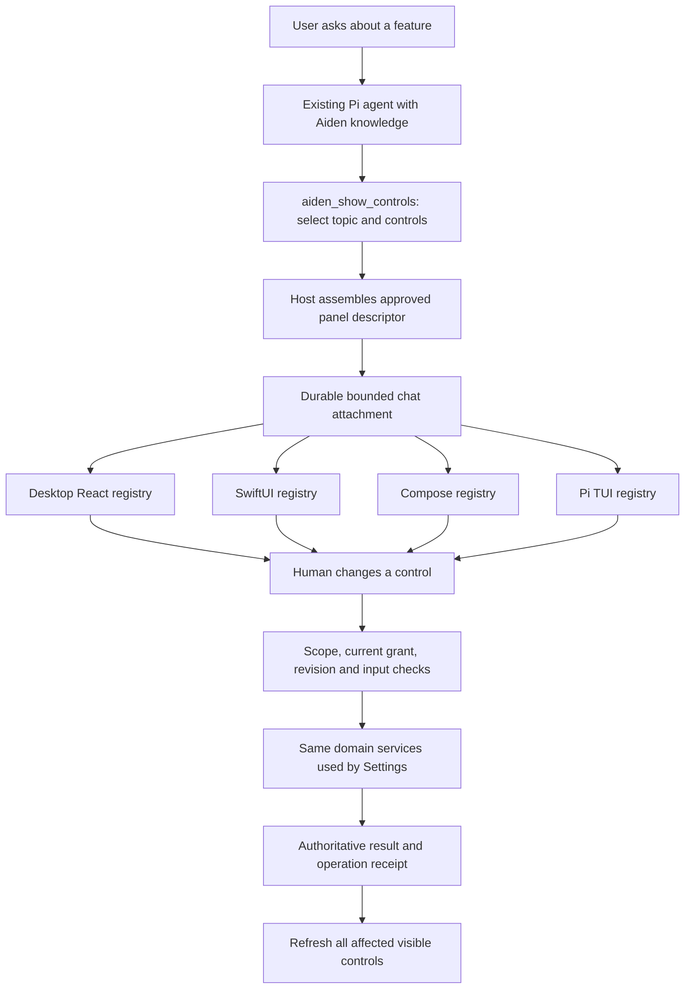

# Interactive Aiden controls inside chat

Status: **Bounded profile implemented in [open PR #312](https://github.com/sambitcreate/aiden-agent/pull/312); automated acceptance is tracked on the PR. Physical release acceptance remains open.**
Date: 2026-10-03.
Implementation update: the bounded MVP described in the [parent plan](aiden-app-knowledge-actions-plan.md#implemented-contract-and-evidence) is implemented. Exact shipped DTOs supersede the proposed names below: assistant `appPanels`, `AppControlPanel` version 1, current host snapshots and four-field typed operations. json-render core/React 0.21.0 renders only the host-assembled desktop template. Native clients and CLI use their existing native controls. Automated acceptance is tracked on PR #312; physical release acceptance remains open.

Parent: [built-in product knowledge and app actions](aiden-app-knowledge-actions-plan.md). This specification expands its MVP to include interactive chat panels on desktop, iOS, Android and the CLI TUI. Mobile controls are required acceptance work, not a future optional integration.

## Product decision

When someone asks about a feature or wants to configure it, Aiden should explain the feature and display the relevant real controls in the conversation. The controls read and change the same settings as the normal Settings screen. A user can continue chatting while the panel remains useful. A switch click calls the application service directly; it does not require another model response, token spend or a suspended agent turn.

The AI chooses the relevant controls and explains them. Aiden supplies their labels, current values, scope, availability and executable bindings. Settings screens remain the full configuration surface; conversational panels are contextual access to the same behavior.

Examples of the intended interaction:

| Request | Inline response and interaction |
| --- | --- |
| “How does memory work? Can I turn it off here?” | Short explanation, Memory group, current global and selected-workspace switches with separate scope labels. Turning one off preserves stored facts and reports the verified result. |
| “Make this easier to read.” | Appearance group with supported theme choices and chat width. Desktop theme changes immediately. A phone explicitly distinguishes its own appearance from the paired host's appearance. |
| “Can you search the web?” | Actual availability and Web Search switch for the executing host. Enabling preserves its configured route/key and makes no search or catalog request. If setup is missing, show that state and an owned setup destination. |
| “What can Aiden do?” | Brief installed-feature overview with a few relevant feature groups; expand a group on demand rather than rendering every setting. |
| “Turn off skills.” | Skills switch with its real scope. The action's independent receipt survives cancellation of the generating run. Product help remains available as a separately owned read function. |
| “Use a different model.” | Later slice: a picker populated from the authorized configured inventory, labeled “This chat.” No invented models, provider defaults changed implicitly or background catalog fetch. |
| “Enable Computer Use.” | Readiness and consent/setup control; the switch must not bypass that domain's existing gates. Supported desktop actions and phone limitations remain explicit. |

Direct instructions such as “turn memory off” may use the typed action immediately when existing policy permits it and then show the verified panel. Do not force every explicit command through a redundant second click. Questions and exploratory requests display controls without changing settings.

## What json-render provides

Inspected local checkout: `/Users/sambitbiswas/projects/opp/json-render`, origin `https://github.com/vercel-labs/json-render`, clean `main` at `fc2a696a50a30cb30c878ab1eb65e102487eea0f` (2026-10-01), matching fetched upstream. Published `@json-render/core` and `@json-render/react` versions observed: **0.21.0**. Apache-2.0. These are research snapshots, not an instruction to follow a moving latest version at implementation time.

json-render is a useful presentation foundation: define a catalog/schema, let a model produce a constrained JSON UI specification, and map its element types to application-owned components. Its flat tree uses `root` and an `elements` map. The state layer supports reads and bindings; registered handlers supply actions. Streaming can assemble partial specifications. None of this supplies Aiden's setting owners, consent, persistence or Remote protocol.

| Inspected implementation | Finding and adoption consequence |
| --- | --- |
| `packages/core/src/schema.ts`, `types.ts` | Catalog/component/action descriptions and typed spec machinery can describe Aiden's restricted control vocabulary. Use a custom catalog, not the broad demonstration catalog. |
| `packages/react/src/renderer.tsx` | Registry-backed React rendering and event dispatch fit Electron. It also executes `watch` bindings when state changes: exclude watchers from the Aiden settings profile. |
| `packages/react/src/contexts/state.tsx`, `packages/react/src/contexts/actions.tsx` | State writes and action dispatch are presentation mechanisms. `setState`, array mutation and navigation are built-ins; unknown actions can warn and return. An Aiden allowlist and explicit failed outcomes are still required. |
| `packages/core/src/actions.ts` | Bindings support model-provided confirmations and success/error actions. These cannot define permission or trusted confirmation text. Reject chaining and generated effect descriptions for settings controls. |
| `packages/core/src/spec-validator.ts` | Useful structural checks for roots, references, misplaced fields and repeat context. This is not Aiden authorization or a complete resource/tree policy. Add explicit cycle, depth, count, bytes and allowed-binding checks. |
| `packages/react/src/schema.ts` | Default prompt/rules include general data and action conventions. Do not let generated sample data represent real current settings. Supply an Aiden-specific schema/prompt. |
| `packages/react-native` | React Native renderer exists, but Aiden's iOS app uses SwiftUI and Android uses Jetpack Compose. This does not provide drop-in renderers for either app. |
| `packages/ink` | Terminal renderer exists for Ink. Aiden CLI owns its terminal through Pi's TUI; use a Pi TUI adapter rather than adding a second Ink terminal root. |
| `examples/harness-chat/lib/agent.ts` and its catalog | Demonstrates agent prose plus structured reports with a Pi harness among the adapters. Its report catalog has no executable settings actions. It is evidence of presentation integration, not an existing Aiden control bridge. |
| Experimental spec composition, WebMCP, Next.js and gateway examples | Not necessary for this feature. Keep Aiden's current Pi execution and local domain services; do not adopt an additional agent, gateway, sandbox or browser automation stack. |

Pinned upstream source references: [catalog](https://github.com/vercel-labs/json-render/blob/fc2a696a50a30cb30c878ab1eb65e102487eea0f/packages/core/src/schema.ts), [React renderer](https://github.com/vercel-labs/json-render/blob/fc2a696a50a30cb30c878ab1eb65e102487eea0f/packages/react/src/renderer.tsx), [actions](https://github.com/vercel-labs/json-render/blob/fc2a696a50a30cb30c878ab1eb65e102487eea0f/packages/core/src/actions.ts), [structural validation](https://github.com/vercel-labs/json-render/blob/fc2a696a50a30cb30c878ab1eb65e102487eea0f/packages/core/src/spec-validator.ts), [Pi harness example](https://github.com/vercel-labs/json-render/blob/fc2a696a50a30cb30c878ab1eb65e102487eea0f/examples/harness-chat/lib/agent.ts). Product documentation: [registry](https://json-render.dev/docs/registry), [data binding](https://json-render.dev/docs/data-binding).

### Dependency decision and spike

Provisional choice: exact-pin core/React 0.21.0 for the desktop presentation layer after a focused spike. Keep Aiden's portable wire contract independent of package-private types. Build small SwiftUI, Compose and Pi TUI renderers over that contract. Do not promise the entire json-render expression engine on mobile.

The React package requires React `^19.2.3`; Aiden's root lock currently resolves React/React DOM **19.2.7**, so this observed lock satisfies the declared peer range. Aiden's root declaration alone (`^19.1.1`) would not prove that. core uses Zod 4, while Aiden's root lock resolves Zod **3.25.76**. Verify dependency resolution and a separately scoped Zod 4 catalog import without upgrading existing Zod consumers incidentally; explicit peer setup/alias or an isolated adapter package may be needed. Do not globally upgrade Zod just to implement panels.

Spike acceptance: render one real Memory group with Aiden components, reject an invalid action/spec, measure production renderer bundle delta, test controlled state updates without automatic effects, verify package peers/build/licenses, and show the identical bounded descriptor through minimal SwiftUI/Compose/Pi TUI views. If the React wrapper adds disproportionate complexity, keep the catalog/spec approach and use Aiden's small registry renderer; document that decision before the production PR. The product contract and native parity must not depend on adopting the library wholesale.

## Aiden architecture



Initial tool: `aiden_show_controls({ topic, controlIds?, scopeHandle? })`. The host resolves a manifest-owned topic, available controls and target scope. Prefer deterministic group templates in MVP: memory, web search, appearance and skills. This already satisfies conversational UI without asking the model to construct a raw spec for every switch. A later layout proposal may reorder approved groups/rows within the same schema; it cannot mint bindings, facts or labels.

The tool returns a compact textual fallback plus a typed panel attachment through the existing tool-result/chat application seam. It is folderless and works under workspace None. Register it as a presentation/read effect, separate from its eventual human-operated mutations. No file write or `render_artifact` call is required. This is persistent conversation content, not an `ask_user_question` request that parks the model or replaces the composer.

Add an owned `appPanels` message attachment (proposed name), stable panel IDs and an explicit bounded placement/sequence contract for prose plus panels. Integrate writes with the chat application service and existing durable stream journal so reads, live events and reconnects agree. Do not infer settings UI from arbitrary Markdown JSON fences or republish the full transcript on every control update. MVP publishes a complete validated panel atomically; partial streaming displays a noninteractive skeleton. Later streaming layouts may become interactive only after validation/commit, with current bindings resolved independently.

Existing `render_artifact` is sandboxed HTML with scripts but no parent-origin authority or network access. Both mobile chat views currently display “Can't view on this device.” Keep that feature unchanged for charts/visualizations. Settings panels render application components directly; never add a privileged settings bridge to generated HTML or use mobile WebViews to solve native parity.

### Portable panel profile

Versioned envelope: `kind: "aiden.controls"`, `schemaVersion: 1`, stable panel/message ID, catalog revision, target reference, bounded specification and accessible text fallback. Wire fields and exact names are proposed; settle them with fixtures before implementation.

The normalized spec retains json-render's `root`/`elements` shape but allows only:

| Component | Purpose | Owned facts |
| --- | --- | --- |
| `SettingsGroup` | Heading and stacked settings rows | Topic title, target/scope label, group help |
| `SettingToggle` | One boolean setting | Label, current value, disabled/readiness reason, allowed operation |
| `SettingSelect` | Small enum choice | Real options and labels; no generated provider/model inventory |
| `SettingSlider` | Later numeric preference with a real domain range | Min/max/step/unit; commit on release/keyboard confirmation |
| `SettingInfo` | Effective state, warning or application timing | Sanitized host facts |
| `SettingAction` | Exact navigation, setup, refresh or domain confirmation | Closed action identity and trusted consequence copy |

Separate editable drafts from confirmed values. MVP elements reference `controlRef` objects resolved from a host-projected control table; they do not contain arbitrary settings paths, raw IPC channels, JavaScript or URLs. The AI cannot provide “current value,” a false label or a consent claim. Keep options, disabled states and permission consequences in the owned projection.

Read-only users can see admitted controls with disabled reasons; displaying a control never grants its operation. App policy Disabled/Ask still governs the permitted effect. No action-observer/devtools/WebMCP exposure of private control state in production; diagnostics record bounded categorical outcome/operation metadata rather than settings values or binding tokens.

Illustrative display spec, not a request capable of granting mutation authority:

```json
{
  "root": "memory",
  "elements": {
    "memory": {
      "type": "SettingsGroup",
      "props": { "topicRef": "memory", "targetRef": "paired-host" },
      "children": ["global", "workspace"]
    },
    "global": {
      "type": "SettingToggle",
      "props": { "controlRef": "memory.global" }
    },
    "workspace": {
      "type": "SettingToggle",
      "props": { "controlRef": "memory.workspace.current" }
    }
  }
}
```

Reject arbitrary `on`, `watch`, mount actions, success/error chains, repeat loops, computed functions, user-generated confirmations, custom components, CSS/style strings and HTML in this profile. A component dispatches its exact host-assigned operation only from a foreground user interaction. Render, hydration, replay, subscriptions, validation and theme changes never write preferences. If draft state uses `$bindState` internally, restrict it to the draft namespace; it cannot mutate confirmed state or authorize effects.

Proposed bounds, finalized by behavioral tests: four panels per response, 24 elements per panel, depth six, eight children per container, 32 KiB serialized panel, 120-character titles, 500-character descriptions, bounded option counts and IDs. Reject cycles, duplicate ownership/unsupported reuse, unknown props/control references and unreachable elements. Keep a separate per-chat aggregate quota and lazy hydration/windowing so old panels do not amplify long-thread costs. Invalid panels degrade to their safe text fallback without losing the rest of the message.

## State, actions and durability

Panel persistence records the inert descriptor and historical result/fallback. Current values are a live projection with a clear target and revision. Reopening a chat resolves those values afresh. Do not persist live capability tokens, device credentials, action grants or keys in messages, exports, model-visible text or logs.

1. Client obtains a sanitized control projection for the panel's original authorized target. The host verifies the descriptor belongs to an accessible chat/workspace and mints bounded session/device-scoped action references where required.
2. A user gesture submits the absolute desired value, control reference, expected domain revision and stable idempotency operation ID. Host identity, actor, permissions and workspace ownership come from the authenticated adapter, not JSON emitted by the model.
3. Host rechecks policy, target, allowed value, lifecycle and revision, then invokes the same application service as the Settings screen. Domain enablement may require its existing foreground confirmation/setup; generated text cannot stand in for it.
4. Display a pending row while the operation runs. Do not label a draft as saved. On success reconcile against the returned effective value/revision/timing and announce the result accessibly. On failure restore authoritative state and display its concrete reason.
5. Publish a bounded invalidation/result event to the affected domain's subscribers. Settings pages and other panels refresh from that service. Remote clients use their existing authenticated stream/reconnect mechanism; no separate unbounded polling loop.

A simple toggle/select can commit immediately on gesture. Multi-field settings use draft plus Apply/Cancel; sliders commit at gesture completion. Limit one pending operation per control; retries reuse the operation ID. Timeout means unknown outcome until the receipt or state is reconciled, not permission to blindly resend a toggle. Domain revision fencing also applies to edits from normal Settings. For new controls prefer monotonic/store version revisions where an intervening A→B→A matters; the existing Memory endpoint's value-derived revision should be evaluated before being treated as a universal transaction model.

A host-issued control reference narrows routing; it is not sufficient authority by itself. Recheck pairing, app policy and domain permission on every effect. Unpairing, workspace deletion, revocation and switching paired hosts invalidate appropriate references. A panel for one Mac must never silently retarget to a newly selected Mac. Stop may cancel a model-issued mutation before admission; clicking an already displayed panel is a separate attended operation and receives its own lifecycle/result. Domain restrictions during active runs still apply.

Old historical panels show refreshed live values when authorized, with a clear “Current settings” label. If refresh is unavailable, show a last-known/stale state and disable writes. No offline queue for preference mutations. Copied/shared/exported transcripts contain static text, never active control authority. Unsupported/new-schema panels degrade to text plus supported setup guidance. On receipt failure preserve the distinction between persisted, effective later and unknown outcomes from the parent plan.

## Desktop, native mobile and CLI behavior

### Desktop

Reuse normal Settings row/control primitives and semantic tokens. Factor presentation primitives only when necessary; share labels/value parsing/application services rather than duplicating per-page behavior. Match grouped card surfaces, inset separators, shared squircle actions and trailing controls. No decorative colored borders or radio-card outlines. Preserve neutral non-text keyboard focus; text focus uses existing background/caret behavior. Use MemoryCardIcon. Follow all four design references listed in the parent plan.

Panels are conversation content, not modals. Keyboard focus remains where the user placed it; completion announcements do not scroll the chat or steal the composer. Controls have names, state, target and disabled reasons for screen readers. Narrow widths stack long labels cleanly. Support keyboard-only input, system text scaling, dark/light themes and reduced motion. Avoid a global giant settings card in every answer.

Use the existing settings subscription/appearance preview ordering. A panel should not overwrite an in-progress multi-field Settings draft silently; disclose external changes and let that surface reconcile. No new permanent renderer-to-main generic executor.

### iOS and Android

Implement a small Codable/SwiftUI and Kotlin serialization/Compose profile decoder and component registry. Use native switches, pickers, rows and accessible actions; do not port the React Native renderer or embed web UI. Share schema fixtures and semantic control IDs with desktop, while matching each client's actual UI conventions, dynamic type/font scale and touch behavior.

First-release mobile acceptance includes Memory and Web Search panels for the paired host, safe supported host appearance controls, scope/readiness/help states, and typed setup/navigation equivalents. Skills controls appear only where the shared service and client permission support them; otherwise explain why. A desktop-only destination offers supported phone guidance or an explicit owned “Open on paired Mac” action if that bridge is implemented, not a dead route. Never claim a phone can perform unsupported Computer Use.

Every panel labels the target: “Paired Mac — [name],” “Workspace — [name],” “This chat,” or “This iPhone/Android device.” Host appearance and local mobile appearance are different settings. A phone cannot receive the desktop chat-width control as if it changes its own chat. If mobile-local preferences are offered, handle them through that client's existing native preference service; they do not change the serving Mac. CLI preferences remain another distinct owner.

Remote contract work is mandatory:

- Add a negotiated panel schema feature (proposed `chat-ui-panels-v1`) and projection support across chat reads, streams, reconnect snapshots and durable history. Inspect the actual parser behavior in each client, not assumptions about unknown-field tolerance. Unsupported clients receive fallback text and their existing known fields.
- Add typed, bounded control reads/operations and receipt lookup over authenticated Remote. Reuse existing routes/domain services where their semantics match. Current `/memory/settings` GET requires `workspace:read`; PATCH requires `workspace:manage`, `If-Match` and `confirmedForeground`. It already supplies a useful behavior seam, but it does not define a general app-controls grant.
- Specify the grant matrix before adding new appearance/Web Search/Skills routes. Proposed narrow read/respond capabilities must go through pairing/negotiation and owner consent; schema support negotiation is not authorization. Reuse existing Memory grants deliberately, and avoid silently widening `chat:write` or `workspace:manage` into unrestricted settings administration. An old grant cannot authorize a newly introduced unrelated effect by accident.
- Bind each operation to the paired device, chat/panel, host and permitted workspace; recheck live revocation and domain setup. Responses/events are projected per device, not broadcast as raw settings documents. Phone keys/credentials never appear in a panel.
- Native fixtures, protocol constants, desktop peers, server and both client tests change together. Claim the next revision after main at integration, resolving pending PR changes normally. Test old/new clients and permission-denied states explicitly.

Existing foreground-confirmation contracts remain honest: a direct phone gesture can establish the client interaction, while the server still requires its authenticated permission and domain conditions. Do not merely send `confirmedForeground: true` from model arguments. Background bots, notifications, scheduled generations and transcript replay cannot operate these panels.

Recommended new Remote vocabulary is `app-controls:read` and `app-controls:respond`, negotiated only after serving-owner consent, with a bounded per-device control/scope allowlist. Existing paired devices do not acquire it automatically. The respond grant covers foreground operations on admitted controls, not arbitrary preference keys or generation-time agent administration. Read projection requires chat access plus the relevant domain grant; simply supporting the panel schema gives neither grant.

| MVP control | Target | Remote admission | Additional domain rule |
| --- | --- | --- | --- |
| Memory global/workspace | Explicit serving host or granted workspace | Preserve existing workspace read/manage requirements; panel operations may wrap that seam without expanding its scope | Existing foreground confirmation, workspace admission and gate effects |
| Web Search | Serving host | New read/respond grant with exact Web Search control allowed | Preserve route/key; existing app policy/setup; no network effect from enablement |
| Appearance theme | Explicit serving host | New read/respond grant with exact presentation control allowed | Reversible presentation; reflect that the paired host changes |
| Desktop chat width | Serving desktop host | Same exact presentation grant | Render only if user is controlling that desktop preference; never label it phone width |
| Skills | Serving host | Exact read/respond control allowlist | Disabling revokes existing authority; enabling respects app/domain confirmation and existing opt-out |
| Mobile appearance | Current phone | Native preference service; no Remote grant or Mac write | Supported device-local values only |
| Provider/Computer Use setup | Supported owned destination | Existing destination/read rights; any new open-on-host action needs its own admitted target | Navigation cannot fetch/authenticate/grant execution; sensitive setup remains trusted |

Final protocol parsers may use different vocabulary if existing capability conventions require it, but preserve this authority separation. Validate migration with an old paired device that has broad workspace grants but no new app-controls consent: unrelated Web Search/appearance/Skills operations remain denied.

### CLI

Use Pi's existing custom TUI component/focus mechanisms to render a compact settings group with keyboard navigation, boolean/select controls and verified receipts. This must remain a single Pi-managed terminal session with scrollback and normal composer input. `/help-aiden` and a proposed `/aiden-settings [topic]` open the same supported control groups. Match actual terminal capabilities rather than pretending desktop widgets exist.

Print/JSON/RPC outputs serialize a static panel descriptor/text fallback; rendering it is never an action. The separate explicit `aiden app set` human command can use the same domain parsers. Interactive focus and confirmation require a TUI; no terminal manipulation or approval bypass in headless modes. Preserve custom config directories, leases, exact app-owned tool classification and truthful reload timing.

## Delivery and acceptance

| Slice | Deliverable | Main acceptance gate | Estimate |
| --- | --- | --- | --- |
| A — package/profile spike | Dependency proof, bounded schema/catalog, one Memory control rendered through desktop/native/TUI seams | No side effects from render; same semantic descriptor; bundle/peer findings recorded | 1–2 days |
| B — knowledge and shared services | Parent plan knowledge/built-in source, domain settings extraction, app policy, state/action receipts | Offline folderless help; real side effects; exact scope/revision; disabled skills stay disabled | 5–8 days |
| C — desktop chat panels | `aiden_show_controls`, durable attachment, React registry, current-state subscriptions, chat/Settings consistency | Actual conversation-to-control test; keyboard/failure/replay/refresh behavior | 3–4 days |
| D — Remote contract | Negotiated projections, grant matrix, typed operations/receipts, reconnect/invalidation | Old clients retain chat; denied/revoked/concurrent operations; no grant widening | 2–3 days |
| E — native mobile renderers | SwiftUI and Compose views/adapters, host/device scope and native setup equivalents | Both native behavioral suites plus end-to-end paired-host operation on each platform | 4–6 days combined |
| F — CLI TUI and packaging | Pi-native renderer, supported control adapters, relocated artifact tests | Full/Ask/None, TUI/headless distinction, no Ink root, reload timing | 2–3 days |
| G — onboarding/release | Help/tour disclosures, artwork if advertised, installed offline and device accessibility matrix | Production/signed package and honest device evidence | 1–2 days plus operator time |

Expanded MVP is roughly **18–28 engineering days**, excluding existing Pi integration, CI queues, physical-device/operator delays and later model/schedule/Live actions. This replaces the parent plan's earlier local-only 8–14-day estimate. The ranges assume a bounded control vocabulary, not a universal generated app UI or reimplementation of all Settings.

Detailed behavioral oracles:

- Real temporary domain stores: panel gesture and Settings edit produce the same durable/effective state, preserving sibling preferences and credentials. No fetch on navigation, theme, help or enablement.
- Real panel parsers: unknown components/operations, cycles, bounds, malicious bindings and stale scope rejected independently in host and native decoders. Reject one bad panel without dropping a chat.
- Render/replay: mounting, restoring history, resolving bindings, changing theme and receiving remote invalidations cause zero writes. Historical mutation is never executed again.
- Two clients and Settings concurrently edit one control: one stale operation conflicts/refreshes; no double flip; timeout plus same-ID retry returns the same operation outcome. Reconnect refreshes latest state without duplicate commits.
- Desktop fake-provider chat produces a Memory panel; click its switch; observe the actual gate and persisted state; reopen chat/relaunch and verify refreshed state. Extend existing e2e surface tests rather than grepping JSX/source.
- SwiftUI/Compose view tests operate controls and assert accessible names, states, pending/error behavior and service results. Shared semantic fixtures validate enum/value compatibility. Run both native focused suites and paired-device acceptance; report emulator versus physical evidence separately.
- Mid-operation unpair/revoke/host switch/workspace delete: effect stays with its original target or is denied, never migrates. No mutation from notifications or background receipt hydration.
- Disabling Skills while generation is active: future skill effects stop and panel receipt reaches the UI despite model cancellation. Memory/Web Search tool admission reflects saved enablement with honest timing.
- CLI real TUI fixture: focus/keyboard change and persisted result; external fake app tool cannot escape None. Headless descriptors cannot execute or wait for a nonexistent interactive prompt.
- Export/package: no grant/credential in copied chat, artifact or telemetry; relocated bundles contain only shipped help; private plans/memory omitted. Long histories hydrate only visible panels with bounded subscriptions.

No implementation tests or bundle/native spike have run for this documentation change. Research conclusions come from source inspection and package metadata; rendering quality, dependency cost and end-to-end device behavior remain implementation gates.

## Later expansion

After the control system is accepted, add exact session model/thinking controls, schedule pause/resume, run Stop and permitted sidebar organization through their existing domain services. Provider/key management, destructive deletion and security grant changes remain dedicated trusted setup/confirmation flows. Explore broader data-driven forms/charts only when a concrete user need justifies extra portable vocabulary. Preserve the same current-state, scope, receipt and native compatibility contracts.
