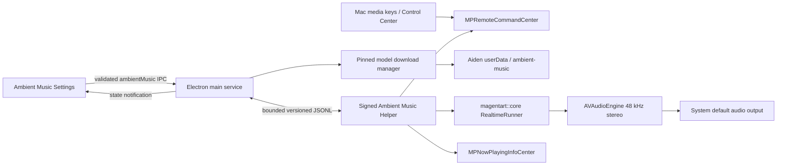

# Ambient Music Plan

Status: Partial — Phases 0–6 source-complete and reviewer-gated; external acceptance pending  
Date: 2026-08-10  
Aiden baseline: `c3d644485e543579bbf478bb1e7355ba6667ce65`  
Magenta RealTime baseline: `v2.0.3` / `694a545e4ba0b88bf1150137b129582166d3e07f`  
Model revision inspected: `010aa0dcb0dfd27b24f0ad07b4dad63e8f9521cc`

Source basis: current Aiden source and planning conventions; Aiden's ChatGPT/Codex UI inspiration and interactive specimen; the supplied MRT2 Collider and modulation screenshots; a local clone at `/tmp/magenta-realtime`; the Magenta RealTime 2 source, model card, application examples, and official documentation; and Apple's Now Playing/remote-command APIs.

Primary references:

- [Magenta RealTime 2 source](https://github.com/magenta/magenta-realtime)
- [Magenta RealTime 2 technical overview](https://magenta.withgoogle.com/magenta-realtime-2)
- [Official models and hardware documentation](https://magenta.github.io/magenta-realtime/models.html)
- [Official Collider documentation](https://magenta.github.io/magenta-realtime/apps/collider.html)
- [Google model card and weights](https://huggingface.co/google/magenta-realtime-2)
- [Apple `MPNowPlayingInfoCenter`](https://developer.apple.com/documentation/mediaplayer/mpnowplayinginfocenter)
- [Apple `MPRemoteCommandCenter`](https://developer.apple.com/documentation/mediaplayer/mpremotecommandcenter)

## Verdict

Ambient Music is a good Aiden feature if it remains **optional, on-device, quiet, and operationally isolated**. It should feel like a background work aid rather than a miniature DAW.

The safe implementation is:

1. A new **Ambient Music** destination under the App group in Settings.
2. A signed, headless Apple-silicon helper that owns Magenta's C++ `RealtimeRunner`, MLX, `AVAudioEngine`, and macOS Now Playing commands.
3. A main-process service that owns the helper, model downloads, persisted preferences, IPC validation, and shutdown behavior.
4. A simple text-prompt mixer with one to six prompt rows and normalized weights. The screenshot's two-dimensional physics surface is inspiration, not the first-release UI.
5. `mrt2_small` as the recommended default. `mrt2_base` is available only after an explicit additional download and a successful local real-time benchmark.
6. No model weights in the Aiden application bundle. A clean install performs no ambient-music network request until the user explicitly chooses a download.

Do not load MLX/TensorFlow Lite into Electron's main process and do not use a Python sidecar. A native helper gives the audio thread and macOS media integration a natural home while containing native crashes, unified-memory pressure, and process teardown.

Do not begin the full feature until Phase 0 proves the helper can stream, pause without continued inference, survive a signed packaged build, and register as the Now Playing app on supported Macs.

## Outcome

A person can open **Settings → Ambient Music**, download an on-device MRT2 model, describe one or more instrumental styles, blend those styles, and start an indefinite background stream. Playback continues when Settings closes and can be paused or resumed from:

- the Ambient Music settings page;
- the Mac's play/pause media key;
- Control Center's Now Playing surface; and
- compatible headphones or external media controls.

The first release should optimize for this loop:

```text
Open Ambient Music
  → explicitly download the recommended model
  → edit a small prompt mix
  → Apply mix
  → Play
  → keep working
  → adjust live weights or pause from anywhere
```

The feature never autoplays on launch, after download, after an app update, or after wake from sleep.

## What the source actually provides

### Magenta RealTime 2

| Finding | Consequence for Aiden |
| --- | --- |
| The source is Apache-2.0 and the model weights are CC BY 4.0 with additional responsible-use language. | Pin provenance, preserve notices, add attribution in Settings/About and `THIRD_PARTY_NOTICES.md`, and show the model terms before the first download. |
| `mrt2_small` is 230M parameters and is documented for real-time use on any Apple Silicon Mac. `mrt2_base` is 2.4B and is documented only for substantially faster Pro/Max-class hardware. | Recommend Small everywhere. Base requires an additional download plus a measured device benchmark; never infer support from RAM alone. |
| The engine outputs 48 kHz stereo audio at a 25 Hz frame rate and targets about 200 ms control response. | The native host should use `AVAudioEngine` with a 48 kHz stereo `AVAudioSourceNode` and report dropped frames and frame time. |
| `magentart::core::RealtimeRunner` already owns the inference thread, lock-free stereo ring buffers, prompt blending, volume smoothing, reset behavior, metrics, and a bypass state that sleeps instead of generating. | Reuse `RealtimeRunner`; route Pause to bypass so GPU work stops, rather than merely muting already-generated audio. |
| The standalone and Collider examples already use `AVAudioEngine`, text prompt arrays, blend weights, model management, and a React/native bridge. | Reuse the engine/audio patterns and message semantics, not the example app's WKWebView, UI styling, `NSUserDefaults`, or broad file-picker surface. |
| Collider sends position-derived weights at about 10 Hz and separately performs text encoding. | Live weight changes should be throttled to about 10 Hz. Text edits should be drafts until Apply/Enter/blur, not re-encoded on every keystroke. |
| The public `set_audio_prompt(path)` method is explicitly a placeholder that creates a fake deterministic embedding; real audio references must be decoded/resampled and passed through `set_audio_prompt_samples`. | The first release is text-prompt mixing only. Do not advertise reference-audio uploads until a separate real decoding/resampling path is implemented and tested. |
| Upstream's example downloader follows the Hugging Face `main` branch, writes directly into `~/Documents/Magenta`, and does not provide Aiden's required pinned-manifest, checksum, atomic-install, or cancellation contract. | Implement an Aiden-owned download manager. Do not copy the downloader unchanged. Store assets under Aiden's device-local application data. |
| The top-level upstream CMake project always adds all examples and frontend builds. | Aiden's native build must compile only `magentart::core` plus the headless host, not the AUv3, Collider, Jam, WKWebView, or npm example targets. |
| MLX requires `mlx.metallib` beside the loading executable. Upstream also statically links MLX, TensorFlow Lite, and SentencePiece. | Package and sign the helper bundle and its colocated metallib as one reviewed nested artifact. Extend package verification to check both. |
| The supported native stack is macOS 14+ on Apple Silicon. | The current Aiden macOS product and helper are arm64. Source contracts still fail closed on unsupported architectures. A future x64/universal Aiden product must omit or never launch this arm64 helper; that whole-app distribution expansion is tracked separately. |

### Inspected download footprint

The exact numbers below come from the inspected Hugging Face revision and must be replaced by the checked-in manifest values when the revision changes.

| Asset set | Approximate download size | Notes |
| --- | ---: | --- |
| Shared MusicCoCa + SpectroStream resources | 1.38 GB | Required by both model sizes. |
| `mrt2_small` model and state | 0.46 GB | Recommended model. |
| Clean Small installation | 1.84 GB | Shared resources plus Small. |
| `mrt2_base` model and state | 2.79 GB | Optional additional model. |
| Clean Base-only installation | 4.16 GB | Shared resources plus Base. |
| Small plus Base installed | 4.63 GB | Shared resources are not duplicated. |

Settings must show manifest-derived sizes, the destination, available disk space, and whether a model is installed, downloading, verifying, ready, failed, or needs repair.

### Aiden

- Settings already has a searchable App group, semantic `FieldSet`, `Field`, `Button`, `Input`, `Textarea`, `Select`, `Switch`, badge, callout, focus, responsive, and reduced-motion primitives.
- Settings mutations are validated in main and persisted in a future-tolerant local settings document. Ambient Music should follow that pattern with a versioned nested configuration rather than loose fields.
- Preload exposes allowlisted IPC prefixes and notification channels. A new `ambientMusic:` API must be added to the same contract and covered by the live-channel inventory test.
- Aiden already packages signed nested helpers and has strict build, signing, notarization, and package verification scripts. Ambient Music should extend those paths instead of creating an unverified release shortcut.
- Aiden's performance plan explicitly calls for process isolation of heavy native work, owned child lifecycles, resumable/verified downloads, and central power policy. Ambient Music should implement that target state from its first release.
- Onboarding ends with a data-driven feature gallery whose assets and count are contract-tested. Ambient Music is a durable core capability and needs its own cohesive 1024 × 1024 transparent PNG and gallery entry when it ships.
- `.memory/` is ignored and absent in this worktree, so there was no project-memory document to consult or update while writing this plan.

## Scope contract

### First release

- macOS 14+ on Apple Silicon only.
- Local inference only; no hosted music generation API.
- Small and Base model management from one pinned official Hugging Face revision.
- One to six text prompts, each with a label and mix weight.
- Live normalized-weight mixing, prompt Apply, reset/regenerate, volume, mute, a no-drums preference, and one restrained variation control.
- Play, pause, and stop from Aiden and macOS media controls.
- System default output device, including normal system routing changes.
- Clear loading, warming, playing, paused, stopping, unsupported, download, verification, low-disk, underrun, helper-crash, and output-device error states.
- No playback or model activity until a user action requests it.

### Deliberate non-goals

- A full Collider-style 2D physics surface.
- Camera gestures, LFOs, MIDI controllers, keyboard performance, note gating, or AU/DAW hosting.
- Audio-reference prompts or sound cloning.
- Recording, exporting, saving, sharing, waveform editing, track history, a seek timeline, or a finite-song abstraction.
- Vocals, lyrics, artist imitation presets, training, or fine-tuning.
- Windows, Linux, or Intel offline/JAX generation.
- Prompt generation through Aiden's chat model. The music model receives only the user's direct local style text.
- A permanent new control in the conversation toolbar for version one. Settings and system media controls are sufficient; a compact global Aiden control can be evaluated after usage data justifies it.

## Product and UI decisions

### Settings placement

Add `ambientMusic` to `SETTINGS_SECTIONS` and `SETTINGS_DESTINATIONS` under **App**, between Voice and Keyboard shortcuts. Use a `Music2` or `AudioWaveform` Lucide icon and search terms such as music, focus, ambient, audio, soundtrack, prompt, mix, and Magenta.

The route remains inside the current settings shell. It should not become a separate app window or copy Collider's dark visual language.

### Page structure

1. **Ambient Music**
   - One-sentence explanation: locally generated instrumental music that continues while Aiden is open.
   - Platform/model status badge.
   - Explicit privacy and battery copy: model files download from Hugging Face only when requested; generation stays on the Mac; playing uses sustained GPU and memory.
2. **Now Playing**
   - A quiet player well with current state, selected model, and compact prompt summary.
   - A segmented 18-band spectral visualizer follows normalized post-gain generated audio while playing and collapses to a quiet baseline while paused, stopped, or running the force-silent Base benchmark. It uses no microphone/system-capture permission and persists no samples; qualification is labeled **Benchmarking**, not Playing.
   - Large circular Play/Pause control, smaller Restart and Mute controls, and an accessible volume slider.
   - No elapsed/duration display because the source is an indefinite live stream.
   - Frame/underrun diagnostics appear only when degraded or inside a disclosed diagnostics row.
3. **Style Mix**
   - One to six rows. Each row has a prompt field, a 0–100 weight slider, exact percentage text, and Remove.
   - **Add style**, **Apply mix**, and **Reset to default** actions.
   - Prompt edits are local drafts. Apply commits the bounded prompt set and starts text encoding; live weights remain responsive without repeated text encoding.
   - Normalize active weights to 100%. Empty prompts carry zero weight. If all weights become zero, retain the prior valid mix and explain the correction instead of silently choosing a style.
4. **Sound**
   - Model selector: Small (recommended) and Base (high quality, benchmark required).
   - No drums switch, restrained Variation slider, and output text `System default`.
   - Hide raw top-k, CFG, unmask width, seed rotation, buffer size, and PCA controls in version one.
5. **Models & storage**
   - Shared resources and per-model rows with exact size/status.
   - Download, cancel, retry/repair, and Remove actions.
   - Deletion requires a confirmation naming the exact model and size; it never removes shared resources while another installed model needs them.
6. **About this model**
   - Attribution to Magenta RealTime 2 / Google DeepMind, code and weight licenses, model limitations, and a concise responsibility notice.

### Visual language

- Reuse Aiden semantic tokens from `renderer/styles.css` and `renderer/shared/appearance.ts`; add no literal Magenta screenshot colors.
- Reuse `FieldSet`, `Field`, button, input, switch, callout, badge, toast, and dialog primitives. Add one reusable semantic slider primitive if no existing accessible range control fits.
- The player is one contained `bg-well` surface, not a dashboard of cards. Prompt rows use separators and stable geometry.
- Hover changes surface contrast and shadow without movement. Press uses inset feedback. Focus uses the existing accent halo.
- Limit motion to the existing control timing, subtle state fades, and the audio-reactive segmented spectrum. Audio changes use native gain ramps; visual motion never represents timeline progress.
- Flatten all visual transitions under Reduce Motion. Sliders remain fully usable with arrow, Page Up/Down, Home, and End keys.

### Accessibility contract

- The play button exposes `aria-label="Play ambient music"` or `Pause ambient music` and `aria-pressed` where appropriate.
- Playback state is announced through one polite live region; failures use an alert. Frequent metrics and weight changes are not announced.
- Each slider has a programmatic label, numeric value, min/max, and keyboard behavior. Percentages and engine state are never color-only.
- Prompt rows preserve focus when weights update. Removing a row returns focus to the next row or Add style.
- Apply reports encoding/ready without moving focus. Download progress is announced at coarse milestones rather than every byte.
- Narrow settings widths stack prompt controls without horizontal scrolling or clipped percentage labels.

## Architecture



### 1. Pinned native dependency

Vendor the reviewed Magenta RealTime source at tag `v2.0.3` / commit `694a545e…` under an explicit third-party path. A git subtree or checked-in reviewed source snapshot is preferable to a runtime/development clone because Aiden's only source repository must contain enough information to reproduce the shipped helper. If a submodule is chosen instead, CI, source archives, and release builds must fail closed when it is absent or at the wrong commit.

The build must select only:

- `core/src/mlx_engine.cpp`;
- `core/src/realtime_runner.cpp`;
- `core/src/autorelease_pool.cpp`;
- `core/src/midi_note_tracker.cpp`;
- the public `core/include/magentart` headers; and
- required Apache license/header material.

Do not build or package the upstream example frontends or host apps. Pin the transitive native versions reviewed upstream: MLX `v0.31.1`, SentencePiece `v0.2.0`, and TensorFlow Lite `v2.21.0`. Record every source revision and license in a machine-readable provenance manifest used by build/package tests.

### 2. Native helper boundary

Add `native/ambient-music/` with an Objective-C++ or Swift/Objective-C++ host built as **Aiden Ambient Music Helper.app**:

- bundle identifier: `com.sambitcreate.aiden-agent.ambient-music`;
- `LSUIElement=true`, no Dock icon, menu, web view, or user-facing window;
- macOS 14 deployment target, arm64 only;
- `RealtimeRunner` plus `AVAudioEngine` / `AVAudioSourceNode` at 48 kHz stereo;
- `MediaPlayer.framework` for `MPNowPlayingInfoCenter` and `MPRemoteCommandCenter`;
- `mlx.metallib` colocated with the helper executable;
- no network client and no model download authority;
- only validated model/resource paths supplied by main;
- bounded stderr diagnostics and a versioned JSONL stdin/stdout protocol.

The helper owns exactly one runner and one audio graph. It serializes lifecycle changes on a controller queue and keeps the render callback free of locks, allocation, logging, IPC, and model mutations.

Supported commands:

```ts
type AmbientMusicHelperCommand =
  | { version: 1; id: string; method: "hello" }
  | { version: 1; id: string; method: "load"; modelPath: string; resourcesPath: string }
  | { version: 1; id: string; method: "setMix"; prompts: AmbientPrompt[] }
  | { version: 1; id: string; method: "setWeights"; weights: number[] }
  | { version: 1; id: string; method: "setSound"; volumeDb: number; variation: number; drumless: boolean }
  | { version: 1; id: string; method: "play" }
  | { version: 1; id: string; method: "pause" }
  | { version: 1; id: string; method: "restart" }
  | { version: 1; id: string; method: "unload" }
  | { version: 1; id: string; method: "shutdown" };
```

Responses echo `id`; unsolicited events have an increasing sequence number. Reject unknown versions/methods, duplicate IDs, lines over the fixed byte limit, non-finite numeric values, paths outside the validated install root, more than six prompts, and prompt text over the product limit.

On EOF, parent death, SIGTERM, or shutdown, fade out, bypass inference, stop the runner, stop `AVAudioEngine`, clear Now Playing state, and exit. Main waits for graceful exit, then terminates after a bounded deadline. A helper crash never crashes Electron and is not restarted in a hot loop; the next explicit Play may perform one bounded restart.

### 3. Audio and power behavior

- Default output gain is conservative (target `-18 dB`) and persisted. Fade in/out over a short click-free ramp.
- Insert a conservative peak limiter in the native audio graph and preserve `RealtimeRunner`'s reset envelope.
- Play loads the selected model if necessary, applies the committed mix, resets to a fresh state, primes buffers, and becomes audible only when ready.
- Pause calls `set_bypass(true)` and updates Now Playing. It does not merely mute; the inference loop must stop generating within 250 ms.
- Keep the loaded model for a short fast-resume window, then unload after a measured idle timeout (initial target: five minutes) to reclaim unified memory.
- App quit, sign-out, or model deletion unloads immediately. System sleep pauses and clears the user's active-play intent; wake never resumes sound automatically.
- Handle `AVAudioEngineConfigurationChange` by rebuilding the output graph against the new system default route, preserving settings but remaining paused after an unrecoverable route failure.
- Report transformer time, total frame time, buffer fill, and dropped frames to main at a low frequency (target 2 Hz). Do not stream 25 Hz metrics into React.

### 4. Native Now Playing integration

The helper registers only Play, Pause, Toggle Play/Pause, and Stop commands through `MPRemoteCommandCenter`. Disable next/previous, seeking, rate, shuffle, and repeat because an ambient stream has no finite track or queue.

Publish metadata through `MPNowPlayingInfoCenter`:

- title: `Ambient Music`;
- artist: `Aiden · Generated on this Mac`;
- album/subtitle: a bounded summary of the committed prompt mix;
- artwork: a bundled square Aiden/Ambient Music mark;
- playback rate/state matching the actual runner state.

Do not invent a duration or elapsed position. Remote command handlers execute the same helper state transitions as Aiden UI commands and emit state events back to main so every open renderer stays synchronized.

Phase 0 must prove macOS assigns the helper/Aiden correctly as Now Playing in a signed package, not just an ad-hoc development process.

### 5. Main-process controller

Add a pure `ambient-music-core` state machine plus an Electron-facing singleton service. Main is authoritative for platform support, installed asset validation, configuration, process ownership, command serialization, stale-event rejection, download/delete exclusion, and renderer notifications.

Recommended public state:

```ts
type AmbientMusicRuntimeState =
  | "unsupported"
  | "not_installed"
  | "downloading"
  | "verifying"
  | "ready"
  | "loading"
  | "encoding"
  | "warming"
  | "playing"
  | "paused"
  | "stopping"
  | "error";

interface AmbientMusicSnapshot {
  revision: number;
  state: AmbientMusicRuntimeState;
  supported: boolean;
  supportDetail: string;
  selectedModel: "mrt2_small" | "mrt2_base";
  models: AmbientMusicModelStatus[];
  committedMix: AmbientMusicMix;
  playing: boolean;
  volumeDb: number;
  diagnostics?: { totalFrameMs: number; droppedFrames: number; degraded: boolean };
  error?: { code: string; message: string; retryable: boolean };
}
```

Each mutation carries the last observed `revision` when stale UI could be destructive or surprising. Serialize load/play/pause/model-switch/delete actions. Weight updates may supersede older pending weight updates but never cross a model or helper generation boundary.

Register narrow IPC methods such as:

- `ambientMusic:get`;
- `ambientMusic:download`;
- `ambientMusic:cancelDownload`;
- `ambientMusic:removeModel`;
- `ambientMusic:setConfig`;
- `ambientMusic:applyConfiguration` (one validated main-owned runtime + persistence transaction);
- `ambientMusic:setWeights`;
- `ambientMusic:play`;
- `ambientMusic:pause`;
- `ambientMusic:restart`;
- `ambientMusic:benchmarkBase`; and
- notification `ambientMusic:changed`.

Parse every payload in main. The renderer never receives filesystem paths, remote URLs, download response bodies, helper stdout, or native stack traces.

### 6. Persisted configuration

Add a tolerant, versioned nested document to `AppSettings`:

```ts
interface AmbientMusicConfigV1 {
  version: 1;
  selectedModel: "mrt2_small" | "mrt2_base";
  prompts: Array<{ id: string; text: string; weight: number }>;
  volumeDb: number;
  variation: number;
  drumless: boolean;
}

interface AppSettings {
  ambientMusic?: AmbientMusicConfigV1;
}
```

Defaults are applied at runtime, not eagerly written. Suggested first-run mix:

- `slow evolving ambient pads, instrumental, calm and spacious` — 70%;
- `soft organic texture, minimal rhythm, warm and unobtrusive` — 30%;
- no drums on;
- Small model;
- `-18 dB` volume.

Bound text length, IDs, array length, numeric ranges, and total serialized size in main. Preserve future unknown keys in persistence while projecting only supported V1 values to runtime, following Aiden's existing forward-compatible settings policy.

Draft prompt text lives only in the mounted Settings component until Apply succeeds. Committed prompts persist only after helper validation/encoding succeeds, so a failed mix does not replace the last working one.

### 7. Model asset manager

Use a fixed, checked-in asset manifest under `resources/ambient-music/`:

```ts
interface AmbientMusicAssetManifest {
  version: 1;
  source: "google/magenta-realtime-2";
  revision: string;
  files: Array<{
    role: "shared" | "mrt2_small" | "mrt2_base";
    relativePath: string;
    size: number;
    sha256: string;
  }>;
}
```

The production URLs are derived from the fixed repository, pinned revision, and allowlisted manifest path. They are not supplied by the renderer or a remote catalog.

Store assets under a versioned descendant of `app.getPath("userData")`, for example:

```text
Ambient Music/
  manifests/<revision>.json
  installs/<revision>/resources/...
  installs/<revision>/models/mrt2_small/...
  installs/<revision>/models/mrt2_base/...
  partials/...
```

Download contract:

1. Network begins only after explicit Download/Repair.
2. Check free space for remaining bytes plus staging and a safety margin.
3. Write only regular `.part` files under the validated partials root.
4. Support HTTP range resume only after validating ETag/revision/expected size; otherwise restart the individual partial.
5. Bound redirects to trusted Hugging Face download hosts and reject scheme/host/path drift.
6. Stream SHA-256 and byte counts; never load an asset into main-process memory as one buffer.
7. Verify every required file before publishing an installation.
8. Atomically rename validated staging into the revisioned install root. An interrupted update leaves the prior valid revision untouched.
9. Cancellation settles only after the response/file handles close. Keep valid resumable partials; remove invalid ones.
10. Delete only manifest-owned, containment-checked targets after confirmation. Shared resources remain while any model needs them.

Normal status reads and music playback are offline. A future **Check for model updates** action may contact the official fixed endpoint explicitly; it must never become an automatic launch/read call.

### 8. Model selection and benchmark

Small is always the recommended option on a supported Mac. Base is not enabled merely because a chip name looks recent.

After Base downloads, run an explicit benchmark with output muted:

- load the exact model/resources;
- apply a fixed checked-in prompt and seed;
- warm up;
- generate enough frames to cover a sustained interval;
- record p50/p95 total frame time and underruns;
- require p95 under the 40 ms frame budget with no dropped frames and adequate headroom established in Phase 0;
- persist the result keyed by helper version, model manifest revision, hardware identifier, and OS version.

An unknown future chip can qualify by benchmark. A failed benchmark keeps Base installed but labels it **Not recommended for live playback on this Mac**; the user can remove it or rerun after an app/model update. Do not silently fall back to Small in the middle of playback.

## End-to-end lifecycle

```text
Settings opens
  → main returns platform + install + persisted-config snapshot (offline)
  → unsupported: explain and stop
  → not installed: show exact explicit download action
  → download → verify → atomic install → ready (still paused)
  → user applies text mix
  → main validates bounded mix
  → helper starts if needed and loads validated paths
  → helper encodes prompts; success commits config
  → user presses Play
  → helper resets, primes, fades in, publishes Now Playing
  → weight changes coalesce at ~10 Hz
  → media key or UI Pause uses the same helper transition
  → bypass stops inference; idle timer later unloads model
  → quit/sleep/delete fades out, clears Now Playing, and settles helper ownership
```

## Expected Aiden file map

The exact split may change after Phase 0, but implementation should remain close to this ownership map.

```text
docs/plans/ambient-music-plan.md
native/ambient-music/
  CMakeLists.txt
  Info.plist
  AmbientMusicHost.mm
  AmbientMusicProtocol.*
  AmbientMusicNowPlaying.*
  AmbientMusicAudioEngine.*
  tests/...
resources/ambient-music/
  asset-manifest.json
  LICENSE.magenta-realtime.txt
  LICENSE.model-weights.txt
  ambient-music-artwork.png
scripts/build-ambient-music-helper.mjs
scripts/build-ambient-music-helper.test.mjs
main/services/ambient-music-core.ts
main/services/ambient-music.ts
main/services/ambient-music-download-core.ts
main/services/ambient-music-download.ts
main/services/ambient-music-*.test.ts
main/handlers/ambient-music.ts
renderer/components/settings/ambient-music-settings.tsx
renderer/components/settings/ambient-music-player.tsx
renderer/components/settings/ambient-music-mixer.tsx
renderer/components/settings/ambient-music-settings.test.tsx
renderer/lib/ambient-music-core.ts
renderer/lib/ambient-music-core.test.ts
renderer/assets/onboarding/features/ambient-music.png
```

Existing files expected to change include `package.json`, release/build/sign/verify scripts, `THIRD_PARTY_NOTICES.md`, both main and renderer settings types/normalizers, Settings routing and navigation, preload channels, renderer IPC/query bindings, onboarding data/tests, README privacy/features only when shipped, and the plan inventory/status.

## Delivery plan

## Phase 0 — feasibility, provenance, audio, and package proof (4–7 days)

Build no production Settings UI. Use a disposable native spike and record results in an ADR.

### Work

1. Pin and inventory Magenta `v2.0.3`, MLX, TensorFlow Lite, SentencePiece, code licenses, model revision, file sizes, and content hashes.
2. Build only `magentart::core` plus a minimal arm64 host from a path containing spaces.
3. Load Small from an Aiden-owned temporary model root and stream 48 kHz stereo through `AVAudioEngine` for at least 30 minutes.
4. Prove text-prompt encoding, six-prompt normalized mixing, 10 Hz weight updates, restart, volume ramp, no-drums, and bypass.
5. Measure startup/load time, steady unified memory, CPU/GPU/energy, p50/p95 frame time, buffer health, and pause-to-no-inference latency on at least an Air-class Apple Silicon Mac.
6. Build the Now Playing proof with play, pause, toggle, and stop from keyboard media keys, Control Center, and Bluetooth/headset control.
7. Put the helper and metallib in an Aiden development package; ad-hoc sign, launch, pause, quit, and verify no orphan remains.
8. Prove direct helper spawning has correct bundle identity and run-loop behavior. If not, compare a LaunchServices-launched helper with a private local socket.
9. Kill the helper during loading and playback. Confirm Aiden survives, audio stops, Now Playing clears, and one explicit retry can recover.
10. Run Small alongside a representative local Aiden model/chat workload to establish contention and frame-drop limits.

### GO criteria

- Signed packaged Small playback remains real-time on the lowest supported test Mac with no sustained underruns.
- Prompt Apply and live weights alter audio without blocking Electron or rebuilding the audio graph.
- Pause stops inference within 250 ms and produces silence without a click; idle unload returns most model-owned memory.
- macOS system media controls consistently target the helper and reflect real play/pause state.
- Helper crash/kill and audio-route change cannot crash or hang Electron.
- Model/resource paths can live under Aiden Application Support; no dependency on `~/Documents/Magenta` or `MAGENTA_HOME` remains.
- The targeted native build does not compile/package upstream example apps or perform model downloads.
- The measured packaged size and build time are accepted before product work begins.

If Now Playing cannot be made reliable from the isolated helper, stop and reassess whether a minimal main-app native bridge can own only MediaPlayer commands while inference stays isolated. Do not replace the proof with global Electron shortcuts that compete for media keys.

## Phase 1 — reproducible helper and lifecycle service (5–8 days)

- Add pinned source/provenance and a targeted CMake build.
- Implement the helper protocol, strict parsing, monotonic state events, render-safe audio graph, limiter, fade, sleep/wake, route-change, and Now Playing behavior.
- Add a build script that outputs a deterministic nested helper bundle with `mlx.metallib`.
- Add the main pure state machine and persistent child controller with bounded startup, request, idle, shutdown, and crash behavior.
- Register shutdown-barrier disposal so quit waits only for the documented deadline.
- Add platform/architecture/OS gates and helper self-test/status endpoints.

Exit gate: a development Aiden process can drive the helper through its full lifecycle using typed service calls, and native/unit tests cover invalid protocol input, duplicate/stale messages, crash, timeout, EOF, and shutdown.

## Phase 2 — verified model management (5–8 days)

- Check in the exact official asset manifest and legal notices.
- Implement status validation, free-space calculation, pinned URL construction, redirect policy, resumable partials, streamed hashing, cancellation, retry/repair, atomic publish, and bounded deletion.
- Keep download and helper load/delete mutually serialized.
- Add Small and Base metadata plus benchmark result storage.
- Add the muted Base benchmark and conservative qualification policy.
- Expose status and progress through typed IPC without filesystem paths.

Exit gate: clean install, interrupted download, low disk, offline failure, redirect rejection, size/hash mismatch, cancellation, retry, repair, update staging, model removal, and prior-valid-install preservation all pass automated or fixture-backed tests.

## Phase 3 — Settings player and mixer (5–7 days)

Implementation status (2026-08-11): **complete and reviewer-gated GO.** Settings now provides explicit model download/repair/removal, truthful Now Playing state, an accessible prompt mixer, ordered live controls, rollback-safe Apply, committed-mix recovery, revision-monotonic renderer updates, and an audio-reactive 18-band segmented spectrum sourced from bounded native post-gain telemetry. The settled visualizer gate passes 103 TypeScript tests, the native DSP self-test, two helper protocol tests, 21 soak contracts, 47 packaging contracts, 94.45% scoped line coverage (100% for the visualizer component), type-check, scoped lint, the production renderer/main build, diff hygiene, and two independent final no-edit reviewer GOs. Force-silent Base qualification is projected as Benchmarking with unavailable telemetry from its first loading snapshot through cleanup.

- Add the Settings route, search metadata, icon, renderer types, API, query, and `ambientMusic:changed` subscription.
- Add the status/setup, Now Playing, Style Mix, Sound, Models & storage, and attribution sections using Aiden primitives.
- Add a reusable accessible range control if necessary.
- Implement draft-versus-committed prompts, Apply state, one-to-six rows, live normalized weights, add/remove focus behavior, reset confirmation, and responsive layouts.
- Keep the view a projection of main state; unmounting the page never stops playback.
- Add error recovery and coarse live-region announcements.

Exit gate: the full clean-install-to-playing flow works by keyboard and VoiceOver at narrow and wide settings widths, with light/dark/high-contrast/reduced-motion appearances and no direct renderer network/filesystem access.

## Phase 4 — system integration, power, and degradation handling (3–5 days)

Implementation status (2026-08-11): **code/automated gate complete; production acceptance pending.** The 2 Hz degradation monitor, MediaPlayer ownership, terminal-state-preserving route recovery, suspend/resume fencing, five-minute idle unload with RSS-reclamation evidence, bounded quit teardown, offline/network observation, and aggregate-only acceptance harness passed two fresh independent reviews. The user-authorized real Small-model four-hour/overnight receipt and packaged physical media/headset/signing/notarization checks remain release evidence; no model was downloaded automatically to manufacture that evidence.

- Complete media-key/Control Center/headset acceptance against the production player.
- Add app activation, window close, sleep/wake, output-route changes, helper idle unload, and quit semantics.
- Surface dropped-frame degradation with a quiet recommendation to pause heavy local work, use Small, or retry; do not silently change models.
- Confirm Aiden window/background throttling does not desynchronize player state.
- Add optional local aggregate diagnostics for state duration, crashes, underruns, and model size only if Aiden has an established private telemetry path; never store prompts or audio.

Exit gate: a four-hour mixed workload and an overnight paused soak leave no orphan, hot loop, unexpected network call, repeated notification, or unbounded memory/log growth.

## Phase 5 — onboarding, documentation, packaging, and legal (3–5 days)

Implementation status (2026-08-11): **source/automated gate complete and reviewer-gated GO; external acceptance pending.** The onboarding tile/transparent asset, helper-enabled development packaging, loose/ASAR/archive model-asset guards, immutable fetched/configured/compiled dependency lock, exact packaged licenses, helper signing checks, and helper-less development state passed two final independent reviews. A fresh clean native build and signed arm64 development app passed strict package verification against its sealed bundle/CDHash/app.asar/CodeResources identity and contains no model weights. The current product artifact remains arm64; whole-app x64/universal distribution is a separate proposed plan rather than an untested Ambient Music claim.

- Add the final-tour **Ambient Music** bento tile and its optimized 1024 × 1024 transparent PNG. The tile explains local live focus music; it does not trigger a download during onboarding.
- Update the onboarding asset-count/alpha/dimensions contract and preserve hover, focus, responsive, and reduced-motion behavior.
- Update README features/privacy/architecture and About/third-party notices only when the feature ships.
- Document the network boundary, local asset location, disk use, supported Macs, removal, power cost, licenses, and troubleshooting.
- Extend `build:native`, `build:native:optional`, development runtime preparation, `extraFiles`, `mac.binaries`, signing options, package verification, distribution checks, and release consumer checks.
- Verify exact helper tree, executable mode, arm64 architecture, macOS minimum, bundle identifier, hardened runtime, entitlement set, Developer ID signature, notarization, metallib presence, code/model notices, and the absence of model weights from app/DMG/ZIP.

Automated/source exit gate: a fresh helper-enabled arm64 development package passes offline verification, contains every locked notice, and contains no model bytes in loose resources or ASAR. External release acceptance still requires a signed/notarized distribution app/DMG/ZIP plus the user-authorized Small download and physical playback checks. Intel launch belongs to the proposed whole-app universal distribution plan because Aiden does not currently publish an x64 product.

## Phase 6 — staged release and follow-up (2–4 days plus soak)

Implementation status (2026-08-11): **source/automated gate complete and reviewer-gated GO; external canary acceptance pending.** `AIDEN_AMBIENT_MUSIC_ENABLED=0` prevents manager/helper construction and Ambient IPC registration, removes Ambient Music from Settings navigation/search/direct routes, the command palette, assistant-visible Settings inventory, and onboarding, and preserves prompt configuration plus downloaded model data for re-enable. The default-on path retains the complete feature. Two fresh independent reviews, the canonical repository suite, type-check, full lint, coverage, and exact package verification passed.

- Ship behind a compile-time or local rollout flag for the first canary builds while keeping the plan status Partial.
- Canary Small on at least M1/M2 Air-class and Base on hardware that passes the benchmark.
- Record model load time, helper crash recovery, underruns under local-agent workloads, package size, and idle unload results without recording prompt content.
- Fix release-blocking lifecycle, loudness, download, signing, or control-center failures before enabling by default.
- After the original first-release scope passes and ships, move this plan to `docs/plans/completed/` and update the plan index. Collider surface, MIDI, recording/export, and audio-reference prompting belong in new follow-on plans.

## Test matrix

### Pure/main tests

- Platform, architecture, macOS, helper-version, model-manifest, and Base-benchmark gating.
- Strict prompt/mix/config parsing: array length, IDs, Unicode, control characters, byte limit, finite numbers, clamping/rejection, normalization, and future-field retention.
- State transitions and command serialization across download, verify, load, encode, warm, play, pause, restart, switch, delete, crash, retry, sleep, and quit.
- Helper protocol line bounds, response correlation, event sequence rejection, timeout, EOF, invalid JSON, stderr/output caps, restart budget, and parent disposal.
- Download path containment, fixed-host/revision URL generation, redirect policy, disk budget, partial resume, ETag drift, byte/hash mismatch, cancellation settlement, atomic publish, repair, shared-resource reference counting, and deletion.
- Settings section parsing/search and the live IPC prefix/notification inventory.
- Query synchronization when remote media controls change state while Settings is mounted or unmounted.
- Onboarding feature count, unique illustration, 1024 × 1024 PNG, alpha channel, title/description, focus/hover, and reduced-motion contract.
- Package manifest tests that fail on missing helper, metallib, licenses, unreviewed architecture/entitlements, or accidentally bundled model files.

Register every new test file in the narrow `package.json` script used by CI; add a dedicated `test:ambient-music` script and include it in `pretest`/coverage as appropriate.

### Native tests

- Protocol parser and serializer with malformed/fuzzed lines.
- Prompt and weight bounds before calling `RealtimeRunner`.
- Audio state transitions, gain ramp, limiter, bypass, idle unload, and repeatable shutdown.
- Now Playing metadata and command handlers through injectable adapters where Apple APIs cannot be driven in a unit process.
- Route-change and no-output-device behavior.
- `--self-test` verifies metallib/framework loading without requiring a model; a separate opt-in installed-model smoke performs a muted short generation.

### Manual packaged acceptance

| Area | Required checks |
| --- | --- |
| Setup | Supported/unsupported Macs, no network before click, exact size/destination, low disk, cancel, resume, offline retry, corrupt partial, repair, remove. |
| Playback | First play, loading/warming, pause/resume, restart, volume/mute, no drums, safe loudness, no clicks, settings close/reopen. |
| Mixing | Add/edit/remove six prompts, Apply failure, live weights, all-zero prevention, rapid changes, Unicode, long prompt rejection. |
| macOS | Keyboard media key, Control Center, Bluetooth/headset, app unfocused, window closed, sleep/wake, default output device change. |
| Contention | Hosted chat, local model chat, transcription, terminal load, Computer Use, Small/Base benchmark, degraded-frame message. |
| Lifecycle | Helper crash during load/play, renderer reload, app update/relaunch, quit while downloading, quit while playing, five-minute idle unload, overnight pause. |
| Appearance | Light, dark, high contrast, custom palettes, narrow window, VoiceOver, keyboard-only, Reduce Motion. |
| Release | Current arm64 development and Developer ID builds, notarized DMG/ZIP, updater replacement, clean uninstall/re-download. Whole-app x64/universal packaging is tracked in its own proposed plan. |

## Release acceptance criteria

The feature is ready only when all of the following are true:

1. A clean Aiden install performs zero Ambient Music network requests until an explicit model download.
2. The renderer has no direct filesystem, helper, or network access; main validates every mutation.
3. Small installs atomically, survives interrupted downloads, plays on the supported Air-class canary, and remains offline afterward.
4. Play/Pause works from Aiden, media keys, Control Center, and a remote accessory, with one authoritative synchronized state.
5. Pause stops inference promptly; idle unload reclaims memory; quit/sleep leave silence, no Now Playing item, and no owned helper.
6. Prompt Apply and live weights work without blocking chat/UI input or producing an all-zero/invalid engine mix.
7. Base cannot present itself as real-time-ready without a current passing benchmark.
8. Native failure cannot take down Electron, and bounded recovery does not create a restart loop.
9. Model weights never appear in the application bundle, ASAR, DMG, ZIP, updater payload, logs, or portable configuration.
10. Prompt text and generated audio are never sent to Aiden providers, Hugging Face, telemetry, crash logs, or usage records.
11. Attribution, licenses, model terms, privacy, disk, hardware, and sustained power cost are visible before download and in durable documentation.
12. Full targeted, onboarding, IPC, native, type-check, lint, build, package, sign, notarize, and installed acceptance gates pass.

## Primary risks and mitigations

| Risk | Mitigation |
| --- | --- |
| Small is not truly real-time under simultaneous local coding-model load. | Phase 0 contention benchmark, Small default, dropped-frame diagnostics, no silent quality claim, and a canary gate. |
| Base support heuristics become stale as Apple ships new chips. | Qualification by measured helper/model/hardware/OS benchmark rather than a fixed marketing whitelist. |
| Native MLX/TFLite failure crashes Aiden. | Separate signed helper, strict protocol, bounded restart, and main-owned state recovery. |
| Pause still consumes meaningful GPU. | Use `RealtimeRunner` bypass, measure stop-to-idle, then unload after a short timeout. |
| Large model downloads corrupt or fill disk. | Exact manifest, free-space margin, resumable partials, streamed hashes, atomic publish, and prior-version preservation. |
| Remote media commands diverge from UI state. | One helper state machine emits sequenced events to main; renderers only project the main snapshot. |
| Generated audio is unexpectedly loud or resumes at a bad time. | Conservative gain, limiter, fades, no autoplay, no wake resume, and real pause rather than mute. |
| A reference-audio picker appears to work but uses upstream's fake placeholder embedding. | Text-only first-release contract; separate follow-on implementation through `set_audio_prompt_samples`. |
| Upstream changes break reproducibility or licensing. | Pin source and model revisions, check hashes/provenance, review updates explicitly, and run package/license guards. |
| The UI grows into a DAW and distracts from Aiden's workbench. | Settings-only authoring, small prompt-row mixer, progressive disclosure, and explicit non-goals for physics/MIDI/recording. |

## Rollback

Set `AIDEN_AMBIENT_MUSIC_ENABLED=0` before launch to hide the Settings destination and onboarding advertisement, skip Ambient IPC registration, and prevent manager/helper construction without deleting installed model data or prompt configuration. Re-enabling restores the same future-tolerant settings document and device-local assets. Users can remove downloaded models from the last supporting version or manually delete the documented Ambient Music data directory after quitting Aiden.

Removing the feature from a release must also clear Now Playing state and terminate the helper during upgrade/first launch reconciliation; it must never leave a background process from an older app version.
