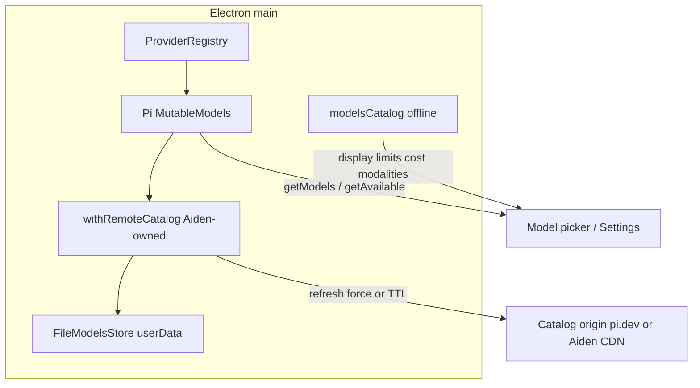

# Dynamic Model Catalog Plan

Status: Partial — Pi's device-local models store, cache-only hydration, and explicit
provider refresh are implemented; the remote overlay for otherwise-static hosted
providers is not.
Date: 2026-07-24  
Source audited: local `/Users/sambitbiswas/projects/pi` (`packages/coding-agent` remote catalog + `packages/ai` Models/ModelsStore)  
Related: `docs/plans/pi-provider-integration-plan.md` (Phases 1–2 already call for `ModelsStore` + refresh; this plan owns the **remote overlay** that plan deferred)

## Outcome

Aiden users should get newly published hosted models (for example Opus 5) **without waiting for an Aiden app release**, by refreshing a device-local catalog overlay — the same product idea as Pi’s `pi update --models` / `/model` refresh.

When this ships:

1. Built-in Pi providers still ship with a static baseline catalog from `@earendil-works/pi-ai`.
2. Aiden can overlay newer model records from a trusted remote catalog endpoint.
3. Overlays persist under Electron `userData` and work offline after the last successful fetch.
4. Soft refresh respects a TTL; force refresh is an explicit user/settings action (and optionally a CLI/dev script).
5. Capability display metadata stays on Aiden’s existing offline precedence (local discovery → Artificial Analysis cache → bundled models.dev snapshot) unless a later phase deliberately extends overlays into that layer.

## Non-goals

- Adding `@earendil-works/pi-coding-agent` as a dependency (rejected in the provider plan: executable config, extensions, larger attack surface).
- Contacting **models.dev** from the live app on ordinary reads (current `AGENTS.md` policy). Dynamic inventory must use a different trusted source, or an explicit policy amendment.
- Making Artificial Analysis the source of selectable model IDs (it remains suggestion/ranking metadata).
- Replacing Ollama / LM Studio / custom OpenAI-compatible discovery (`main/services/models.ts`). Those stay provider-endpoint discovery.
- Shipping Pi’s Radius gateway as required infrastructure for catalog refresh.

## Current Aiden state

| Layer | Today | Gap |
| --- | --- | --- |
| Selectable hosted models | Pi `builtinModels()` is authoritative for built-ins and provider-owned dynamic catalogs | Providers without their own dynamic fetch still require a Pi pin bump **and** an Aiden release |
| Capability metadata | Bundled `resources/model-capabilities.json` via `npm run models:refresh`; AA device cache on Connect & fetch | Offline by design; not the Opus-5 availability problem |
| Pi registry | `ProviderRegistry` + `builtinModels({ credentials, modelsStore })`; cache-only hydration and explicit force refresh are wired | No Aiden-owned remote overlay for otherwise-static providers |
| Device-local store | `pi-models-store.ts` persists Pi `ModelsStoreEntry` snapshots under Electron `userData` | The store can retain provider-owned dynamic results, but it cannot create a remote path for a static provider |

Pi coding-agent reference (do not import the package; mirror the pattern):

- `withRemoteCatalog` in `packages/coding-agent/src/core/remote-catalog-provider.ts`
- `GET https://pi.dev/api/models/providers/{providerId}`
- Persist `{ models, checkedAt }` in `models-store.json`
- TTL `4 * 60 * 60 * 1000`; `force: true` bypasses TTL
- Merge: remote id replaces baseline; new ids append
- `404` / `501` = overlay unavailable, keep cache
- Reads stay sync via `getModels()`; network only in `refreshModels` / `Models.refresh`

## Architecture decision

### Catalog source (choose before Phase 0 exit)

Three options. Prefer **A** for speed-to-parity with Pi; prefer **B** if Aiden must not depend on `pi.dev`.

| Option | Source | Pros | Cons |
| --- | --- | --- | --- |
| **A. Consume pi.dev overlays** | Same endpoints Pi uses | Zero publish infra; Opus 5 appears when Pi publishes | Couples Aiden availability to Pi’s CDN/schema; User-Agent / attribution policy needed |
| **B. Aiden-hosted catalog CDN** | Publish from Aiden CI (reuse `scripts/update-model-capabilities.mjs` + generated Pi model JSON) to an Aiden-controlled HTTPS origin | Privacy/product ownership; can ship Aiden-specific filtering | Ops, signing, cache headers, schema versioning |
| **C. Live models.dev on explicit refresh** | `models.dev` only from a user-triggered “Fetch model catalog” path | Familiar to current release tooling | Requires amending `AGENTS.md`; couples to third-party uptime/shape; mixes inventory with capability snapshot |

**Recommendation:** Option **A** for an MVP that matches the tweet’s behavior, with a hard interface so Option **B** can replace the base URL and response parser later. Do **not** use Option C for inventory unless product explicitly revises the models.dev boundary.

Keep `npm run models:refresh` / `npm run dist` as the **only** models.dev writers for the **bundled capability snapshot**. Dynamic inventory is a separate channel.

### Where the overlay lives

- **Inventory authority for Pi built-ins:** `Models.getModels()` after overlay merge.
- **Display/capability authority:** existing `modelsCatalog` (unchanged in MVP).
- **Local/custom providers:** unchanged discovery paths; no remote overlay wrapper.

### Dependency policy

- Stay on public `@earendil-works/pi-ai` (bump only if refresh/`ModelsStore`/`force` contracts need a newer pin; `0.80.10` already exposes `Models.refresh`, `modelsStore`, and `createProvider({ fetchModels })`).
- Copy/adapt `withRemoteCatalog` into Aiden (`main/services/remote-catalog-provider.ts`), not via coding-agent.
- Wrap providers when composing the registry — same as Pi’s `ModelRuntime.create` mapping — excluding providers that already own dynamic fetch (Radius if/when enabled; Ollama/LM Studio customs).

## Product and security boundaries

1. Offline-first: startup restores `ModelsStore` with `allowNetwork: false` (or refresh that short-circuits to cache) before any UI model list.
2. Soft network refresh is optional and throttled (default 4h, match Pi unless product wants longer).
3. Force refresh is explicit: Settings action and/or developer script; never silent infinite polling.
4. Catalog HTTP uses HTTPS only, fixed allowlisted origin(s), timeout (15s like Pi), abort on window/app quit.
5. Responses are validated (id, api, provider, required numeric fields) before write; reject partial poison that would wipe a good cache (write only after successful parse; on failure keep previous entry).
6. No credentials in catalog requests for MVP (Pi’s pi.dev route is unauthenticated). If Option B later needs auth, use app-attested or anonymous install id carefully — no provider API keys on catalog GETs.
7. Renderer never sees raw store files or fetch URLs as mutable config; IPC exposes status DTOs only.
8. Failure UX: keep cached/static models; show a concise error (same spirit as Pi’s “showing cached models”).
9. Do not auto-select a newly appeared model; only expand the choosable set.
10. Historical chats that reference unknown models keep recovery/disabled state (provider plan Phase 5).

## Phased delivery

### Phase 0 — Policy and contract freeze

**Decide**

- Catalog origin Option A vs B (URL constant, schema version, User-Agent string e.g. `aiden/<version>`).
- Whether soft refresh runs on model-picker open, on app idle, both, or settings-only.
- Amend product docs: dynamic inventory ≠ models.dev live reads.

**Deliverables**

- This plan accepted; short note in `.memory/PLANNED.md`.
- If Option A: confirm `pi.dev` response shapes against live fixture capture in tests (keyed object / `{ models: [] }` / array — Pi already accepts all three).
- Schema: `ModelsStoreEntry` = `{ models: Model[], checkedAt?: number }` per provider id.

**Exit gate:** Written ADRs for origin, TTL, force-refresh UX, and offline behavior.

### Phase 1 — Durable `ModelsStore` (unblocks provider plan Phase 1)

Files:

- new `main/services/pi-models-store-core.ts`
- new `main/services/pi-models-store.ts`
- tests under `main/services/pi-models-store*.test.ts`

Tasks:

1. Implement Pi’s `ModelsStore` interface with atomic JSON under `userData` (e.g. `pi-models-store.json`), file locking pattern consistent with `EncryptedPiCredentialStore` / auth backends.
2. Permissions `0600` where feasible; corrupt-file → empty store + warn log, never crash startup.
3. Unit tests: concurrent writes, round-trip, delete provider, corrupt JSON.

**Exit gate:** Store usable by `builtinModels({ credentials, modelsStore })` with no network.

### Phase 2 — Remote overlay wrapper + registry wiring

Files:

- new `main/services/remote-catalog-provider.ts` (+ tests with mocked `fetch`)
- `main/services/provider-registry.ts`
- possibly thin `main/services/model-catalog-runtime.ts` for refresh coalescing

Tasks:

1. Port Pi’s `withRemoteCatalog` semantics (merge, TTL, force, 404/501, in-flight dedupe, abort).
2. Construct registry as: for each built-in (except excluded dynamic providers), `setProvider(withRemoteCatalog(provider, catalogBaseUrl))`.
3. Pass `modelsStore: piModelsStore` into `builtinModels` / `createModels`.
4. On registry init: `await models.refresh({ allowNetwork: false })` to hydrate overlays from disk.
5. Expose `refreshModelCatalogs({ force, signal })` on a main-process service; coalesce concurrent callers; 15s timeout.

**Exit gate:** With a mocked catalog server, a new model id appears in `getModels()` after force refresh and survives process restart offline.

### Phase 3 — IPC + Settings UX

Files:

- `main/handlers/*` (providers or new `model-catalog` channel)
- `renderer/preload.ts`, `preload-channels.ts`
- `renderer/lib/ipc.ts`, `queries.ts`, `types.ts`
- `renderer/components/settings/model-data-settings.tsx` (or sibling section)
- `renderer/components/model-picker.tsx` (optional soft refresh + status line)

Tasks:

1. IPC: `modelCatalog:status` → `{ lastCheckedAt, lastError?, refreshing, originLabel }`.
2. IPC: `modelCatalog:refresh` → force refresh; invalidate provider/model queries.
3. Settings copy parallel to Artificial Analysis: explain overlay is inventory only; offline after fetch; button **Refresh model catalogs**.
4. Model picker: optional background soft refresh (TTL) with non-blocking status (“Refreshing…” / “Updated” / “Using cached catalogs”).
5. Respect Reduce Motion / no spinner spam; use existing semantic tokens (review ChatGPT UI refs before new chrome).

**Exit gate:** Manual force refresh in Settings updates picker lists without relaunch; offline after success still lists overlay models.

### Phase 4 — Wire selectable lists to Pi inventory

Depends on progress of `docs/plans/pi-provider-integration-plan.md` Phases 2–5.

Tasks:

1. Hosted Pi providers: stop treating static Aiden preset arrays / hand-maintained id lists as source of truth; use registry snapshots (`getModels` / `getAvailable`).
2. Ensure Anthropic / OpenAI / others that still use compat adapters at least **list** overlay ids even if streaming still goes through current adapters (listing can ship before full stream migration).
3. Google / Codex already Pi-native: verify overlay ids flow through their services.
4. Keep local discovery for Ollama/LM Studio unchanged.

**Exit gate:** A newly published Anthropic (or OpenAI) id from the overlay is choosable when the provider is configured, without bumping Aiden’s release artifact.

### Phase 5 — Capability snapshot coexistence

Tasks:

1. Document precedence when overlay has a model the bundled models.dev snapshot lacks: chat must still run with Pi-exact limits when present; display falls back to conservative unknowns (existing `models-catalog-core` behavior).
2. Optionally extend release `models:refresh` to run more often in CI without blocking users.
3. Do **not** auto-call models.dev from the app.

**Exit gate:** Missing capability rows never block selecting/streaming an overlay model that Pi metadata already carries.

### Phase 6 — Hardening and ops

Tasks:

1. Telemetry: optional anonymous success/fail counts only if product already allows similar install pings; default off or reuse existing telemetry gates.
2. If Option B: add `scripts/publish-model-catalog.mjs` (Pi’s script is a template) + CI publish; immutable object keys + no-store index.
3. Chaos tests: timeout, 500, malformed JSON, empty body, provider subset failure (one provider error must not clear others).
4. Update `AGENTS.md` with the new allowed network path (catalog origin only; still no models.dev at runtime).
5. Papercuts entry for any Electron `net` / undici / session partition friction.

**Exit gate:** Documented runbook for “model missing in Aiden but live on provider.”

## Mapping to Pi’s UX

| Pi | Aiden |
| --- | --- |
| `pi update --models` | Settings **Refresh model catalogs** (+ optional `npm`/`npx` dev helper that calls the same main-process function in tests) |
| `/model` soft refresh | Model picker open / focus soft refresh |
| `~/.pi/agent/models-store.json` | `userData/pi-models-store.json` |
| `https://pi.dev/api/models/providers/:id` | Same (Option A) or Aiden CDN (Option B) |
| 4h TTL | Same default constant, configurable later |

## Test plan (minimum)

1. **Unit:** mergeModels replace/append; TTL skip; force bypass; 404/501; abort mid-flight; corrupt store.
2. **Integration:** registry init offline hydrate; force refresh with mock HTTP; multi-provider partial failure.
3. **UI:** Settings refresh invalidates queries; picker shows new id; error banner does not clear list.
4. **Regression:** AA Connect & fetch unchanged; `models:refresh` still only in refresh/dist; local Ollama discovery unchanged; Codex/Google login still works.
5. **Privacy:** catalog fetch request headers contain no API keys or chat content (assert in test with fetch spy).

## Suggested implementation order (practical)

Given Aiden today has credentials store + partial Pi registry but **no** models store:

1. Phase 0 decision (A vs B).
2. Phase 1 store.
3. Phase 2 overlay + registry.
4. Phase 3 Settings force refresh (highest user-visible value).
5. Phase 4 list wiring for the providers users care about first (Anthropic, OpenAI, Google, Codex).
6. Phase 5–6 as polish.

This can ship **ahead of** full provider-plan Phase 5 UX rewrite if Phase 4 narrowly updates the existing model picker data source for Pi-backed providers.

## Open questions for product

1. Option A (`pi.dev`) acceptable for a private Electron app, or must catalog be Aiden-hosted (B)?
2. Soft refresh on every picker open, or settings-only until trust is proven?
3. Should overlay models that lack bundled capability metadata show a subtle “limited info” affordance?
4. Is a menu-bar / command-palette “Refresh model catalogs” required for MVP, or Settings only?

## Success criteria

- After a remote catalog publish of a new model id, an Aiden install with a configured provider can force-refresh and select that model **without** installing a new Aiden build.
- With network disabled after a successful refresh, the model remains listed.
- Ordinary chat/settings usage does not contact models.dev.
- No coding-agent dependency is introduced.
