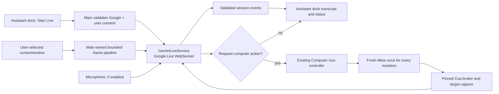

# Gemini Live Assistant Plan

Status: Partial — Phases 0–4 implementation and automated/package verification complete; authorized macOS screen capture and real Google beta receipts remain operator-owned
Date: 2026-08-11
Related: `aiden-assistant-plan.md`, `pi-provider-integration-plan.md`, and
`../computer-use-integration.md`

## Outcome

The attended **Aiden Assistant** dock becomes the single entry point for a
user-started Gemini Live session. Aiden streams microphone PCM and a
user-approved screen/window as bounded JPEG frames to Gemini Live, plays Gemini
native audio, and shows its input/output captions. When Gemini needs to act, it
invokes Aiden's existing `computer_use` tool; every input action keeps the
current global gate, per-chat activation, target binding, and fresh **Allow
once** approval.

This is deliberately not a general screen recorder, an unattended assistant,
or a second automation authority.

## Implementation status (2026-08-11)

Phases 0–3's provider/protocol proof, main-process session boundary,
experimental Assistant voice UI/media lifecycle, and safe Computer Use bridge
are complete without a paid provider call.
The macOS capture proof is intentionally split between deterministic contracts and an
operator-owned permission acceptance:

- Current Pi was reviewed at `@earendil-works/pi-ai` 0.84.1 and Aiden remains
  exact-pinned to 0.80.10; neither Google adapter implements Live.
- Aiden now exact-pins the independently reviewed `@google/genai` 2.16.0 while
  Pi retains its private 1.52.0 copy. Installed declarations, runtime exports,
  and an isolated loopback WebSocket prove the Live setup/realtime/response/
  resumption/close surface without contacting Google.
- Electron 43.1.1's display-media handler, main-frame request, permission path,
  and macOS system-picker option are covered by an exact document-owner
  contract. A real Electron 43 development-package spike executes the
  AudioWorklet directly from `app.asar`. Its default deterministic mode uses a
  custom auto-selected source and can prove only that handler contract; the
  authorized mode uses the native system picker and rejects any fallback
  handler dispatch as acceptance evidence.
  On the current machine macOS rejects `getDisplayMedia` before Electron calls
  either handler, so native chooser, handler dispatch, cancellation, source end,
  and navigation invalidation still require a Screen Recording-authorized
  operator run; they are not recorded as runtime passes.
- The packaged renderer's 20 ms, mono 16 kHz PCM AudioWorklet executes in real
  Electron. Provider PCM is rechunked to at most the renderer's 96 KB bounded
  24 kHz playback queue contract.
- A production-inert protocol core and fake transport cover bounded PCM/JPEG,
  captions, interruption flush, compound server events, tool correlation,
  malformed input, deadlines, cancellation, controlled GoAway resumption, and
  unexpected-disconnect no-autorestart. Normal Pi Google regression remains
  green.
- The SDK connector owns its Node WebSocket rather than relying on 2.16.0's
  pre-`setupComplete` abort behavior. Real loopback wire tests prove abort and
  timeout terminate and settle the attempt while setup is withheld, and verify
  tool-response plus resumption wire shapes. Every attempt has a fixed 1 MiB
  raw-frame ceiling, and an oversized loopback frame closes and settles.
  Provider-idle time is inbound-only;
  outbound PCM/frames cannot keep a silent provider alive. Rolling event/audio
  budgets and a hard 256-entry session-wide issued/completed/cancelled tool-ID
  ledger fail closed across controlled resumption. Malformed provider traffic
  closes the transport and never refreshes provider idle. Nested inbound
  objects use exact allowlists and types; compound events validate, budget,
  and update the tool ledger atomically before any event is emitted.

Phase 1 adds an exact-document `GeminiLiveService` lifecycle, Google API-key-only
credential admission, strict start/stop IPC parsing and preload inventory, safe
renderer event projection, clean shutdown, owner-loss/navigation replacement,
and fake-transport acceptance. Credentials, PCM/JPEG, and raw tool arguments
have no Phase-1 IPC, persistence, or logging path. The production model resolver
returns no model and therefore cannot open a provider connection. Resolver
failures and unexpected status-service failures collapse to the same fixed
`live_model_unverified` unavailable snapshot before crossing IPC.

Phase 2 adds an Assistant-only, explicit-experimental capability and model gate,
an accessible user-confirmed microphone setup sheet, 20 ms AudioWorklet PCM
admission, bounded 24 kHz playback with interruption flush, captions, persistent
Stop, manual reconnect, and exact-session renderer teardown/late-event fencing.
The UI and main service both keep screen capture unavailable until the native
macOS picker acceptance is recorded. No capture resumes automatically.

The guide's `gemini-3.1-flash-live-preview` string remains fake-test evidence,
not a production default. An operator may supply a separately accepted model
only through both `AIDEN_EXPERIMENTAL_GEMINI_LIVE=1` and
`AIDEN_EXPERIMENTAL_GEMINI_LIVE_MODEL`; the ordinary app remains fail-closed.

## Evidence and architecture decision

The local Pi checkout at `/Users/sambitbiswas/projects/opp/pi` was audited at
its current `@earendil-works/pi-ai` 0.84.1 source. Its already first-class
Google provider calls `GoogleGenAI.models.generateContentStream` for ordinary
chat and maps ordinary text/tool events; it has no `live.connect`,
`bidiGenerateContent`, or realtime-input implementation. The only
`gemini-live` reference is model-id parsing. Aiden currently pins Pi 0.80.10,
so a Pi bump alone cannot provide a Live transport.

**Decision:** retain Pi as the sole authority for Aiden's normal Google chat,
provider metadata, and encrypted Google credentials. Add a narrow
`GeminiLiveService` in Electron main using the reviewed, exact-pinned
`@google/genai` SDK Live API. Do not fork Pi, retrofit Live into its ordinary
request/response `ProviderTransport`, or expose Google credentials to preload
or renderer code. If Pi later ships a typed, lifecycle-safe Live abstraction,
evaluate it as a replacement behind Aiden's service interface—not before.

This integration does **not** call `interactions.create`. Gemini Interactions
remains a separate request/turn API that may be evaluated for ordinary Gemini
work later; it is not the continuous full-duplex WebSocket, VAD, native-audio,
and realtime-video transport this feature needs.

The existing `computer_use` controller already emits transient screenshot image
parts into the Pi tool loop and enforces approval at the action boundary. Live
screen frames must use a separate transient path; they must never be appended to
chat history, assistant threads, exports, or logs.

## Explicit non-goals

- Replacing regular Google/Gemini chat, one-shot dictation, or Pi tool streaming.
- Always-on capture, background monitoring, or automatic session start/reconnect.
- Giving the Assistant ambient files, shell, MCP, project, settings, or scheduled-task authority.
- Bypassing Computer Use gates or converting capture permission into action permission.
- Persisting audio, screen frames, model event payloads, or raw tool arguments.
- Google Search Grounding or cloud code execution.

## User interaction and authority

1. The Assistant dock shows **Start Live** only when Aiden's first-class Google
   provider has a healthy API-key credential and its dedicated Live-model gate
   approves the current Google Live model. This is separate from the ordinary
   chat picker because Pi's catalog currently does not expose a Live transport
   capability. Pi OAuth-only or unknown/withdrawn Live models fail closed.
2. Selecting it opens an accessible setup sheet: model, microphone toggle,
   optional screen/window picker, privacy disclosure, and the exact provider
   destination. Nothing connects or captures until **Start**.
3. The renderer sends only validated intent and opaque session events over a
   new allowlisted `assistant-live:` IPC namespace. Main owns credentials,
   device capture admission, session ID, binary encoding, backpressure, and
   every provider message.
4. The Live model may request `computer_use` only through the existing
   controller. Main creates it only while both Computer Use gates are enabled;
   read-only capture remains read-only and each click/type/key/drag/etc. pauses
   for the established owner-bound Allow once UI.
5. **Stop**, navigation/unmount, provider disconnect, revoked permission,
   app shutdown, or renderer-owner invalidation immediately aborts media,
   clears queued frames, closes the WebSocket, and tears down the Computer Use
   generation/session. Reconnect is an explicit user action.

The Assistant's present positive tool allowlist remains intact. Live and
Computer Use are a separately named attended-live capability—not a broad
exception in `buildAgentTools({ mode: "assistant" })`.

## Design

### Main process

Add a pure protocol/parser core plus `GeminiLiveService`:

- single active Live session per attended Assistant document; a new start first
  closes the old session;
- credential lookup via the existing Google Pi credential store; only API-key
  Google connections are eligible until a separately reviewed Live auth route
  exists;
- strict inbound/outbound event schemas, finite size/count/rate budgets,
  heartbeat/error normalization, connection and idle deadlines, AbortSignal
  propagation, and an explicit close state machine;
- a dedicated Live model resolver, initially pinned only after a real contract
  probe proves the supported model (Google's current SDK guide uses
  `gemini-3.1-flash-live-preview`). It is not inferred from a normal chat model
  name or a generic Pi image capability;
- bounded, latest-frame-wins, activity/change-aware screen queue. Renderer
  capture starts only from an explicit Electron display/window picker approved
  by main; it is downscaled, JPEG encoded, and sent to main at no more than
  Google's documented 1 FPS Live-video limit. Do not blindly transmit a frame
  every second for the entire session; never capture all displays by default;
- a 20–40 ms, mono, signed-16-bit little-endian PCM queue at 16 kHz. The
  renderer's existing `MediaRecorder`/WebM dictation path is batch-oriented and
  must not be reused. An AudioWorklet captures/resamples audio and sends bounded
  chunks through the dedicated IPC channel; main immediately forwards them as
  `sendRealtimeInput({ audio })` messages. The exact 20–40 ms size is a
  Phase-0 latency/IPC benchmark choice, not an unverified product invariant;
- a renderer playback queue for Gemini's raw 24 kHz PCM output. On Live
  `interrupted`, clear buffered audio immediately; captions come only from
  optional input/output transcription events, not a second transcription call;
- configure context-window compression and session resumption. Google currently
  documents a roughly 10-minute connection lifetime and, without compression,
  a 15-minute audio-only / 2-minute audio-video session limit. A controlled
  `GoAway` handoff may resume the same already user-started session with its
  current resumption token; an unexpected disconnect shows a reconnect control
  and never silently restarts capture;
- tool-call correlation and idempotency keyed by Live session + tool call ID;
  sanitize all captured AX/OCR/model text as untrusted data;
- aggregate-only usage/status accounting. No audio/frame/event content lands in
  `usage.json`, chat persistence, crash reports, or diagnostics.

Use a dedicated direct dependency on `@google/genai` at an exact reviewed
version. Do not import the SDK transitively from Pi. Phase 0 validates the
installed SDK's Live type/API and compatible Node/Electron WebSocket behavior
before updating the package and lockfile.

### Screen-share transport

Computer Use's `capture` is an action-loop observation tool. It is neither the
source nor the permission model for Live screen sharing. The Live session needs
its own user-selected `getDisplayMedia` stream, governed by an Electron-main
display-media request handler and the platform picker where available. The
renderer necessarily captures, resamples, and JPEG-encodes browser media; main
owns source admission, document binding, quotas, credentials, provider
transport, and teardown. Phase 0 must verify the exact Electron version's
supported handler/system-picker path; if it cannot bind the capture source to a
current Assistant document, the beta must not offer screen share.

Capture frames stay in renderer/main memory only. The screen track is stopped
on Stop, picker cancellation, source end, owner loss, navigation, app shutdown,
and provider failure. Aiden displays the selected source and an active-sharing
indicator for the whole session.

### Computer Use handoff

Live action requests map only to the existing `ComputerUseParameters` schema
through Aiden custom function declarations and `sendToolResponse`—not Google's
built-in Computer Use tool. The adapter must reject unknown tool names, unknown
fields, stale targets, coordinate-only mutations without the controller's
required current capture, and attempts to request foreground delivery without
its distinct approval.

The controller result is converted to a bounded structured tool result; its
optional screenshot is a transient response to the current Live turn, never a
history attachment. Session abort invalidates the controller before closing the
socket so no detached action can complete after Live has stopped.

Gemini 3.1 Live function calling is synchronous: while an Aiden approval is
pending, the model waits for that tool response. A server event may include
multiple calls, so Aiden queues them in a bounded, session-scoped sequential
queue and asks for a fresh approval for every mutation. On VAD interruption or
a server cancellation of pending calls, Aiden invalidates the matching queue
entry, withdraws its approval UI, and aborts its controller work before any
input can execute.

### Renderer and accessibility

Extend the existing Assistant dock rather than adding a menu-bar agent or a
second BrowserWindow. Reuse semantic appearance tokens and review the desktop
UI references before UI work. The panel needs clear idle/connecting/listening/
speaking/approval/error states, visible selected capture target, mic/screen
indicators, a persistent Stop control, keyboard focus order, captions/transcript
handling, reduced-motion states, and an explicit privacy status.

Treat captured screen text and Live output as untrusted content in the renderer.
The model cannot write its own status/error copy or approve itself.

## Phased delivery

### Phase 0 — provider, voice, and screenshare proof

- Review a specific Pi release and `@google/genai` version; prove current Pi
  lacks Live and record the SDK's actual `live.connect`, realtime input,
  server-content, function-response, session-resumption, and close types from
  installed sources.
- Prove the exact Electron screen-picker/display-media handler and AudioWorklet
  paths in the packaged renderer. Confirm capture is bound to Assistant's live
  document and that a canceled/ended source stops immediately.
- Build a fake local Live server and protocol contract tests—no real keys or
  paid provider calls—for 20–40 ms PCM input, 24 kHz output playback events,
  1 FPS JPEG frames, captions, VAD interruption/buffer flush, function calls,
  malformed frames, size/rate limits, close/error/timeout, controlled GoAway
  resumption, unexpected-disconnect no-autorestart, and cancellation. Process
  every part of every server event, and use `sendRealtimeInput({ text })` for
  conversational text after initial history seeding.
- Add exact dependency/lockfile only after the API proof; keep normal Pi Google
  chat regression coverage green.

Current acceptance boundary: protocol/SDK/build/packaged-AudioWorklet proof is
green. The native macOS chooser and real display-track lifecycle are not
automatable without granting the built application Screen Recording access;
first build with `npm run test:gemini-live:packaged`, then run
`npm run test:gemini-live:packaged:authorized` from a Screen
Recording-authorized operator profile. The latter fails unless every required
native-picker field passes and Electron's custom fallback handler remains
unused, including after replacement-document navigation. The default packaged
command fails unless its narrower deterministic custom-handler contract passes.
Local `track.stop()` proves only local teardown; authorized acceptance requires
an actual externally delivered track `ended` event and never synthesizes one.
Custom source auto-selection can never certify this acceptance; only
then may the screenshare portion of Phase 0 be called complete.

### Phase 1 — main-process session boundary

Status: Complete (2026-08-11) — production-inert until the real-model gate is proven.

- Implement `GeminiLiveService`, lifecycle ownership, credential eligibility,
  strict IPC parsers/preload allowlist, and a document-scoped session store.
- Implement a fake transport acceptance suite and assert credentials and raw
  media cannot cross IPC, persistence, or log boundaries.
- Add clean shutdown, owner-loss, and session-replacement tests.
- Review remediation: start failures are fixed safe errors at both service and
  IPC-handler boundaries, and replacement deletes/closes the incumbent before
  installing its successor. Pending starts and late events cannot reclaim or
  signal through the exact-document session slot. Synchronous throws and
  rejected promises while resolving status are fixed safe unavailable results
  at both the service and IPC-handler boundaries.

### Phase 2 — Assistant dock, voice, and screen consent

Status: Complete for the voice/UI boundary (2026-08-11). Screen selection is
deliberately shown as unavailable and rejected by main until the Phase-0 native
picker operator acceptance passes; that withheld authority is not simulated.

- Add the Assistant-only Start Live setup sheet and live-state UI, hidden until
  capability/credential gates pass.
- Add explicit microphone/screen consent and selected-target state; screen use
  begins only after user confirmation and has no automatic resume. Add live
  input/output captions and native-audio playback with VAD interruption flush.
- Cover keyboard, screen-reader labels, reduced motion, errors, reconnect
  policy, and renderer reload/late-event races.
- Review remediation now generation-fences playback and capture across every
  asynchronous continuation. Controlled resumption drops queued/active output
  while leaving microphone capture running, and old audio promise settlements
  cannot tear down replacement media. Permission and AudioWorklet setup expose
  an immediate Stop path that also aborts main. Stop failures reconcile against
  main status and retain a truthful retry/quit warning instead of claiming the
  provider closed.
- The consent sheet names the exact main-approved model. Interim captions update
  one stable utterance and finalized utterances enter a separate polite log;
  Live controls opt into a scoped 3 px focus halo without changing the shared
  Button/Switch contract. The Live controller stays mounted above the animated
  dock panel, and minimizing is disabled while setup or a session is active so
  Stop remains visible. Escape, outside click, and the setup close control all
  route a busy dismissal through the same main/media cancellation path. Mounted
  async renderer tests cover dock exit timers, delayed permission/worklet
  setup, resumption, stale audio rejection, deferred cleanup versus replacement
  playback, stop failure, reconnect, unmount, and playback races.

### Phase 3 — safe Computer Use bridge

Status: Complete (2026-08-11). The Live session declares only Aiden's custom
`computer_use` function after the global gate, exact Assistant chat opt-in,
helper readiness, feature gate, and model gate all pass. The ordinary Assistant
tool catalog is unchanged.

- Adapt only validated Live function calls to the existing controller; keep the
  Assistant's ordinary allowlist unchanged.
- Verify capture/action distinction, per-mutation approval, stale-token
  rejection, multiple-call queue bounds, VAD/server-call cancellation of stale
  approvals, Stop/abort teardown, target-specific post-action capture, and no
  persisted screenshots.
- Exercise a fake Cua bridge plus the existing packaged operator-driven
  Computer Use acceptance path; Live never gets a privileged test shortcut.
- Completed with a bounded eight-call sequential queue, session/call
  correlation, exact schema normalization, fresh controller approval for every
  mutation, current-capture enforcement for coordinates, transient bounded
  results, and controller-first Stop/owner-loss teardown. VAD interruption and
  server cancellation abort pending controller work and withdraw the owner-bound
  approval UI before execution. Focused fake bridge, existing controller,
  renderer approval, protocol/service, and packaged-acceptance contract tests
  are green; the real packaged helper remains on its existing operator-driven
  acceptance path.
- Review remediation adds the missing user-owned authority control to Live
  setup: Computer Use is visibly off by default, reads global helper readiness,
  and changes only the exact active hidden Assistant chat through
  `chats:setComputerUse`. Ordinary Assistant streaming and pending automation
  approvals disable both setup entry and confirmation with an explicit recovery
  message, while exact-session Live approvals remain visible. Revoking either
  Computer Use gate now terminates the whole Live session consistently:
  issued/pending/queued calls and approval/controller authority are invalidated
  before the renderer receives a terminal state and before the provider socket
  closes, so local media stops and restart remains manual.
- Final P1 remediation makes a per-chat disable a synchronous authority
  revocation before the first persistence await. A deferred or rejected chat
  write cannot keep the exact Live session, approval queue, or controller
  alive; the renderer shows the disable intent immediately and reconciles the
  durable setting after failure. New/open-conversation actions share one
  mounted gate across setup, start/stop, Computer Use setting changes, pending
  Live approval, and active/closing sessions, with a specific disabled reason
  and guarded callable methods so a programmatic action cannot detach the UI
  from its session-owned chat.

### Phase 4 — bounded beta and release evidence

Status: Implementation complete (2026-08-11); operator evidence pending. The
experimental surface now keeps credential, model, and microphone-permission
health visible while unavailable, clears session-only captions on confirmed or
terminal teardown, and includes the direct Live Computer Use suite in the
ordinary gate. A signed exact-app capture harness binds chooser/cancel/external
end/navigation evidence to package identity, CDHash, signing identity, ASAR
hash, and an isolated profile. The real-Google runbook uses a clean-tree fresh
build, isolated encrypted credential flow, same-session app lifecycle markers,
exact runtime-input hash, and content-free receipt. Neither interactive receipt
has been claimed on this machine: macOS denies the deterministic display probe
before handler dispatch, and no user-provided key was available for a paid
provider call.

- Ship behind an off-by-default experimental setting with model/capability and
  permission health indicators; no silent fallback to one-shot dictation.
- Run focused suites, `npm run type-check`, `npm run lint`, relevant `npm run
test:*`, package verification, and signed-package permission acceptance.
- Require an operator-driven real Google Live smoke only with a user-provided
  key and isolated profile, following the bounded
  [`../gemini-live-google-acceptance.md`](../gemini-live-google-acceptance.md)
  runbook. Record content-free evidence (versions, timing, pass/fail), never
  media or prompts.

## Completion gates

- Pi normal chat remains unchanged and the Live API is used only behind the
  Aiden service boundary.
- A session cannot start, capture, reconnect, or act without explicit attended
  user intent and the relevant OS/product permissions.
- Every mutation still requires the existing Computer Use Allow once decision.
- Stop/cancellation reliably terminates network, capture, queues, and broker
  work; no frame/audio/provider payload persists.
- Unit/fake-server tests cover adversarial protocol and lifecycle paths; a
  signed-package beta acceptance verifies the real permission boundary.
