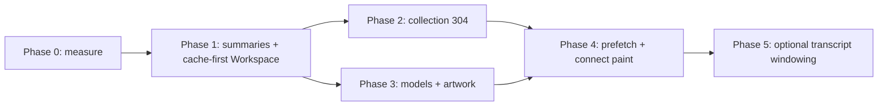

# iOS Remote Caching Strategy Plan

- Status: Planned
- Created: 2026-08-24
- Primary surface: Aiden On The Go (iPhone/iPad) talking to Aiden Agent Remote API v1
- Authority: the paired Mac remains execution, persistence, grant, and mutation owner
- Related: `docs/aiden-remote-api-v1.md`, `docs/plans/aiden-on-the-go-plan.md`, `docs/plans/bot-first-aiden-on-the-go-plan.md`, `docs/plans/performance-stability-efficiency-plan.md`, `docs/testing/missing-test-coverage-audit.md`

## Outcome

Aiden On The Go should feel instant on a returning pair: Bots home, Workspace home, and an already-opened chat paint from device-local state, then reconcile with the Mac. First-session pairing can still wait on the network. Mutations stay disabled while disconnected. Cache never outranks grants, revocation, Bot classification, or revision checks.

This plan is Mac API + iOS client work. It does not move agent execution onto the phone.

## Research method

Three parallel codebase research agents inventoried (1) tests, (2) every Remote/IPC API, (3) current iOS cache and launch waterfalls. The requested Deepseek v4 flash 0731 subagent model is not available in this environment; findings were produced with the default Cursor agent model and then triaged against the shipped OpenAPI, router, and Swift clients.

## 1. Current architecture (what already ships)

```text
iOS  --HTTPS REST + resumable SSE-->  Electron main Remote router  --> application services
        bearer device credential         /api/aiden/v1
        URLSession ephemeral             Cache-Control: no-store
        device-local file caches
```

There are two API surfaces on the Mac:

1. **Electron IPC** (renderer only). Allowlisted in `renderer/preload-channels.ts`, guarded by `main/handlers/ipc-contract.test.ts`. React Query in `renderer/lib/queries.ts` caches providers/chats/bots in the Mac UI. iOS never calls IPC.
2. **Aiden Remote HTTP** at `/api/aiden/v1`. This is the only iOS API. Normative shapes: `protocol/aiden-remote/v1/openapi.json`. Behavior: `docs/aiden-remote-api-v1.md`. Router: `main/services/aiden-remote-router.ts`.

iOS already has several installation-scoped file caches. They are not one system.

| Cache | Path / type | Holds | Missing |
| --- | --- | --- | --- |
| `AidenBotCache` | Application Support `RemoteBotCache-v1` | List, details, conversation page, catalog, notice, avatars; A→B→A generation fencing; segment merge | Home still refetches list+inbox on every appear when connected |
| `AidenChatCache` | Application Support `RemoteChatCache-v2` | Per-workspace chat lists, per-chat bodies, stream cursors, attachment images | **Workspace home does not read it** |
| `AidenChatDraftStore` | Application Support | Unsent composer text keyed by `(instanceId, chatId)` | Fine; keep |
| `AidenScheduledTaskCache` | Application Support | Task list + settings | Home fetches schedules live without painting cache first |
| `AidenWorkspaceEnvironmentCache` | Caches dir | File index + documents (8 MiB) | Only after Files/Review is opened |
| `AidenWorkspaceArchiveStore` | UserDefaults | Locally archived workspace IDs | Not a server cache |
| `AidenInstallationStore` + Keychain | Installations + bearer | Pairing restore | Workspaces/server projection not snapshotted for offline chrome |
| URLCache | **none** | `URLSessionConfiguration.ephemeral` | Intentional vs cookies/credentials; do not turn on a shared HTTP cache for bearer traffic |

Bots home **is** cache-first stale-while-revalidate (`AidenBotsHomeView.load`): activate cache → paint snapshot → parallel `GET /bots` + `GET /bot-conversations` → `mergeAndStore`. Workspace home is not.

## 2. API catalog (iOS-relevant)

Base: `/api/aiden/v1`. Auth: `Authorization: Bearer` + `Aiden-Protocol-Version: 1` except `/health` and pairing bootstrap/exchange. Every JSON response is capped at **1 MiB** and sent with `cache-control: no-store`.

### 2.1 Bootstrap

| Method | Path | Hot path? | Cache today | Notes |
| --- | --- | --- | --- | --- |
| GET | `/health` | Probe only | No | Minimal `{ ok, protocolVersion }` |
| POST | `/pairing/manual-bootstrap` | Pairing | Never cache | Sealed envelope; setup code never on wire |
| POST | `/pairing/exchange` | Pairing | Never cache credential | Issues device grants + optional `serverCapabilities` |

### 2.2 Session chrome (every cold start)

| Method | Path | Cap | Today on iOS connect | Problem |
| --- | --- | --- | --- | --- |
| GET | `/server` | `server:read` | Parallel with workspaces | Small; must revalidate grants. Cache a **last-known projection** for chrome only |
| GET | `/workspaces` | `workspace:read` | Parallel with server | Small registry + `revision`. **Not persisted** on iOS |
| GET | `/workspaces/{id}` | `workspace:read` | Detail | Same DTO |

### 2.3 Workspace chats (largest load)

| Method | Path | Cap | Payload | Problem |
| --- | --- | --- | --- | --- |
| GET | `/chats?workspaceId=` | `chat:read` | **Full `Chat` for every regular chat**, including all visible messages (up to 10_000 each, 200k scalars/message, whole response ≤ 1 MiB) | `list()` does `listRegular` then `Promise.all(get)` + `projectAidenRemoteChat`. N disk reads, huge JSON, 413 if the workspace is history-heavy. iOS Workspace home calls `chats()` **without** `workspaceId`, so it hydrates **all** regular chats |
| GET | `/chats/{id}` | `chat:read` (+ `bot:read` if Bot) | Full transcript | Correct for the open thread; also refetched on every detail `load()` even when cache exists |
| POST/PATCH/DELETE | `/chats…` | `chat:write` | Mutations | Keep If-Match / idempotency; do not retry create/turn on TCP loss |

### 2.4 Bots (already closer to cache-first)

| Method | Path | Cap | Payload | Notes |
| --- | --- | --- | --- | --- |
| GET | `/bots` | `bot:read` | ≤256 summaries + favorites + revision | Home already caches. Still no `If-None-Match` |
| GET | `/bot-conversations` | `bot:read` | Pages ≤50, 500-scalar previews, 256 KiB inbox cap | **Do not copy Workspace list.** This is the pattern to steal |
| GET | `/bots/{id}` | `bot:read` | Detail including instructions | Cached in Bot snapshot details |
| GET | `/bot-capabilities` | `bot:read` | Catalog + notice | Cached; refetch when editor opens |
| GET | `/bot-favorites` | `bot:read` | ≤20 IDs | Included in list envelope |
| GET | `/bots/{id}/avatar/{assetRevision}` | `bot:read` | 512×512 PNG, `no-store` | **Content-addressed URL.** iOS file-caches by revision. Prefetch visible favorites |
| Other Bot mutations | create/patch/archive/restore/access/avatar PUT | `bot:read`+`bot:write` (+ chat/files as documented) | If-Match + Idempotency-Key | Optimistic UI already used for favorites |

### 2.5 Models, usage, schedules

| Method | Path | Cap | Problem |
| --- | --- | --- | --- |
| GET | `/models` | `chat:read` | Full configured catalog, optional PNG artwork base64, truncated ~900 KiB. **Fetched on every chat detail load** and again on Workspace home |
| GET | `/usage?range=` | `server:read` | Aggregates only. Workspace home fetches it **after** chats/tasks/catalog |
| GET | `/scheduled-tasks` (+ item/runs/settings/scripts/mcp-servers) | `schedule:read` | Home fetches full list live; disk cache exists but home does not hydrate first |

### 2.6 Files, Git, browser

| Method | Path | Cap | Cache today |
| --- | --- | --- | --- |
| GET | `/workspaces/{id}/files` | `files:read` | Recursive snapshot, max 4000 entries, depth 20. Environment cache after first open |
| GET/PUT | `.../files/{fileId}` | read/write | Documents in environment cache; writes expectedVersion |
| GET | `/bot-conversations/{chatId}/files` | `bot:read`+`files:read` | Same DTOs; Bot-home only |
| Git review/diff/compare/branches/worktrees | `git:read` | Snapshot IDs | Cached with environment; mutations confirmed + operation IDs |
| Workspace browser roots/children/selections | `workspace:browse` | Opaque handles | **Never persist handles across process/Mac**; existing lease tests cover A→B |

### 2.7 Streams and approvals

SSE `GET /streams/{id}/events` is not a cache. Persist only `AidenChatCache.ActiveStream` (`streamId`, `turnId`, `lastSequence`) and resume. Approvals are snapshots; do not cache an allow/deny decision.

### 2.8 Immutable-looking GETs that still send `no-store`

- `GET /bots/{botId}/avatar/{assetRevision}`
- `GET /chats/{chatId}/attachments/{attachmentId}/content`

Bytes are already keyed by opaque id + revision. iOS stores them as files. Do **not** enable URLSession HTTP cache for these while the session carries a bearer token. Keep the file cache; add prefetch and LRU (attachment cache already prunes at 96 MiB).

### 2.9 IPC-only (Mac renderer, not iOS)

Providers auth, MCP OAuth, secrets, Computer Use, terminals, dictation, local models, Telegram pairing, subagent control, profile share, Artificial Analysis fetch. iOS must not grow equivalents. Mac React Query is a separate performance track (`docs/plans/performance-stability-efficiency-plan.md`); Git 4–5s polling is Mac-only.

## 3. Launch / load sequence today

### Cold start, already paired

1. `AidenRemoteCoordinator.start` → `connectActiveInstallation`
2. Keychain credential
3. **Parallel** `GET /server` + `GET /workspaces` (no last-known workspaces on screen until this returns)
4. `connectionState = .connected` unblocks area UI
5. If Bots area: cache hydrate → `GET /bots?includeArchived=true` + `GET /bot-conversations`
6. If Workspaces area: `AidenWorkspaceHomeModel.load` **requires connected**, then parallel `GET /chats` (all workspaces, full messages) + `GET /scheduled-tasks` + `GET /models`, **then** `GET /usage`
7. Opening a chat: cache body if any → parallel `GET /chats/{id}` + `GET /models` again → restore SSE

Bottlenecks, in order:

1. **Full chat list** (CPU, disk on Mac, JSON parse on iOS, 413 risk)
2. **Serial wait on connect** before area UI (Bots could paint cache during `.connecting`)
3. **Duplicate `/models`** (home + every chat)
4. **Usage after the heavy batch** (extends Workspace spinner; failure handling is OK-ish via `try?`)
5. **Avatar N+1** after Bot list (each raster is a separate GET; file cache helps on warm start)
6. **No workspace registry snapshot**, so the split view is empty until step 3

### Warm start / area switch

Bots: last snapshot stays mounted (plan requirement: keep both stacks). Refresh still hits the network when connected.

Workspaces: home `load` bails unless connected, so offline does not show last chats unless the in-memory `homeModel` survived. Process death loses Workspace home unless someone opened a chat (chat cache) or Files (environment cache).

## 4. Non-goals

- HTTP caching of authenticated JSON via `URLSession` shared cache
- Client-authored delta CRDTs; Mac remains canonical
- Caching credentials, paths, tool args, Pi journals, or SSE token streams
- Serving 304 for a device whose grants changed
- Replacing Bot conversation pages with full chat list semantics
- Computer Use or generic shell on iOS
- SQLite migration unless file envelopes exceed measured budgets (Bot envelope already 4 MiB, chat files 10 MiB)

## 5. Design principles

1. **Paint last-good, then reconcile.** Bots already do this. Workspaces and session chrome must.
2. **Lists are summaries. Detail is a transcript.** Steal `GET /bot-conversations` (preview + activity + pagination). Do not send `messages[]` on Workspace home.
3. **Revisions are for writes and for cheap reads.** Today `If-Match` is mutation-only. Add collection versions so a warm phone can send `If-None-Match` / `Aiden-Collection-Revision` and get 304.
4. **Grants beat cache.** If `/server` capabilities drop `bot:read` or `chat:read`, purge that segment before paint. Revocation already purges; keep it.
5. **Identity isolation.** Every envelope is `(instanceId, deviceId)`. A→B→A activations must not publish. Already true for Bots; copy for Workspace list and models.
6. **Immutable bytes, mutable JSON.** Avatar/attachment file cache keyed by revision/id. JSON snapshots are replace-or-merge, never mixed across Bots vs Workspaces (`RemoteChatCache-v2` exists because v1 could not tell them apart).
7. **Disconnect never retries create/turn.** Cache cannot invent a chat id.
8. **Additive wire only.** Prefer new summary DTOs and optional headers. Do not break shipped TestFlight clients. Old phones still decode full `Chat` on `GET /chats` until a minimum client version is enforced.

## 6. Target wire additions (additive)

Keep `/api/aiden/v1`. Bump OpenAPI `x-aiden` annotations and fixture `contractRevision` together with Swift/TS tests.

### 6.1 Chat summaries (Phase 1, highest leverage)

Add one of:

- `GET /chats` with `view=summary` (default for new clients), or
- `GET /chat-summaries` capability-gated

Summary item (sketch, exact schema in OpenAPI when implementing):

- `id`, `workspaceId`, optional `botId` (Workspace lists remain regular-only)
- `title`, optional `titlePending`
- `updatedAt`, `createdAt`, `revision`
- bounded `preview` (reuse Bot inbox 500-scalar rules)
- `activityState` (`idle` / `running` / `waiting_for_approval` / …)
- optional `providerId`+`modelId` pair
- **no `messages`**

Mac implementation: `application.listRegular()` + bounded preview/activity batch, **no** `this.chat(id)` body read. Mirror `bot-inbox-projection.ts` (`listChatMetadata` + `projectBatch`).

`GET /chats/{id}` stays the full transcript.

Shipped clients that omit `view=summary` keep today’s full list until a documented sunset.

### 6.2 Collection revisions (Phase 2)

Return headers or envelope fields:

- `Aiden-Workspaces-Revision`
- `Aiden-Chat-List-Revision` (scoped by workspace id or `regular`)
- `Aiden-Bots-Revision` (already have favorites/list revision in JSON; also send as header)
- `Aiden-Models-Revision` (hash of configured provider/model identities + artwork asset ids, **not** secrets)

`If-None-Match` / `Aiden-If-Collection-Revision` → `304` with empty body.

**Never 304 when** device grants, `serverCapabilities`, Bot classification rules, or protocol version changed. Compare those first from `/server` or from the request’s authenticated device record.

### 6.3 Model catalog (Phase 3)

- Split artwork from JSON: `GET /models` returns providers/models without `dataBase64`; `GET /models/{providerId}/artwork/{hash}` returns PNG with the same nosniff policy as avatars
- Or keep inline artwork but add `Aiden-Models-Revision` + iOS disk cache of the last catalog per instance
- Chat detail must use the session-level catalog, not refetch per chat

### 6.4 Server + workspaces snapshot (Phase 1, iOS-only is enough if wire stays small)

`GET /server` and `GET /workspaces` are small. Persist last JSON on iOS keyed by instance/device. Paint during `.connecting`. Revalidate immediately. If `instanceId` mismatches, fail closed (already required).

## 7. iOS client strategy

### 7.1 One activation gate

Extend the Bot cache activation idea to a **session snapshot store**:

```text
SessionSnapshot
  server?: AidenServer          // grants + support; never credentials
  workspaces?: [AidenWorkspace]
  models?: AidenModelCatalog    // after artwork split, no huge inline images
  savedAt
```

Same A→B→A generation token as `AidenBotCache.Activation`. Purge on revocation/remove installation (already in `purgeInstallationData`).

### 7.2 Workspace home becomes cache-first

Match Bots:

1. Hydrate `AidenChatCache.loadChats` **per visible workspace** (not the unscoped all-chats GET)
2. Hydrate `AidenScheduledTaskCache`
3. Paint
4. If connected: summary list + schedules (+ usage in background, never blocking first paint)
5. Merge; do not clear warm rows on refresh failure

Skeleton only when there is no snapshot (already the Bot rule; `AidenProductShellTests` covers the helper).

### 7.3 Chat detail

1. Paint cached `AidenChat` immediately (already)
2. Fetch `GET /chats/{id}` if revision differs or cache missing
3. Do **not** fetch `/models` if the session catalog is current
4. Restore SSE from cached cursor (already)

Optional later: `GET /chats/{id}?afterMessageId=` or a tail window. Only if traces show transcript parse dominating. Compaction on the Mac should remain the long-term bound.

### 7.4 Prefetch (after first paint)

- Favorite Bot avatars not already on disk (cap concurrency at 4, same as Mac `BotCanonicalPhotoCache`)
- Selected workspace summary if the user lands on Bots first (idle prefetch)
- Do not prefetch every transcript
- Do not prefetch Git/file trees until Files/Review is opened (environment cache is enough)

### 7.5 Connection reuse

`AidenRemoteCoordinator` already reuses `AidenRemoteClient` per activation key. Keep it. Home and detail must share that client so TLS/session setup is once per Mac.

### 7.6 Offline

Mutations stay disabled (existing). Cached Bots/chats/schedules/files are read-only. Copy must stay honest (“showing saved …”). If grants cannot be revalidated and the snapshot is older than a conservative bound, still show it but mark **unverified** rather than blanking the UI.

## 8. Phased delivery



### Phase 0 — Measure (no wire break)

- Privacy-safe client timings: connect start, first cache paint, first network paint, `/chats` bytes, `/models` bytes, avatar GETs, usage
- Mac timings: `listRegular` vs per-chat `get`, JSON serialize ms
- Fixtures: 1 / 20 / 100 chats; 1 / 50 / 200 messages; Bot home with 20 favorites
- Exit: numbers on a physical iPhone, not a guess

### Phase 1 — Summaries + Workspace cache-first (user-visible)

Mac:

- Metadata+preview list path; no full body hydration
- Additive `view=summary` or sibling route
- Keep legacy full list for old clients
- Tests: N chats do not call `application.get` N times; payload has no `messages`; 1 MiB still enforced

iOS:

- Persist server+workspaces snapshot
- Workspace home hydrates chat cache + schedule cache before network
- Call summary list scoped by `workspaceId` (stop unscoped `GET /chats`)
- Usage non-blocking
- Tests: cache-first, Bot chats excluded, 413/timeout keeps last-good, A→B→A drop

### Phase 2 — Collection revisions

- Headers + 304
- iOS sends last revision; on 304 keep snapshot `savedAt` bump optional
- Capability change forces 200
- Tests: grant drop, Bot-aware vs legacy device, workspace revision after rename

### Phase 3 — Models

- Session-level catalog; chat `load()` reuses it
- Artwork out of the JSON or content-addressed
- Disk cache of catalog JSON
- Tests: two chats one catalog fetch; artwork hash change invalidates; hidden models stay hidden

### Phase 4 — Prefetch and connect paint

- Paint Bots/Workspaces chrome while `connectionState == .connecting` if snapshot exists
- Prefetch favorite avatars
- Optional: prefetch active workspace summaries after Bot home
- Tests: no mutation while connecting; prefetch cancelled on switch Mac

### Phase 5 — Transcript windowing (only if Phase 0/1 traces still show pain)

- Tail of N messages + `before` cursor
- Must fail closed with compaction: never imply missing history is complete without a marker
- Higher risk; do not start here

## 9. Risks and fail-closed rules

| Risk | Rule |
| --- | --- |
| Stale Bot chat in Workspace list | Keep `RemoteChatCache-v2` namespace; summaries still carry `botId`; Workspace UI filters `isBotChat` |
| 304 after revocation | Revocation path already purges; 304 must run after auth; revoked credential never 304s |
| Summary preview leaking tool args | Reuse Bot inbox: previews from Mac-owned bounded metadata only |
| Old iOS + new Mac | Legacy `GET /chats` remains full bodies until min client version |
| New iOS + old Mac | Client falls back to full list, strips messages for home rows, caches bodies for detail |
| Collection revision across devices | Revisions are Mac-authoritative; two phones can 304 independently |
| Artwork in catalog exploding memory | Phase 3; until then cap decode and do not store base64 in the session snapshot if over budget |
| Files snapshot stale vs expectedVersion | Keep expectedVersion writes; cached document is a hint, save conflicts reconcile from Mac |
| Prefetch on cellular/Tailscale | Cap concurrent GETs; skip prefetch when Low Data Mode / expensive path if reachable via `NWPath` without collecting extra identity |

## 10. Tests required with the implementation

Register every new file in the matching `package.json` script (`test:aiden-remote`, iOS target, protocol fixtures). See `docs/testing/missing-test-coverage-audit.md` §9.

Must add:

- TS: list-summary does not hydrate bodies; legacy list still does
- TS: collection 304 vs grant change
- TS: models revision / artwork split
- Swift: Workspace cache-first + scoped workspaceId
- Swift: session snapshot A→B→A
- Swift: chat detail does not refetch models when session catalog current
- Shared fixtures for summary DTO in `protocol/aiden-remote/v1/fixtures/`
- Router tests for new query/header
- No models.dev, no real provider calls

## 11. Suggested implementation order on the Mac vs iOS

Do **Mac summary list first** (can ship behind `view=summary` with iOS in the same PR). iOS cache-first Workspace home can ship in the same change using summaries when present and a defensive strip of `messages` otherwise, so a mixed-version Mac still cannot freeze the phone.

Do not wait on 304 or artwork split to fix Workspace home. Those are multipliers after the payload shrinks.

## 12. Success bar

On a returning pair (LAN or Tailscale), physical iPhone:

- Bots home shows last inbox before the first byte of `/bots` (already true if cache warm)
- Workspace home shows last chat rows before `/chats` returns
- Switching Bots ↔ Workspaces does not flash empty then reload
- Opening a previously viewed chat shows transcript before `/chats/{id}` returns
- Workspace home network payload is summaries + previews, not concatenated histories
- Revoke device → next launch cannot show that Mac’s chats/bots
- Grant loss of `bot:read` hides Bots without leftover cache rows

Exact millisecond budgets come from Phase 0 traces, not from this document.
