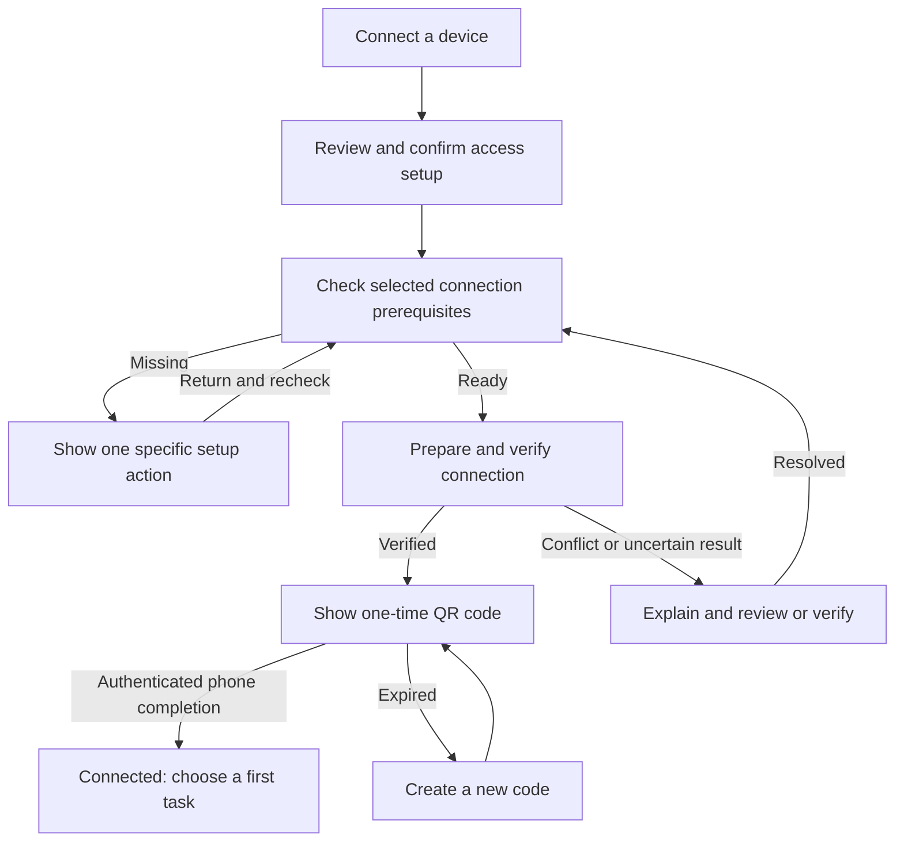

# Make Aiden easier to start, understand, and recover

Date: 2026-09-04
Status: **Active — approved UX implementation in review; broader journey backlog and physical-device usability validation remain open.**
Baseline: `d40d00f1d`
Deliverable: UX audit, journey chart, remote-setup proposal, and implementation handoff.

Visual review: [Now vs proposed — interactive HTML](../ux/now-vs-proposed.html). Ten key journeys, with simulated setup/recovery actions. Open the HTML in a browser; it runs locally without dependencies or external requests. Current screens are simplified source-based reconstructions, not screenshots.

## Approved implementation in this PR

The user approved the HTML with two copy requirements: show **ChatGPT, LM Studio, Ollama, Other Custom Provider**, followed by **Other ways**, and keep **Create a bot** throughout.

| Journey | Implemented change | Practical boundary |
| --- | --- | --- |
| Connect a phone | Two setup cards; one acknowledgement; main-owned setup enables access, prepares the owned route, verifies pairing prerequisites, and issues a code. Rollback, stale review, owner cancellation, and concurrent setup are guarded. | Two desktop actions after choosing the connection method. Changing the selected method adds one choice. Installation, sign-in, HTTPS authorization, scanning, and OS permissions remain external steps. |
| Connect AI / first chat | Four primary provider choices, additional services under Other ways, custom provider model validation, actionable composer readiness link. | Existing profile/tour and first-chat surfaces remain; no new automatic account sign-in or benchmark fetch. |
| Create a bot | Two pages; optional appearance and detailed capability controls; explicit model/access review; fresh desktop drafts start Custom with no file, shell, connection, skill, or extra capability grants. Failed saves retain the draft. | Existing bots preserve their saved access. Native bot editors retain their existing defaults in this desktop editor change; no bot-first phase is advanced. |
| Telegram | Three groups, acknowledgement before enabling, a single enable/connect action, owner pairing status, persistent connect errors; disconnect turns the service off. | BotFather token creation and Telegram owner pairing are still required. Full unattended authority is disclosed before connecting. |
| Voice | Audio destination labels and persistent recorder/transcription recovery beside the draft, with a direct Voice settings action. | Local model download and cloud credentials remain explicit; recording never sends the draft as a chat. |
| Computer Use | Plain explanation and acknowledgement before enable; Mac permission action; provider screenshot/text disclosure up front. | Per-chat opt-in, macOS permission gates, and per-control approval remain. |
| Scheduled work | What / when / access groups followed by a final review; failed saves retain choices. | Existing Create with Aiden natural-language entry remains primary. Script, Full, and MCP authority restrictions remain. |
| Plugins | Connection details disclosed progressively; Connect verifies tool availability; saved credentials are not labelled as a verified connection. | External authorization remains explicit. An unavailable endpoint leaves a persistent error. |
| Recovery | Phone setup rollback, preserved pairing lifecycle, composer voice recovery, and bot/schedule draft retention. | Existing native cache/reconnection contracts remain; no automatic mutation replay or new offline-writing contract. |
| Find settings / mobile pairing | Aiden On The Go destination, natural-language search aliases, updated Mac instructions, QR-first mobile navigation with manual/advanced fallbacks. | Stable settings route IDs and mobile wire protocol are unchanged. |

The 39-row audit below remains the backlog rather than a claim that every possible branch has been redesigned. Release gates and evidence are tracked in [the implementation review](../ux/implementation-review.md).

## Design direction

Make the user's intended outcome the entry point. Aiden should assemble the required settings, explain the consequences once, and carry the user through to a verified result.

Start with **Aiden On The Go**: two setup cards, **Connect your phone** and **Scan to finish**, followed by a connected-device summary. When Tailscale is already ready, the target is **two desktop clicks from the setup page to a usable QR code**. Scanning and any phone/OS permissions are additional actions. A fresh Tailscale installation cannot honestly be a two-click end-to-end experience; it needs guided installation, sign-in, and possibly administrator authorization.

Then apply the same pattern to first chat, provider connection, permissions, Bots, Telegram, voice, plugins, and scheduled work. Reduce technical decisions and context switches; do not remove meaningful control over data, access, spending, or destructive actions.

## What this audit establishes

This is a source-based review of desktop entry points, all 15 Settings destinations, onboarding, chat/workspace controls, and representative iOS and Android pairing, connection, and task surfaces. It includes first use, repeat use, failure, recovery, and removal. The journey inventory below covers the shipped capability families visible in this checkout; it is not an exhaustive traversal of every conditional screen or every OS/account configuration.

Current labels, control dependencies, and state branches are code observations. Assessments of confusion and proposed improvements are UX hypotheses, not measured user behavior. At audit time, no live application walkthrough, external account connection, physical-device test, or user study was performed. The implementation review now records automated Electron walkthroughs; external-account, physical-device, and user-study gates remain open. Release availability, actual timings, and platform-specific system dialogs still need verification before publishing setup instructions.

Existing strengths to preserve:

- Desktop onboarding already has three stages and explicit provider deferral.
- Settings already has search; many technical remote controls are already in disclosures.
- Remote pairing already has expiry, one-use codes, authenticated completion, per-device removal, and safe route ownership checks.
- Bots already have a guided editor and a review step.
- Schedules already support ordinary repeat/time controls and natural-language creation through the Assistant.
- Chat drafts, mobile caches, retry states, accessibility options, and local diagnostics have substantial existing support.

The main shortcoming is how these pieces join together. A disclosure can hide a prerequisite without helping the user complete it. A wizard can still demand five difficult decisions. A successful connection does not necessarily mean the user knows what to do next.

## Journey chart

Priority: **P0** = first useful outcome or accurate understanding of access/data; **P1** = common repeat work or recovery; **P2** = specialist convenience. These are UX priorities, not vulnerability ratings. “Gap” is the source-informed hypothesis to validate. Evidence IDs link to the source register below.

### Start and find your way

| ID | User goal and current path | Gap / likely hurdle | Proposed path and completion signal | Priority / evidence |
|---|---|---|---|---|
| J01 | Launch → profile → provider → feature tour → app | A name, detailed search disclosure, provider choice, and large feature inventory precede first value. | Keep three stages; make optional profile detail deferrable, explain the AI connection, then offer a first task. Retain the full tour as optional exploration. Success: a first useful reply. | P0 · [S1](#s1) |
| J02 | Connect AI during onboarding or Providers | API keys, browser sign-in, local servers, and custom Tailscale models require different expertise. | Show “Sign in,” “Use an API key,” and “Use a local or custom model”; progressively reveal relevant fields. Label the actual account/service and costs where known. Success: connection validated and one visible, usable model selected. | P0 · [S1](#s1), [S3](#s3) |
| J03 | Skip provider → finish setup → try to chat | Deferral is explicit, but reaching the app can be mistaken for chat readiness. | Preserve browsing; place “Connect AI to send your first message” at the composer with a return-to-draft setup action. No automatic paid test prompt. | P0 · [S1](#s1), [S4](#s4) |
| J04 | New Agent → workspace/context controls → message | “Agent,” “chat,” “workspace,” and “scratch folder” require a mental model too early. | Start with “New chat”; offer “Just chat” and “Work with a folder.” Explain where generated files are saved, including the existing scratch folder behavior. | P0 · [S4](#s4), [S5](#s5) |
| J05 | Sidebar → workspaces/chats, Bots, Scheduled, Assistant dock | Multiple conversation entry points can look interchangeable. | Explain in empty states: Chat = a task; Bot = a reusable helper with its own ongoing conversation; Scheduled = repeated work; Assistant = help with Aiden. Keep recent work easy to resume. | P1 · [S5](#s5), [S6](#s6), [S8](#s8) |
| J06 | Settings → search section titles/keywords → section | Search currently filters destinations, not individual fixes; “Android” and ordinary “connect my phone” wording are not explicit Remote Access keywords. | Add intent aliases and result links to exact actions, including phone, sign-in, microphone, update, and missing folder. Preserve existing routes. | P1 · [S2](#s2) |

### Chat and local work

| ID | User goal and current path | Gap / likely hurdle | Proposed path and completion signal | Priority / evidence |
|---|---|---|---|---|
| J07 | Choose provider/model; optional Pad and reasoning controls | A large technical inventory makes the first choice hard. | First show current and pinned models with supported capability labels; offer a clearly identified default from the connected inventory. Keep full search/Pad available. Success: user can explain which service receives the message. | P0 · [S3](#s3), [S4](#s4) |
| J08 | Pick No access / Ask first / Full access; handle approvals | Users must understand scope, and “Full” can sound like a quality setting. | Retain enforced scopes; describe concrete file/command consequences and name the folder. Explain each approval with action, affected resource, and allow-once/deny choices. Full access remains an explicit consequential choice. | P0 · [S4](#s4), [S10](#s10) |
| J09 | Attach photo/file → model compatibility → send | Ordinary composer can skip images for unsupported models with a toast. User may think the photo was included. | Keep a persistent attachment-level explanation; offer an explicit compatible-model choice without changing recipients silently. Preserve supported attachments and text. Bots keep their separate companion-vision contract. | P0 · [S4](#s4), [S6](#s6) |
| J10 | Send → streaming answer, tools, reasoning, subagents/todos | Several kinds of activity compete with the actual outcome. | One plain-language current status; expand details when needed. Approval waiting, stopped, failed, and completed must remain distinct. Preserve current cancellation and durable activity semantics. | P1 · [S10](#s10) |
| J11 | Provider error, interrupted generation, retry | A generic retry can conceal sign-in, quota, network, or uncertain side effects. | Map known failures to “Sign in again,” “Try again,” or an explicit model change. Preserve draft and originating context; do not automatically resend an action with an unknown result. | P0 · [S4](#s4), [S10](#s10) |
| J12 | Open Files / Review / Quick View / Environment | Container names and Git-only states can obscure the simple goal of finding a result. | Lead with “Files” and “Changes” actions beside relevant output. A non-Git folder should lead to Files with a useful explanation, not an apparent dead end. | P1 · [S11](#s11) |
| J13 | Open generated artifact → expand/export | The interactive result and the saved deliverable are different objects. | Make preview, export, destination, and export failure clear. Success means a verified usable file, not merely an open preview. | P1 · [S11](#s11) |
| J14 | Branch/worktree → review → commit → push | Specialist Git vocabulary; save and publish can be confused. | Keep optional developer tools. Add short explanations: commit saves a version locally; push sends commits to the named remote. Preserve separate confirmations, stale-state checks, and conflict handling. | P2 · [S11](#s11) |
| J15 | Find/rename/delete chats or remove a worktree | Removing a conversation, a saved location, and actual files have different consequences. | Use object-specific removal copy and show exactly what survives. Offer undo only where backend recovery is real; never imply deleted files can be restored without evidence. | P1 · [S5](#s5) |

### Reuse, connect, and automate

| ID | User goal and current path | Gap / likely hurdle | Proposed path and completion signal | Priority / evidence |
|---|---|---|---|---|
| J16 | Create Bot → Identity → Access → Model → Capabilities → Review | Five stages and independent model/capability choices before a conversation. | Two core cards: “What should your bot do?” and “Review model and access.” Start a new Bot with a supported minimal custom scope; advanced customization stays available. Model remains explicitly pinned. | P1 · [S6](#s6) |
| J17 | Edit Bot, customize avatar, enable vision, bind Telegram | Durable identity, optional decoration, and external access are different tasks. | Allow optional avatar editing after first chat. Explain that model changes affect this Bot's ongoing conversation; connect Telegram or vision only on explicit intent, with recipient/access review. | P1 · [S6](#s6), [S7](#s7) |
| J18 | Telegram profile → token → enable → connect/poll → owner pairing → workspace/model | Multiple toggles and technical descriptions; independent Bot binding can require a second trip to Settings. | Three cards: “Connect Telegram,” “Choose what it can use,” “Send a message to finish.” Resume after BotFather; combine Aiden-owned enable/connect steps after acknowledgement. Verify the authorized owner before claiming readiness. | P1 · [S7](#s7) |
| J19 | Plugins catalog → preset → credential/authorization → save/test | “Connect” and “Test” may represent different readiness; generic editor exposes commands/headers. | Known plugin → permission/recipient summary → sign in or paste key → supported non-mutating connection verification. Distinguish “Saved” from “Ready.” Keep custom server setup under Advanced. | P1 · [S9](#s9) |
| J20 | Create/enable skill → invoke with `$` or model use | Difference between skill instructions, executable tools, and Bots is implicit. | Explain “Reusable instructions”; offer a simple example/template and a visible composer picker. Say when instructions are applied; do not claim enabling a skill guarantees invocation. | P2 · [S9](#s9) |
| J21 | Scheduled → editor or Ask Aiden → timing, scope, model/tools → confirm | Existing ordinary time controls are helpful, but run context is extensive. | Default to “What” and “When,” then one concrete review showing model, folder, access, time zone, and next run. Preserve advanced scripts/cron. Success: saved task with confirmed next run. | P1 · [S8](#s8) |
| J22 | Run/pause/resume schedule; inspect failure | A schedule can be mistaken for a cloud service that runs while the Mac is unavailable. | Keep “Runs while Aiden is open on this Mac” beside next run. Explain the actual missed-run policy, attention state, and pause status; never imply catch-up behavior without checking scheduler rules. | P1 · [S8](#s8) |
| J23 | Web Search on/off → provider catalog → routing/setup | Advanced fallback and recipient policy dominates a basic search preference. | First show On/Off and current recipient(s), with concise data disclosure. Keep custom routing below “Search options.” Changing recipients or unattended use remains explicit. | P1 · [S12](#s12) |
| J24 | Model Pad → benchmark credential/fetch → arrange models; Providers → catalog update | Optional evaluation data may look necessary for chat or become confused with model availability. | Describe it as optional model comparison. Keep manual source-specific fetch actions, provenance, and incomplete-data labels. Never fetch benchmarks or models.dev during setup or ordinary browsing. | P2 · [S3](#s3), [S12](#s12) |

### Use Aiden on another device

| ID | User goal and current path | Gap / likely hurdle | Proposed path and completion signal | Priority / evidence |
|---|---|---|---|---|
| J25 | Remote Access → enable → Connection → method → Tailscale Connect → Add device | Primary action is gated by prerequisites the user must find and order. | Two-card setup described below; explicit acknowledgement enables the selected connection and opens pairing after verification. | P0 · [S13](#s13), [S14](#s14) |
| J26 | Mobile onboarding → prepare Mac → choose connection → camera/manual entry | iOS repeats network choices already encoded in QR; Android puts Paste JSON beside Scan QR. | “Scan the code on your Mac” is primary. Manual setup remains accessible as fallback; payload import becomes Advanced. No second transport decision for a valid QR. | P0 · [S15](#s15), [S16](#s16) |
| J27 | Pair successfully → choose Bot/workspace; approve browsing folders on Mac | “Connected” can lead to an empty workspace; folder browsing roots and existing workspaces have different scopes. | Show existing permitted content, then “Add a folder on your Mac” only when relevant. Explain precisely that browsing roots govern discovery/addition; do not suggest all existing workspaces are hidden by default. | P0 · [S13](#s13), [S14](#s14), [S17](#s17) |
| J28 | Leave Wi-Fi, sleep/quit Mac, lose connection → reconnect | Off, unreachable, Tailscale not ready, and revoked are different states. | “Can't reach your Mac” with known facts, preserved drafts/cache, and one relevant next action. Label cached content with freshness; show “Nearby only” for a LAN pairing. Do not assert the Mac is asleep without evidence. | P0 · [S14](#s14), [S17](#s17) |
| J29 | Pair another Mac/phone → switch installations | Similar Mac names and cached content can conceal which machine will run work. | Keep active Mac visible on action surfaces and approval cards. Verify every newly paired device independently; preserve installation/device-scoped caches and revocation. | P1 · [S13](#s13), [S17](#s17) |
| J30 | Revoke on Mac or remove saved Mac on phone | Stopping service, removing one credential, and deleting local cached data are different. | Use “Pause phone access,” “Remove device access,” and “Remove this Mac from this phone” with exact consequences. Local removal must not claim server-side revocation unless performed and verified. | P0 · [S13](#s13), [S16](#s16), [S17](#s17) |

### Voice, permissions, maintenance, and help

| ID | User goal and current path | Gap / likely hurdle | Proposed path and completion signal | Priority / evidence |
|---|---|---|---|---|
| J31 | Voice settings → provider/model/download → microphone or dictation shortcut | On-device engine setup and cloud credentials precede an apparently simple microphone action. | First microphone use opens relevant setup: show audio destination, download size if needed, and one setup action. Capture only after explicit record intent. Success: editable transcript, not automatic message sending. | P1 · [S18](#s18) |
| J32 | Mobile speech → native or paired Mac → optional Parakeet setup | Where speech is processed and why the Mac must be online can be unclear. | Label “On this device” / “On your Mac” according to actual supported processing; disclose native service behavior accurately. Show Mac model download progress and retain typed fallback. | P1 · [S14](#s14), [S18](#s18) |
| J33 | Enable Computer Use → OS Accessibility/Screen Recording → per-chat opt-in → Allow once | Global readiness, OS permissions, and chat authority are separate gates; copy names the driver. | “Let Aiden help in Mac apps” → plain privacy review → request missing OS permissions in order → return to originating chat. Preserve per-chat opt-in and approval before control actions. | P0 · [S19](#s19) |
| J34 | Memory settings → automatic compaction engine + global/workspace memory | Conversation shortening and durable remembered facts are presented together. | Explain “Keep long chats working” separately from “Remember useful information.” Put experimental engine selection under Advanced. Any future fact viewer/delete action needs actual storage support. | P1 · [S20](#s20) |
| J35 | Appearance / shortcuts → customization and conflict handling | Useful existing controls need to remain discoverable through a simpler information architecture. | Keep system defaults, text size, contrast, reduced motion, and shortcut conflict repair accessible; no prerequisite customization tour. Test keyboard-only and screen readers across setup. | P1 · [S21](#s21) |
| J36 | Profile → usage/date range → share snapshot | Tokens, estimates, and actual provider bills can be confused; profile sharing includes a name. | Explain request/usage totals, cost coverage and missing prices; do not present estimates as invoices. Keep preview and explicit sharing with the included personal data visible. | P1 · [S22](#s22) |
| J37 | About/sidebar → update → download/retry/restart | App restart can interrupt an ongoing task; failures need a durable next action. | Clear progress and “Restart to update” when safe; retain existing active-work guards and retry. Distinguish installed version from downloaded update. | P1 · [S5](#s5), [S23](#s23) |
| J38 | About → reopen onboarding vs reset onboarding; diagnostics → export/delete | “Reset onboarding” sounds like replaying a tutorial but its description clears profile setup/preferences. | Rename by actual consequence; separate “Show setup again,” scoped repairs, and destructive reset. Support export explains local contents; sensitive dumps remain a separate explicit choice. | P0 · [S23](#s23) |
| J39 | Ask Assistant for help setting up the app | Assistant settings explicitly say it cannot inspect live settings/projects or use connected tools. | Initially provide accurate guidance and links. A future “Help me set this up” capability must use a bounded reviewed setup operation and confirmation; do not advertise it as shipped. | P1 · [S8](#s8) |

## The Aiden On The Go proposal

### Two setup cards, then a useful connected state

Use **Aiden On The Go** as the user-facing destination, with “Remote Access” retained as a searchable alias. Settings, onboarding's optional feature tile, and the existing connection popover should open the same setup state.

| Card | What the user sees | Primary action | What Aiden handles |
|---|---|---|---|
| **1. Connect your phone** | “Use your Bots and workspaces from your phone or tablet while Aiden is running on this Mac.” Connection choice: **Away from home — uses Tailscale on both devices** or **On the same Wi-Fi — no Tailscale needed**. Show the available recommended route, never hide its requirement. | **Connect a device** opens the acknowledgement below. | Read current settings and local readiness. Prepare a summary of the exact proposed changes. No service or route mutation merely from opening the page. |
| **2. Scan to finish** | After confirmation: compact preparation progress, then QR; “Open Aiden On The Go on your phone and scan this code.” Mac name visible. Manual-code fallback available. | Phone: **Scan code**. Desktop: **Create new code** only when required. | Enable the chosen service/mode, configure the Aiden-owned private connection when permitted, verify it, then open the existing one-use pairing window. Track authenticated completion. |
| **Connected summary** | “[Device name] is connected to [Mac name].” Show “Nearby only” or “Uses Tailscale,” available content, and “Keep Aiden running on your Mac.” | Phone: **Open a Bot** or **Open a workspace**, according to available content. | Show current reachability separately from saved pairing. Keep device management and advanced connection diagnostics below. |

There are only two setup cards. If a dependency is missing, replace the preparation area inside card 2 with a single repair instruction. Do not add an expanding wall of independent switches. Optional folder access is a follow-up in the connected summary; it does not block pairing or Bot use.

### One acknowledgement modal

For the Tailscale path:

> **Connect your phone to this Mac?**
>
> Aiden will turn on phone access, set up its private connection through Tailscale, and show a one-time code for your phone.
>
> Paired devices can use the workspaces and capabilities this Mac allows. Your AI keys stay on this Mac; requests still go to the AI service you choose. Keep Aiden running to use it from your phone.
>
> You can remove a device's access here at any time.
>
> **Enable and show code** · **Cancel**

For nearby access, replace the first paragraph with: “Aiden will turn on phone access over your local network and show a one-time code. Your phone and Mac need to be on the same network.”

The scope sentence must be built from the actual current permissions and allowed workspaces. Put a human-readable access summary behind **Review access**, with no new grants selected automatically. Enabling the network connection is not permission to grant the home folder, Full access, unattended tools, or every Bot capability.

The primary button is the acknowledgement. Do not add an “I understand” checkbox or a second generic confirmation. Use a separate review only if the proposed action materially changes, such as replacing a previous Aiden connection or changing an existing device's route.

### Honest click budget

Count desktop clicks starting on the setup page; network waits, QR scanning, text entry, OS permissions, and external sign-in are recorded separately. Current counts are inferred from controls and vary with saved settings; establish the actual baseline in the live test.

| Starting state | Target Aiden interaction | Extra work that must remain visible |
|---|---|---|
| Fresh Aiden remote setup, Tailscale already installed/signed in/HTTPS authorized, default route suitable | **Connect a device → Enable and show code** | Phone scan and any camera permission; both devices need authorized Tailscale connectivity. |
| Same Wi-Fi chosen instead of the suggested away route | Select **On the same Wi-Fi**, then the two actions above | Phone camera/local-network permissions and scan. This is three desktop clicks when a route choice is changed. |
| Existing ready connection; add another device with unchanged scope | **Add device** opens code directly; existing access summary remains visible | Phone scan. No repeated acknowledgement of unchanged settings. |
| Tailscale missing or signed out | Same two Aiden setup actions, then a guided prerequisite | Installation, sign-in on both devices, and any required HTTPS/admin approval. Resume rather than restart. No two-click completion claim. |
| Conflict or unknown previous route result | Explain and offer the applicable review/verification | Owner review or external repair may be necessary; do not overwrite a connection to satisfy a click target. |

### State and recovery contract

| State | Plain-language presentation | Required behavior |
|---|---|---|
| Tailscale missing | “To connect away from home, install Tailscale on your Mac and phone.” **Get Tailscale**; **Use same Wi-Fi instead**. | Use reviewed official destinations; do not install or authorize it silently. Changing transport requires the updated scope to be visible. |
| Tailscale signed out | “Open Tailscale and sign in on both devices to the same private network.” **Open Tailscale**. | Recheck on return; preserve setup progress. Mac readiness alone cannot prove phone membership. |
| HTTPS approval missing | “Your Tailscale network needs permission to create a secure connection. You may need its administrator.” **View setup instructions**. | Keep HTTPS authorization explicit; do not auto-change account/network policy. |
| Preparing | “Turning on phone access…” → “Preparing your private connection…” → “Checking the connection…” | Ordered, bounded operations; one active attempt. No QR until the selected transport is verified. |
| Different Aiden profile uses route | “Another Aiden profile is using this Mac's phone connection.” | Keep the current route. Active owner blocks; a stale owner gets a specific review. Never overwrite unrelated routes or enable Funnel. |
| Unknown route result | “We couldn't confirm whether setup finished.” **Check connection**. | Reconcile observed ownership/health before retrying; never claim nothing changed without evidence. |
| QR ready / consumed / expired | “Scan this code”; “Finishing connection”; “This code expired.” | Preserve existing five-minute one-use lifecycle and identity checks. Do not weaken/manual-shorten the setup secret. Do not interrupt a completing phone handshake to rotate the code. |
| Camera denied / unavailable | “Camera access is off. You can enter a setup code instead.” | Provide accessible manual pairing and OS-settings recovery. Keep address required where discovery cannot supply it. |
| Paired but no usable content | “Connected. Open a Bot, or choose a workspace on your Mac.” | Tailor to actual inventory and granted scope; never silently approve a folder or select a different AI recipient. |
| Unreachable later | “Can't reach [Mac name]. Keep Aiden running and check the connection.” | Preserve drafts/cache with explicit freshness. Retry only safe reads; revoked credentials go to re-pairing and cache cleanup. |

### Orchestration requirements for implementation

Reuse existing service, route, pairing, and revocation logic. Add a main-process-owned setup coordinator rather than a fragile sequence of renderer toggle clicks. The new operation must:

1. Capture the exact profile, prior enabled/mode state, route ownership, and reviewed change scope. Recheck before each mutation; reject a stale review if consequences changed.
2. Perform prerequisite checks before avoidable mutations. Then enable the selected service, configure only the owned connection, verify health, and begin pairing in the order required by the existing service contract.
3. Serialize attempts and handle double clicks, navigation, app restart, cancellation, and late responses. Reuse the existing authenticated pairing-completion lifecycle.
4. Preserve pre-existing enabled access, devices, roots, endpoints, and unrelated Tailscale handlers. Do not silently select “both” to make discovery easier or change an established mobile endpoint.
5. On failure/cancel, close the exact unused pairing session. Roll back only changes proven to belong to this attempt when no completed pairing or concurrent change depends on them. If cleanup is uncertain, report what is known and offer verification; never blanket-reset Tailscale.
6. Distinguish preparation, code-ready, paired, reachable, and useful-content states. A local listener, created QR, or consumed code alone is not completion.
7. Keep secrets, codes, endpoints, raw Tailscale output, and identifiers out of diagnostics. Optional UX measurements must be coarse local counters, not new upload telemetry.

This is more than rearranging controls. Safe orchestration and recovery are the substantial engineering work; the two-card surface is its presentation.

### Mobile parity and accurate copy

- iOS and Android should use the same user concepts and state meanings while retaining native interaction patterns. Both default to scanning, support accessible manual entry, and put payload import under Advanced.
- Update desktop device labels, empty states, and onboarding copy to include Android where the shipped build supports it. `SettingsDeviceRow` currently renders every non-iPad device as “iPhone”; this needs contract review before choosing a corrected type mapping.
- Verified during implementation: the manual setup code decrypts the bootstrap on the phone and is never sent to the Mac. Preserve that accurate disclosure and the existing cryptography. This does not mean prompts or all chat data stay on the phone.
- Remove transport terminology from the primary phone path because a valid QR already specifies its endpoint. Keep endpoint/pin information available for manual setup and identity problems.
- Never bypass an identity mismatch, credential revocation, system permission, or unavailable feature on an older client. Provide a named recovery action or compatible fallback.

## A consistent pattern for every setup

Use **Choose outcome → review meaningful consequences → prepare automatically → verify → first useful action**. Keep the interface to two or three cards where that actually simplifies decisions. Do not force ordinary repeat actions into a wizard.

| Setup | First card | Second card | Optional third / completion |
|---|---|---|---|
| AI connection | Choose how to connect | Sign in or provide required key; verify | Selected model and **Start a chat** |
| Bot | Describe its job | Review explicit model and minimal supported access | **Create and chat**; appearance/custom scope optional |
| Telegram | Connect your Telegram bot | Review owner and allowed work | Send pairing message; confirm connection |
| Voice | Choose where audio is processed | Complete required download/permission | Return to editable composer and record on intent |
| Computer Use | Explain screenshots and actions | Complete missing OS permissions | Enable for originating chat with existing action approvals |
| Plugin | Choose service and review access | Sign in/key and verify | Show available tools and return to task |
| Schedule | Describe work and when | Review exact time, model, scope and cost implications | Show next run and how to pause |

Use one acknowledgement when an action enables remote access, changes recipients, grants capabilities, schedules unattended work, or downloads a substantial optional model. Use direct actions with clear feedback for ordinary navigation, unchanged repeat pairing, and reversible preferences. Preserve separate destructive confirmation where warranted.

For new users, offer defaults derived from actual supported inventory. Do not silently replace a user's model, inherit Full access into a new Bot, enable unattended web/plugin access, or change a saved privacy preference. A “recommended” label needs a transparent reason, such as “already connected,” not an invented quality ranking.

## Language and settings organization

| Current wording | Proposed primary wording | Keep in detail when useful |
|---|---|---|
| Remote Access | Aiden On The Go / Connect your phone | Remote Access as search alias |
| Tailscale / Local Network | Away from home / On the same Wi-Fi | Tailscale requirement and actual route |
| Tailscale Serve | Private phone connection | Exact route/command and diagnostics |
| Approved roots | Folders your phone can browse | Root restrictions and existing-workspace distinction |
| Revoke | Remove device access | Immediate credential invalidation |
| Per-device credential / Pinned HTTPS identity | Only paired devices can connect | Identity verification details |
| Pi-powered teammate | Bot | Runtime names in developer information |
| Polling / polling lease | Connected / Checking for messages | Troubleshooting diagnostics |
| MCP server | App connection, or named plugin | MCP in Advanced and search aliases |
| Compaction | Keep long chats working | Summarization engine and experimental controls |
| Reset onboarding | Reset profile setup and preferences | Exact affected/preserved data from backend |

Keep sentences accurate before making them shorter. For example, “Stored on this Mac” does not imply information is never included in a model request. “Same Wi-Fi” needs a fallback explanation for wired Macs and networks that isolate devices. “Away from home” still requires the Mac to be reachable and the phone to have the intended private-network access.

Proposed Settings grouping, retaining deep links and expert access:

| Group | Destinations / actions |
|---|---|
| AI and chat | AI connections, optional Model Pad, memory |
| Apps and tools | Plugins, Skills, Web Search, Computer Use |
| Phone and automation | Aiden On The Go, Telegram, Scheduled tasks |
| Personal preferences | Appearance, Voice, Keyboard shortcuts, Assistant |
| Help and app | Updates/About, replay setup, diagnostics, carefully separated reset |

Prototype and test this grouping before moving navigation. The first implementation should repair high-friction journeys and copy without requiring a whole-app navigation migration.

Every disabled primary control needs a nearby reason and a relevant action. Every empty state needs a next step. Every failure should say what happened, what is preserved, and what the user can do; do not promise preservation if outcome is unknown. Keep raw diagnostic detail expandable and copyable without displaying credentials.

## Visual and accessibility requirements

Use Aiden's existing semantic tokens and UI primitives, informed by [the desktop reference](../chatgpt-desktop-ui-inspiration.md) and [the interactive specimen](../chatgpt-ui-element-specimen.html). This proposal adds no new application UI or assets.

- Cards use existing backgrounds and spacing. No decorative borders/outlines around radio choice cards; selection uses the radio and background state.
- Status uses soft semantic fills, text, and icons, never color alone or decorative colored outlines.
- Non-text keyboard controls retain visible neutral focus rings. Text-entry borders stay unchanged on focus; use existing input-background/caret states.
- Dialogs announce their title, contain focus appropriately, support cancel, and return focus to the initiating control. Step changes have concise screen-reader announcements.
- Progress is readable without animation. Respect reduced motion, text scaling, light/dark/high-contrast settings, and narrow desktop/mobile layouts.
- QR pairing cannot be the sole accessible route. Do not announce a countdown every second; announce meaningful state changes and keep time remaining available.
- Onboarding must stay concise and data-driven. Reuse the existing Aiden On The Go illustration when updating that tile. Any new advertised durable feature requires its own optimized 1024 × 1024 transparent PNG and the existing asset-contract test.

## Delivery order and acceptance gates

| Phase | Concrete deliverable | Dependencies and acceptance |
|---|---|---|
| 0 — Establish baseline | Walk through J01–J39 and mark observed/pass/fail/not applicable on actual builds; prototype remote cards. | No user-account/permission mutations during inspection without the corresponding user action. Record actions, navigation changes, completion, and confusing words. |
| 1 — Remote setup | Main-owned setup operation, two-card desktop flow, acknowledgement, recovery, native pairing copy/navigation, optional onboarding entry, updated remote guide. | Cover already-ready LAN/Tailscale, missing prerequisites, conflicts, cancellation, expiry, multiple profiles/devices, stale clients, and revocation. Two desktop clicks on the defined ready/default path. |
| 2 — First useful chat | Provider return-to-draft setup, deliberate model default, workspace wording, attachment compatibility recovery, actionable blocked composer. | Reuse onboarding validation; preserve provider choice and privacy defaults. Verify key-invalid, cancelled sign-in, no models, all-hidden models, offline provider, and failed send. |
| 3 — Other setup journeys | Bot, Telegram, voice, Computer Use, plugins, schedules using the shared UX pattern. | Ship in independently testable slices; keep backend access distinctions and explicit external authorization. No new unsupported “safe” Bot mode label. |
| 4 — Recovery and navigation | Settings intent search, memory/help/reset clarity, persistent repair actions, optional grouping changes. | Preserve deep links, shortcuts, accessibility, expert controls, and safe migration of existing preferences. |

**Phase 1 definition of done:** a user can start at the setup page, understand what will be enabled, get a working code on a ready connection in two desktop clicks, finish pairing on iOS or Android, identify the connected Mac, open permitted content, recover from a blocked setup, and remove access. All existing identity/ownership safeguards must still pass.

**Engineering checks for future implementation:**

- Extend relevant existing desktop tests; register any added test file in `package.json`. Phase 1 includes `npm run test:aiden-remote`, `npm run test:onboarding`, and focused settings/command/connection-popover coverage where changed, plus type checking and build.
- For shared remote contracts or transcript/activity changes, inspect and update **both** native consumers and focused tests. Run applicable iOS tests under its documented Xcode workflow and Android Gradle suites; do not claim mobile validation from desktop tests alone.
- Other slices use the existing provider, Bots, scheduled, voice, web-search, Computer Use, memory, and command suites as relevant. Check `package.json` for the exact current scripts when implementing.
- Test outcome and state behavior, not only copy snapshots: one attempt per gesture, no premature success, no stale-result publication, preserved drafts, accurate cleanup, no unauthorized scope change, and safe re-entry.
- Add live keyboard/screen-reader, mobile camera/manual-entry, background/foreground, and Mac unavailable checks. Keep physical-device gates open until performed.

**Validation for this document:** source references and local links checked, journey IDs checked for uniqueness, and `git diff --check`. Application tests are not required for this documentation-only proposal; none of the proposed behaviors have been implemented or runtime-validated here.

## Usability study and success targets

Use five to eight participants unfamiliar with developer tools. Include both mobile platforms, a keyboard-only/screen-reader session, someone without an AI connection, and someone without Tailscale. Use consented test accounts/devices; count external setup separately.

| Task | What to observe | Proposed acceptance target, not a measured result |
|---|---|---|
| Connect AI and ask a first question | Abandonment, terms needing explanation, lost drafts | At least 80% complete without moderator intervention after account prerequisites are met. |
| Pair phone on prepared Tailscale | Desktop actions, transport confusion, accurate readiness | Two desktop clicks to QR on the defined default path; at least 80% finish pairing unassisted. |
| Pair phone with no Tailscale | External handoff, return/resume, understanding nearby alternative | Participants can identify the next required action and resume without repeating completed setup. |
| Recover from denied camera or unreachable Mac | Recovery discoverability, draft preservation | At least 80% find manual entry or the relevant recovery action without help. |
| Explain and remove access | Understanding of running Mac, provider requests, allowed work, removal | Every participant can locate removal; any misunderstanding of access/data consequences triggers copy redesign. |
| Create Bot and schedule a task | Required decisions and scope comprehension | At least 80% complete unassisted and can explain the selected model, access, next run, and Mac availability requirement. |

Measure completion time, decision count, navigation changes, backtracking, assistance requests, and one post-task ease rating. Establish actual baseline values before setting time-reduction claims. Store research observations with consent; any product counters remain local and categorical unless separately approved. A small study identifies friction; it does not prove accessibility or population-wide success.

## Implementation handoff prompt

> Implement Phase 1 of `docs/plans/nontechnical-user-journey-ux-plan.md`. Read project instructions, current memory, remote hardening/manual-pairing plans, and both UI design references first. Replace dependency hunting in Aiden On The Go setup with the two-card, explicitly acknowledged flow and a main-process-owned coordinator. Preserve route ownership, endpoint stability, one-use codes, identity validation, permissions, per-device revocation, and all existing-device state. Keep Tailscale installation/sign-in/HTTPS authorization as guided external prerequisites. Include iOS and Android pairing/copy parity, relevant onboarding updates, recovery states, focused tests, remote setup documentation, and plan/memory updates. Treat the two-click budget as applying only to the specified prepared default route. Validate the work and report any remaining physical-device gates. Leave later phases proposed until separately scoped.

## Source register

Paths below are the authoritative audit evidence. Component code takes precedence where older narrative documentation uses superseded labels. Sources support the current-state observations; proposed copy and flows are recommendations.

**S1 — First run:** [onboarding flow](../../renderer/components/onboarding-flow.tsx), [onboarding tests](../../renderer/components/onboarding-flow.test.tsx), [auth/validation plan](onboarding-auth-and-provider-validation-plan.md).

**S2 — Settings:** [destinations and search keywords](../../renderer/shared/settings-section.ts), [settings view](../../renderer/main/settings-view.tsx).

**S3 — Providers/models:** [providers](../../renderer/components/settings/providers-settings.tsx), [custom provider editor](../../renderer/components/settings/provider-editor.tsx), [model picker](../../renderer/components/model-picker.tsx), [model visibility](../../renderer/components/settings/provider-model-visibility.tsx).

**S4 — Compose:** [composer](../../renderer/components/composer.tsx), [workspace picker](../../renderer/components/workspace-picker.tsx), [chat pane](../../renderer/main/chat-pane.tsx).

**S5 — Navigation and history:** [sidebar](../../renderer/components/chat-sidebar.tsx), [chat layout](../../renderer/main/chat-layout.tsx).

**S6 — Bots:** [desktop Bots/editor](../../renderer/main/bots-view.tsx), [iOS editor](../../ios/AidenOnTheGo/Features/Bots/AidenBotEditorView.swift), [Android editor](../../android/app/src/main/java/sbtbiswas/AidenOnTheGo/features/bots/AidenBotEditorScreen.kt), [Bot-first plan](bot-first-aiden-on-the-go-plan.md).

**S7 — Telegram:** [settings](../../renderer/components/settings/telegram-settings.tsx), [parity plan](telegram-first-class-agent-parity-plan.md).

**S8 — Schedules/Assistant:** [task editor](../../renderer/components/scheduled-task-editor.tsx), [tasks view](../../renderer/components/scheduled-tasks-view.tsx), [Assistant capability disclosure](../../renderer/components/settings/assistant-settings.tsx), [Assistant automation approval](../../renderer/components/assistant/assistant-automation-approval.tsx).

**S9 — Plugins/skills:** [plugin settings](../../renderer/components/settings/mcp-settings.tsx), [preset setup](../../renderer/components/settings/mcp-preset-setup.tsx), [skills](../../renderer/components/settings/skills-settings.tsx).

**S10 — Progress/approval/recovery:** [activity feed](../../renderer/components/activity-feed.tsx), [subagent shell approval](../../renderer/components/subagent-shell-approval.tsx), [provider failure mapping](../../main/services/provider-failure.ts), [composer](../../renderer/components/composer.tsx).

**S11 — Work surfaces/results:** [Files](../../renderer/components/files-panel.tsx), [Review](../../renderer/components/review-panel.tsx), [Environment](../../renderer/components/environment-panel.tsx), [artifact preview/export](../../renderer/components/html-artifact-frame.tsx), [commit](../../renderer/components/git-commit-dialog.tsx), [push](../../renderer/components/git-push-dialog.tsx).

**S12 — Search and optional model information:** [Web Search](../../renderer/components/settings/web-search-settings.tsx), [Model Pad](../../renderer/components/settings/model-pad-settings.tsx), [model data](../../renderer/components/settings/model-data-settings.tsx), [manual catalog policy](../../AGENTS.md).

**S13 — Desktop remote UX:** [settings and pairing dialog](../../renderer/components/settings/remote-access-settings.tsx), [remote settings tests](../../renderer/components/settings/remote-access-settings.test.tsx), [connection popover](../../renderer/components/remote-connection-popover.tsx), [pairing lifecycle](../../renderer/lib/remote-pairing-lifecycle.ts).

**S14 — Remote boundaries:** [remote guide](../aiden-on-the-go-remote-access.md), [manual pairing plan](aiden-manual-pairing-plan.md), [multi-instance hardening](completed/aiden-remote-multi-instance-hardening-plan.md), [remote API](../aiden-remote-api-v1.md).

**S15 — iOS pairing:** [onboarding and pairing view](../../ios/AidenOnTheGo/Features/Remote/AidenPairingView.swift), [remote client](../../ios/AidenOnTheGo/Networking/AidenRemoteClient.swift).

**S16 — Android pairing:** [pairing and removal screen](../../android/app/src/main/java/sbtbiswas/AidenOnTheGo/features/remote/AidenPairingScreen.kt), [remote client](../../android/app/src/main/java/sbtbiswas/AidenOnTheGo/networking/AidenRemoteClient.kt).

**S17 — Native continuation:** [iOS coordinator](../../ios/AidenOnTheGo/Features/Remote/AidenRemoteCoordinator.swift), [iOS workspace shell](../../ios/AidenOnTheGo/Features/Remote/AidenWorkspaceShellView.swift), [Android product shell](../../android/app/src/main/java/sbtbiswas/AidenOnTheGo/features/remote/AidenProductShellScreen.kt), [Android workspace shell](../../android/app/src/main/java/sbtbiswas/AidenOnTheGo/features/workspaces/AidenWorkspaceShellScreen.kt).

**S18 — Voice:** [voice settings](../../renderer/components/settings/voice-settings.tsx), [local voice setup](../../renderer/components/settings/local-voice-settings.tsx), [paired-Mac speech](../aiden-on-the-go-remote-access.md#paired-mac-voice-input).

**S19 — Computer Use:** [settings and disclosures](../../renderer/components/settings/computer-use-settings.tsx), [hardening plan](update-microphone-computer-use-hardening-plan.md).

**S20 — Memory:** [memory settings](../../renderer/components/settings/memory-settings.tsx), [compaction plan](compaction-plan.md).

**S21 — Personal preferences:** [appearance](../../renderer/components/settings/appearance-settings.tsx), [shortcuts](../../renderer/components/settings/shortcut-settings.tsx), [semantic appearance definitions](../../renderer/shared/appearance.ts), [style tokens](../../renderer/styles.css).

**S22 — Usage/sharing:** [profile](../../renderer/main/profile-view.tsx), [share card](../../renderer/components/usage/profile-share-card.tsx).

**S23 — Maintenance:** [About/update/reset](../../renderer/components/settings/about-settings.tsx), [diagnostics](../../renderer/components/settings/diagnostics-settings.tsx), [test scripts](../../package.json).
