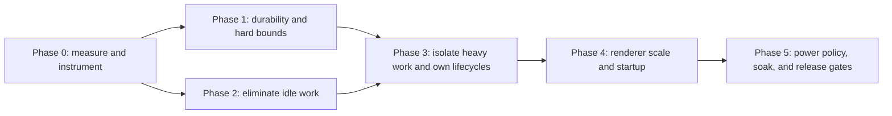

# Performance, Stability, Battery, and Efficiency Master Plan

Status: active; Phase 0 instrumentation implemented, laboratory baseline gate open
Date: 2026-07-27  
Audit snapshot: dirty working tree on `feature/aiden-assistant-plan-777723` at `7299340282f84fb816f1615f54a27bf97390f6fe`; findings refer to the current filesystem, not only `HEAD`  
Scope: Electron main/preload, React renderer, native helpers, storage, IPC, networking, background services, packaging, and macOS lifecycle

## Executive verdict

Aiden has several good foundations: renderer sandboxing and typed IPC boundaries, bounded updater cadence, generation abort bookkeeping, terminal cleanup on renderer destruction, error boundaries, and a broad passing test suite. The performance problem is not one bad framework choice. It is a set of unbounded or always-on paths that compound:

1. **Release-blocking durability and memory risks:** chat JSON is overwritten in place, unreadable state can silently fall back to defaults, attachments and recordings lack aggregate bounds, and chat history repeatedly carries base64 attachment payloads.
2. **Proven idle battery work:** a completed streaming message can retain a perpetual animation-frame loop, while a normal folder-backed chat can launch approximately six Git subprocesses every five seconds.
3. **Main-thread responsiveness risks:** local transcription loads and runs a roughly 600 MB native recognizer synchronously in Electron main; repository search and some helper/network paths lack complete cancellation and deadlines.
4. **Renderer scaling costs:** streaming repeatedly copies and reparses growing strings, transcript scrolling has overlapping layout triggers, and closed or high-cardinality surfaces still do catalog/list work.
5. **Lifecycle gaps:** MCP clients, renderer crash recovery, scheduled catch-up, model installation, and shutdown do not yet share bounded ownership and recovery contracts.
6. **Startup and distribution overhead:** the rebuilt renderer entry is 2.54 MB minified / 764 KB gzip, the full Highlight.js catalog is eager, and production globs include about 9.8 MB of generated source maps.
7. **No trustworthy performance feedback loop:** there are no packaged-runtime budgets for event-loop delay, wakeups, helper/process counts, IPC volume, disk bytes, heap growth, crash loops, or energy impact.

The first implementation milestone should therefore be **data safety and bounded memory**, not cosmetic micro-optimization. The next should remove work that continues when the user is idle. Heavy native and repository work should then move behind owned, cancellable workers. Renderer and bundle work follows once the app can measure the result.

## Goals

- Never lose acknowledged chat or settings data because a write was interrupted.
- Never allocate memory proportional to an arbitrary file, recording, tool result, or renderer-supplied history.
- Keep Electron main responsive during local voice, repository search, downloads, MCP activity, and shutdown.
- Reach zero app-owned animation frames and zero periodic Git subprocesses when idle or hidden.
- Preserve immediate chat/composer availability and smooth perceived streaming.
- Bound background work on battery, while minimized, while locked, and across suspend/resume.
- Make long chats, large workspaces, model catalogs, diffs, terminals, and attachments scale predictably.
- Enforce startup, package, memory, cancellation, and idle-energy budgets before release.

## Non-goals

- Rewriting Aiden away from Electron or React.
- Replacing every JSON store with a database before measurement shows that atomic JSON plus an append journal is insufficient.
- Reducing visual quality speculatively. Transparency, vibrancy, blur, and motion should change only after packaged traces prove their cost.
- Lazy-loading the primary chat shell or composer. Secondary routes and heavy optional surfaces are the split candidates.
- Polling models.dev from normal runtime paths; the existing explicit refresh/release boundary remains intact.

## Audit evidence

| Priority | Confirmed issue                                                                                                               | Evidence                                                                                                         | User-visible impact                                                                                |
| -------- | ----------------------------------------------------------------------------------------------------------------------------- | ---------------------------------------------------------------------------------------------------------------- | -------------------------------------------------------------------------------------------------- |
| P0       | Chat and index files are overwritten directly; parse failure becomes an empty index or missing chat                           | `main/services/chat-store-core.ts`                                                                               | A crash, power loss, disk-full event, or partial write can hide or destroy history                 |
| P0       | Attachments have no count or aggregate budget; text files are fully read before truncation; files are read concurrently       | `main/services/attachments.ts`, `main/handlers/attachments.ts`, `main/handlers/chat-params.ts`                   | A huge file or many images can freeze/crash main and duplicate hundreds of MB across IPC/history   |
| P0       | Several device-local stores treat non-missing read failures as defaults without universal quarantine/recovery                 | `main/services/data-store.ts`, schedule/settings/usage store construction                                        | Recoverable state can be silently replaced after corruption, permissions, or transient I/O failure |
| P1       | Streaming reveal schedules `requestAnimationFrame` forever, including when complete or reduced motion is active               | `renderer/components/streaming-markdown-reveal.tsx`                                                              | Persistent renderer wakeups and battery use after streaming                                        |
| P1       | Git info polls every 5 s, with review at 4 s; an uncached info call launches about six Git commands                           | `renderer/lib/queries.ts`, `main/services/git.ts`                                                                | Approximately 72 child processes/minute in a normal open chat, plus heavier review work            |
| P1       | Local speech recognition constructs and invokes the native recognizer synchronously in main and caches by model               | `main/handlers/local-voice.ts`, `main/services/parakeet.ts`                                                      | Whole-app stalls and potentially roughly 1.2 GB retained after using both voice models             |
| P1       | Streaming copies the full accumulated string per frame, reparses growing Markdown, and has overlapping scroll observers       | `renderer/main/chat-pane.tsx`, `renderer/components/streaming-markdown-reveal.tsx`, `renderer/components/ui.tsx` | Long-task, layout, and frame-drop risk on long/code-heavy responses                                |
| P1       | Stop does not consistently stop recursive repository work or network tools                                                    | `main/services/coding-tools.ts`, `main/services/tools.ts`                                                        | CPU, disk, and network activity can continue after the user presses Stop                           |
| P1       | MCP connect is not single-flight; schemas are fetched per generation; clients have no idle expiry; close is not awaited       | `main/services/mcp.ts`, `main/index.ts`                                                                          | Duplicate/leaked helpers, hangs, stale connections, and incomplete quit                            |
| P1       | Renderer exit immediately reloads without reason-aware backoff or a retry ceiling                                             | `main/index.ts`                                                                                                  | A deterministic crash can become a hot relaunch loop                                               |
| P1       | Model installation deletes the usable version before validating a staged replacement and does not own extraction cancellation | `main/services/local-models.ts`                                                                                  | Interrupted installation can remove a working local voice model                                    |
| P1       | Scheduled catch-up has per-task overlap protection but no global budget or battery/lock policy                                | `main/services/schedule-service-core.ts`                                                                         | Multiple missed tasks can stampede after startup/resume                                            |
| P2       | The closed model picker queries every provider and rebuilds/sorts catalog structures during parent renders                    | `renderer/components/model-picker.tsx`, `renderer/lib/queries.ts`                                                | Stream-frame work scales with provider/model count                                                 |
| P2       | Startup waits for provider enumeration/auth state before the first React render                                               | `renderer/main/index.tsx`, `main/services/provider-registry.ts`                                                  | A slow keychain/provider probe delays visible app chrome                                           |
| P2       | Routes, settings, xterm, KaTeX, and full Highlight.js are in an eager startup graph                                           | `renderer/main/router.tsx`, `renderer/main/settings-view.tsx`, `renderer/components/code-block.tsx`              | Larger parse/compile/startup and update payload                                                    |
| P2       | Terminal output and LLM deltas cross IPC at source cadence; terminal buffers repeatedly copy large strings                    | `main/services/terminal.ts`, `main/services/llm-client.ts`                                                       | Excess wakeups, IPC allocations, and resize churn                                                  |
| P2       | Several realistic lists are unwindowed                                                                                        | files, review, chat/model palettes, transcript                                                                   | Large workspaces and histories degrade nonlinearly                                                 |

The following remain **measurement gaps**, not validated regressions: the GPU/energy cost of the transparent vibrant window, the hidden dictation pill's disabled background throttling, real packaged startup time, KaTeX font subset value, updater cost on battery, and title-generation contention. Phase 0 decides these from traces.

## Delivery principles

1. **Acknowledge only durable state.** An IPC mutation resolves after its recoverable write boundary, not after only an in-memory update.
2. **Bound at every trust boundary.** Renderer input, filesystem input, network/MCP output, and native helper output each get count, byte, time, and concurrency limits.
3. **One owner per expensive resource.** Workers, recognizers, child processes, PTYs, MCP clients, downloads, timers, and watchers have explicit start, abort, idle, and shutdown ownership.
4. **Event-driven by default.** App mutations invalidate state immediately; focused surfaces may use a slow fallback. Hidden/minimized surfaces do not poll.
5. **Zero idle scheduling.** No RAF, short timer, filesystem scan, child process, or helper probe remains live without pending user-visible work.
6. **Isolate the active turn.** Streaming state should not force the persisted transcript, model catalog, composer, and unrelated panels to rerender.
7. **Optimize from packaged evidence.** Development memory and CPU snapshots are directional only. Release gates use a signed/unpacked production-equivalent build on a named reference Mac.
8. **Preserve perceived speed.** Render the chat shell first, keep the composer immediately interactive once provider identity is authoritative, and idle-preload secondary chunks where useful.

## Phased master plan

### Phase 0 — Reproducible baseline and local diagnostics

Deliverables:

1. Add privacy-safe, device-local diagnostic events with explicit export:
   - startup milestones: main ready, window created, navigation started, first shell paint, providers ready, composer ready;
   - event-loop delay/utilization and long main tasks;
   - renderer long tasks, React commits, live RAF/timer counts, and scroll writes;
   - child/helper launches, duration, exit reason, and owner;
   - IPC messages/bytes by channel, filesystem read/write bytes, Git commands, MCP clients, PTYs, and recognizers;
   - renderer `unresponsive`/`responsive`, `render-process-gone` details, `child-process-gone`, process errors, shutdown timeouts, and crash-loop state.
2. Store a bounded redacted ring buffer. Never record prompts, response text, file paths, credentials, environment values, or tool payloads.
3. Add a scripted benchmark fixture and a manual Instruments runbook for:
   - cold/warm launch;
   - visible idle, blurred idle, minimized, window closed/background;
   - 100- and 500-turn chats;
   - 2k/10k-character Markdown streams with code, math, reasoning, and tool phases;
   - clean and dirty monorepos, Review closed/open, and external file churn;
   - one/many/oversized attachments and long voice recordings;
   - four terminals with idle and high-output workloads;
   - MCP offline/hung/duplicate-connect cases;
   - 20 missed schedules, suspend/resume, lock/unlock, and timezone change.
4. Record production-equivalent AC and battery runs with DevTools closed using Instruments Time Profiler, Energy Log, and Core Animation. Capture Chrome Performance and React Profiler only in clearly separate optional attribution passes; they must not be represented as part of the production-equivalent measured interval. Use `powermetrics` only when permissions are explicitly available.
5. Stamp benchmark output with commit, dirty-state hash, build mode, app/Electron versions, hardware, macOS version, power source, and scenario.

Exit gate:

- One reproducible production-equivalent baseline exists for every scenario.
- CI can fail on deterministic counters and bundle/package budgets.
- Hardware energy thresholds are documented as lab gates rather than pretending CI can measure them.

### Phase 1 — Durability, recovery, and hard memory limits

#### 1A. Make persisted state recoverable

- Introduce one tested atomic writer: sibling temp file, bounded serialization, flush, rename, and parent-directory sync where macOS semantics require it.
- Keep the last known good generation; quarantine malformed/schema-invalid files with a timestamp and reason.
- Distinguish `ENOENT`, malformed JSON, schema failure, `EACCES`, disk full, and transient I/O. Do not turn non-missing I/O failures into writable defaults.
- Convert chat/index writes first. Rebuild a missing/corrupt index from valid chat bodies.
- Replace the global chat queue with per-chat mutation ownership plus a serialized index owner.
- Stop pretty-print rewriting unbounded history on every append. First introduce cached/atomic JSON; then benchmark an append journal with compaction. Adopt SQLite only if the journal cannot meet the measured gate.
- Apply the same recovery contract to settings, workspaces, schedules, usage, and cache stores according to whether data is authoritative or regenerable.
- Preserve backward reads and keep recovery tooling available across at least one release rollback window.

Tests:

- Fault injection before/after temp write, flush, rename, index update, and acknowledgement.
- Kill/relaunch, disk-full, read-only directory, corrupt/truncated JSON, stale temp, and interrupted migration.
- Concurrent mutation of two large chats; index rebuild; recovery of the last acknowledged message.

#### 1B. Bound attachments, history, recordings, and results

- Reject attachment count, per-file bytes, aggregate raw bytes, and aggregate encoded bytes before allocation.
- Read only a bounded text prefix; detect binary data in the prefix; use concurrency 2–4 instead of `Promise.all` over arbitrary selection.
- Validate the attachment DTO again in main before persistence or generation.
- Store attachment bodies as content-addressed files under `userData`; store references and metadata in chat JSON. Use bounded thumbnails/blob URLs in the renderer and garbage-collect unreferenced blobs transactionally.
- Send `chatId + current turn` to main and load authoritative history there. Do not clone renderer-supplied base64 history before compaction.
- Add recording duration/sample/encoded-byte limits. Prefer transferable binary buffers over base64 for voice IPC.
- Bound MCP/tool/terminal results before JSON/string conversion.

Tests:

- Sparse 10 GB text file, many near-limit images, base64 expansion, duplicate attachments, binary-prefix detection, deleted source file, and cleanup after failed persistence.
- Repeated attach/remove/chat-switch cycles with heap recovery.
- Oversized renderer-crafted history/attachment payloads rejected at IPC.

Exit gate:

- Zero lost acknowledged chat mutations at every injected write boundary.
- Corruption or permissions failure never silently overwrites recoverable state.
- No file, recording, message history, or tool result can allocate outside a documented aggregate budget.

### Phase 2 — Eliminate idle battery work

#### 2A. Replace polling with one workspace freshness coordinator

- Cache repository identity by real path/common Git directory and invalidate only on path/repository changes.
- Coalesce app-owned mutations, file watcher signals, focus, and explicit refresh into one versioned Git snapshot shared by branch, Review, comparison, push, and environment consumers.
- Ignore high-churn/generated directories and debounce event storms. Watchers are hints; preserve a slow visible-only fallback.
- Do not run Review hashing/diff snapshots unless its surface is visible or the user requests refresh.
- Pause fallback refresh while hidden, minimized, locked, suspended, or in low-power mode.
- Replace per-hook 4–5 second intervals with invalidation/version subscriptions and an adaptive 30–60 second focused fallback only if measurement proves necessary.

#### 2B. Stop idle renderer scheduling

- Replace the perpetual reveal loop with a single scheduled callback only while unrevealed units are due.
- Stop immediately when caught up, complete, reduced motion is active, the document is hidden, or the component unmounts.
- Use a single active-stream scheduler for main chat and Assistant; cap active visual commits around 30 Hz unless traces justify more.
- Coalesce streamed deltas and terminal chunks by time/byte threshold, while flushing state transitions and completion immediately.
- Replace full-subtree scroll mutation observation with a tail sentinel and one coalesced scroll measurement/write. Preserve the user's away-from-bottom state.
- Configure a query freshness matrix: event-owned local state gets long/infinite stale time and no focus retry storm; network/runtime state gets explicit TTL, retry, visibility, and reconnect behavior.

Tests:

- Fake-clock/RAF proof that caught-up, complete, reduced-motion, hidden, and unmounted streams schedule no frames.
- One mutation batch produces at most one scroll write; a detached reader is never pulled to bottom.
- Process-spawn counters prove no periodic Git children when idle/hidden and immediate refresh after a known mutation.

Exit gate:

- Zero live Aiden-owned RAF loops and zero periodic Git subprocesses when idle or hidden.
- Git state appears within two seconds after a known Aiden mutation without polling.
- Visible external changes meet the fallback freshness budget established in Phase 0.

### Phase 3 — Isolate heavy work and own every lifecycle

#### 3A. Local voice and repository tools

- Move Sherpa recognizer creation and decoding to one owned utility process or worker. Prefer process isolation if a native crash can otherwise take down Electron main.
- Use one bounded transcription queue, cancellation, progress state, and one-recognizer LRU/idle eviction. Release on memory pressure and battery policy.
- Replace recursive in-process JavaScript grep with owned `rg` or a worker. Bound traversal, output, duration, and binary/ignored directories.
- Make `AbortSignal`, deadline, byte limit, and result limit mandatory parts of every tool contract, including Exa/network work.
- Define stop-to-settled behavior and assert that filesystem, network, native, and child activity ends.

#### 3B. MCP, downloads, terminal, and shutdown

- Use a single-flight MCP connection record keyed by server ID plus config fingerprint.
- Cache tool schemas with explicit config/health invalidation; connect independent servers with bounded concurrency.
- Add connect/list/call/close deadlines, health state, last-used/refcount idle expiry, and bounded tool results.
- Await MCP closure in the shutdown barrier and report stragglers without hanging quit forever.
- Download local models into a resumable partial artifact with size/checksum/deadline; extract into staging with an owned cancellable child; validate the complete manifest; atomically swap while preserving the previous valid model.
- Serialize model download/delete and make cancellation settle only after owned children exit.
- Replace terminal string slicing with a bounded chunk ring. Coalesce IPC output, dedupe resize calls, and fit after the open/close animation settles.
- Keep hidden PTYs only when a real job is running or the user chose persistence; expose status rather than silently killing work.

#### 3C. Crash and schedule containment

- Make renderer recovery reason-aware with exponential backoff, a bounded rolling retry window, and a safe-mode/recovery screen after repeated exits.
- Add a global scheduled-task concurrency budget, missed-run coalescing, catch-up ceiling, jitter, and explicit battery/locked/suspend/resume semantics.
- Reconcile schedule state on resume and timezone/DST change; make run history/runtime state one durable transaction.

Exit gate:

- Local transcription does not push main event-loop p99 above the Phase 0 budget.
- One MCP client/helper exists under concurrent requests; hung operations meet deadlines; shutdown leaves zero owned children.
- Stop reaches quiescence within a documented per-operation deadline.
- Interrupted model install always leaves the previous valid model usable.
- Repeated renderer failure exits the hot loop into bounded recovery.

### Phase 4 — Renderer scale, startup, and package efficiency

#### 4A. Isolate streaming and high-cardinality UI

- Separate the active streaming turn from memoized persisted transcript rows and composer/model controls.
- Parse only the append-only tail; cache finalized Markdown blocks. Render unfinished fences as plain text and highlight once stable.
- Replace full Highlight.js with `core` plus an evidence-based language allowlist; lazy-load uncommon languages or highlight in a worker.
- Keep the model picker trigger cheap while closed. Batch provider metadata into one revisioned snapshot, memoize indexes/layout, and construct/virtualize the full picker only when open.
- Replace per-provider model-info IPC with one all-provider snapshot. Read/decrypt the Artificial Analysis cache once per cache generation rather than once for each provider.
- Window/paginate transcript, files, diff lines, chat/model palettes, and other measured high-cardinality lists while preserving keyboard navigation, screen-reader context, search, selection, copy, and scroll anchors.
- Stop recreating historical image data URLs; use stable blob URLs/thumbnails and release them with reference ownership.

#### 4B. Render sooner and load optional code later

- Render the lightweight shell before provider enumeration. Show a truthful provider-hydration state and enable composer selection only after alias/identity migration is authoritative.
- Dynamically import Settings/Profile/Scheduled routes, individual heavy Settings sections, terminal/xterm on first open, and other secondary panels.
- Keep ChatLayout, transcript shell, composer, selected-model trigger, and generation bridge in the initial graph. Optionally idle-preload the next likely surface after first input readiness.
- Use package-content allowlists. Bundle pure-JS main dependencies when safe; externalize/unpack only native/runtime-required modules.
- Disable packaged source maps or publish hidden maps outside the app artifact. Add a test that no `.map` is shipped.
- Add bundle visualizer output and initial/async chunk budgets to CI.

Exit gate:

- Initial renderer JS meets the Phase 0-derived budget; proposed first target is at most 1.5 MB minified with no startup chunk over 500 KB.
- Packaged artifacts contain no source maps and only allowlisted unpacked dependencies.
- A 500-turn chat, 4,000-file workspace, large diff, and full model catalog remain responsive within the long-task/heap gates.
- The shell appears before provider discovery completes without allowing a stale provider/model mutation.

### Phase 5 — Power policy, soak, and release gates

- Introduce a central lifecycle/power signal: visible, focused, minimized, locked, suspended, on battery, and low-power mode.
- Each background owner declares behavior for every state: updater, scheduler, MCP, recognizer cache, terminal, Git/workspace watcher, Foundation Models probe, title generation, and optional Assistant work.
- Respect the Foundation Models cache on activation; force only explicit retry or stale resume recovery.
- Measure transparency/vibrancy, blur, dictation-pill `backgroundThrottling`, and animations as controlled A/B variants. Change them only when the energy/frame result is material and the visual/accessibility tradeoff is accepted.
- Run 30–60 minute AC/battery soaks for foreground, blurred, minimized, background, streaming, voice, terminals, MCP, and sleep/wake.
- Add crash, disk-full, offline, hung-helper, process-exit, and quit-under-load chaos scenarios to release verification.

Exit gate:

- No monotonic heap/RSS growth across repeated chat, attachment, voice, terminal, MCP, and model-switch cycles after a defined settling window.
- Idle/minimized app launches no periodic Git or helper probes and improves wakeups/CPU time by at least 50% versus the Phase 0 baseline.
- No owned child process, PTY, recognizer, watcher, or network request remains after its shutdown deadline.
- Packaged startup, first-input readiness, first-token overhead, idle energy, streaming long tasks, package/update size, and bytes written per turn all have recorded release budgets.

## Proposed acceptance ledger

Phase 0 may tighten these numbers. Invariants are hard requirements now; relative performance targets become hard after the reference baseline is recorded.

| Area                | Release gate                                                                                                                                                    |
| ------------------- | --------------------------------------------------------------------------------------------------------------------------------------------------------------- |
| Durability          | Zero acknowledged-message loss across fault injection; recoverable corruption is quarantined, surfaced, and never overwritten                                   |
| Input bounds        | Count, raw-byte, encoded-byte, duration, concurrency, and result caps enforced in main regardless of renderer behavior                                          |
| Idle renderer       | Zero continuous RAF/timer loops after work settles; zero scroll writes without content/viewport change                                                          |
| Idle Git            | Zero periodic Git children while hidden/minimized; target zero while visible idle, with at most one slow fallback refresh/minute if watchers prove insufficient |
| Main responsiveness | Proposed p99 event-loop delay below 50 ms during voice/tool workloads after isolation                                                                           |
| Cancellation        | Every owned local operation reaches quiescence within a measured deadline; network/helper calls have explicit timeouts                                          |
| MCP                 | One client/helper under 100 concurrent connect attempts; a hung server is isolated; zero clients/helpers after quit                                             |
| Renderer scale      | No task over 50 ms at p95 during the reference stream; at most one scroll write/frame; bounded parser/highlighter calls                                         |
| Memory              | Heap/RSS returns within a Phase 0-defined tolerance after repeated attachment, voice, terminal, chat, and model cycles                                          |
| Startup             | Shell first, provider-ready second; proposed p95 shell target at most 1.5 s on the reference Apple Silicon Mac                                                  |
| Bundle/package      | Proposed initial JS at most 1.5 MB minified; no initial chunk over 500 KB; no production maps; package allowlist enforced                                       |
| Battery             | At least 50% fewer idle wakeups/CPU time than baseline and no material minimized/background energy impact                                                       |

## Verification matrix

Every behavioral change includes narrow unit/contract tests and the relevant existing suites. New test files must be registered in `package.json`.

| Workstream       | Automated verification                                                                    | Runtime verification                                        |
| ---------------- | ----------------------------------------------------------------------------------------- | ----------------------------------------------------------- |
| Storage          | fault-injected atomic writer, recovery, concurrent chat/index, migration, disk/I/O errors | kill during writes, relaunch/recovery, large-history append |
| Bounds           | sparse files, many images, renderer-crafted IPC, oversized history/audio/results          | heap trace while adding/removing realistic media            |
| Streaming/scroll | fake RAF/clock, parser/highlighter counters, scroll sentinel contract                     | Chrome + React profile of long Markdown/code/math stream    |
| Git/query        | watcher/debounce/invalidation, child-count assertions, visibility/power state             | dirty monorepo Instruments trace, Review closed/open        |
| Voice/tools      | worker protocol, cancellation, crash, memory eviction, timeout                            | cold/warm dictation and stop-under-load trace               |
| MCP/download     | concurrent connect, idle expiry, stale config, timeout, atomic install                    | hung server, offline install, cancel extraction, quit       |
| Startup/package  | chunk/map/package manifest budgets, provider hydration contract                           | cold/warm packaged launch and first-input timing            |
| Scheduler/power  | missed-run policy, global queue, resume/DST/timezone, lifecycle matrix                    | sleep/wake, locked, battery/AC soak                         |

Required commands at each applicable milestone:

- `npm run type-check`
- `npm run lint`
- the narrow registered test script for the changed area
- `npm test`
- `npm run build`
- package verification and the Phase 0 benchmark scenarios for release-facing changes

## Sequencing and ownership

Safe parallel lanes after Phase 0:

1. Atomic persistence/recovery.
2. Attachment/history/voice input bounds.
3. Git freshness coordinator and query policy.
4. Streaming scheduler and scroll ownership.

Follow-on lanes:

1. Voice/search worker isolation depends on bounds and diagnostics.
2. MCP/download/shutdown ownership depends on common deadline/child tracking.
3. Transcript/catalog virtualization depends on stable streaming boundaries.
4. Startup/package splitting depends on measured module/chunk attribution.
5. Central power policy depends on every background service exposing explicit lifecycle controls.

Each lane should land as a small reversible milestone with its own before/after trace. Do not combine persistence-format migration, worker isolation, and UI virtualization in one release.

## Decisions to freeze before implementation

1. Attachment blob retention and cleanup policy, including behavior when a chat is deleted.
2. Whether Sherpa runs in an Electron utility process or a Node worker; choose from crash containment and packaged native-module compatibility tests.
3. Git watcher implementation and ignored-directory policy after an event-storm prototype.
4. Scheduled-task behavior while on battery/locked and the maximum catch-up count after sleep.
5. Source-map publication destination and package allowlist.
6. Exact reference hardware and hard p95/energy budgets after Phase 0.

## Definition of done

This plan is complete only when:

- every P0/P1 item has a landed fix or an evidence-backed rejection;
- P2 items have either met their budget, moved to a separately indexed plan, or been documented as intentionally accepted;
- release verification contains durability, bounds, idle, cancellation, lifecycle, package, and soak gates;
- a packaged before/after report shows the measured change in startup, idle wakeups/CPU, streaming long tasks, memory settling, child/helper counts, disk bytes, and artifact size;
- `docs/plans/README.md` moves this plan to the completed archive with the remaining deferrals named explicitly.
