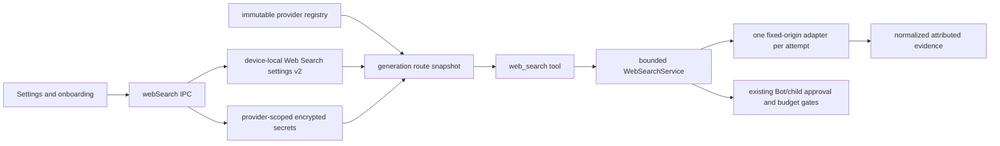

# Web Access Rehaul

Status: Active

Research date: 2026-08-28

Updated: 2026-08-28 after the default-on and provider-zoo decision

## Goal

Make Web Search available by default in a fresh Aiden profile with a genuinely
keyless path, while expanding the current Exa-only setting into a safe provider
catalog. Users can keep the built-in free route, connect their own search
provider, choose a fixed provider, or explicitly construct an ordered automatic
route without giving the model control over cost or data recipients.

"On by default" means the `web_search` tool is available to an attended
foreground chat. It does not authorize a startup probe, background request,
automatic test search, existing Bot authority expansion, or unattended schedule
expansion. The first network request still happens only when an eligible runtime
actually invokes the tool.

The existing Settings field is **Exa API key** and the encrypted secret ID is
`exa`; references to an "XI API key" are treated as references to this existing
Exa integration.

## Product decisions at a glance

1. Fresh profiles start with Web Search on and an automatic route containing
   only anonymous Exa MCP search.
2. An explicit legacy `exaEnabled: false` remains off. Upgrades do not override
   an earlier opt-out or silently spend a dormant key.
3. Settings gains a registry-backed provider zoo with a global switch,
   Automatic/Fixed routing, an ordered automatic route, search/filter controls,
   and provider-scoped setup panels.
4. Saving a provider key configures that provider; it never selects the
   provider, adds it to fallback, or causes a validation request by itself.
5. Fixed-provider mode never falls back. Automatic mode contacts only the
   destinations the user explicitly placed in its ordered route.
6. The model-facing tool remains `web_search({ query, numResults })`; the model
   cannot choose a provider, enable fan-out, or change billing/privacy policy.
7. Existing Full Bots and ordinary schedules do not inherit this new network
   authority. New or existing autonomous contexts need an explicit Web Search
   grant or renewed acknowledgement.
8. Provider adapters ship in evidence-gated waves. A catalog entry is not shown
   as usable until its endpoint, auth, bounds, pricing, privacy, errors, fixtures,
   and adapter tests are complete.

## Scope

This plan covers:

- default-on anonymous Exa MCP search for fresh attended foreground use;
- optional Exa API-key mode and a reusable multi-provider adapter registry;
- a Web Search provider catalog derived from Pi Web Access's 28 concrete
  providers;
- Automatic and Fixed routing owned by Settings, with explicit ordered fallback;
- generic encrypted provider credentials and provider-specific configuration;
- a bounded main-owned router shared by foreground, approved Bot, and approved
  child-agent consumers;
- Settings, onboarding, migration, attribution, errors, tests, and rollout; and
- preservation of existing Assistant, Bot, child, and schedule authority limits.

This plan does not import Pi Web Access wholesale. The browser curator, page
fetcher, result cache, GitHub clone path, PDF/video handling, deep-research agent,
proxy environment variables, arbitrary shell credential sources, browser-cookie
harvesting, and concurrent `all`-provider fan-out remain out of scope. Provider
subscription/session reuse is included only where Aiden can present a separate,
explicit consent and bind the exact existing credential without copying it.

## Audit: Aiden today

The current implementation is a thin direct Exa adapter:

- `main/services/tools.ts` posts to `https://api.exa.ai/search` and registers
  `web_search` only when `settings.exaEnabled` is true and `getKey("exa")`
  returns a key.
- `main/handlers/phase2.ts` exposes unfenced Exa-specific get/set-key/set-enabled
  handlers.
- `renderer/components/settings/web-search-settings.tsx` disables the master
  switch until a key exists and puts its password input and action in one compact
  row.
- `main/services/types.ts` and the renderer duplicate only an optional
  `exaEnabled` field. The key remains main-owned and encrypted.
- Foreground chats and ordinary schedules inherit ambient tools. Full Bots gain
  every currently available ordinary capability dynamically. Custom Bots and
  children have stronger explicit grants, while Aiden Assistant excludes Web
  Search through a positive allowlist.
- Child Web Search has useful approval, generation, revocation, query/body/result,
  and network-budget gates, but duplicates the Exa request path rather than using
  a shared router.

Weaknesses to repair:

- response bytes are not bounded before JSON parsing;
- upstream response text can leak into errors;
- Web Search mutations are not fenced to the active renderer document;
- availability is incorrectly coupled to one provider's credential;
- product configuration and IPC are named after Exa;
- there is no provider attribution or destination-aware fallback policy; and
- simply flipping the existing global default would silently widen Full Bot and
  unattended scheduled-task authority.

## Research: Pi's default and provider zoo

The local reference is `/Users/sambitbiswas/projects/opp/pi-web-access`.

### Free/default path

- `index.ts` treats Web Search as enabled unless explicitly disabled.
- `exa.ts` always reports Exa available. Without a key it makes a JSON-RPC
  `tools/call` to the fixed `https://mcp.exa.ai/mcp` hosted endpoint; with a key
  it can use Exa's direct API.
- Pi's automatic resolver is sequential first-success fallback, not fan-out. It
  checks configured SearXNG and compatible active-model auth, then reaches
  always-available Exa before ordinary keyed providers.
- DuckDuckGo is keyless HTML scraping, but Pi deliberately keeps it explicit-only
  because its parser depends on an unofficial page contract.

External evidence still supports Exa as Aiden's built-in first route:

- Exa's [official MCP documentation](https://exa.ai/docs/reference/exa-mcp)
  describes anonymous casual use, an optional `x-api-key`, and `429` behavior.
- Exa's [official MCP server repository](https://github.com/exa-labs/exa-mcp-server)
  describes anonymous rate-limited access and authenticated higher limits.
- Exa's [pricing page](https://exa.ai/pricing) distinguishes account credits and
  paid requests; Aiden must not invent a numeric anonymous quota.
- Exa's [privacy policy](https://exa.ai/privacy-policy) requires honest query-data
  disclosure and warns against personal information in queries.

A live no-key probe on the research date confirmed that Pi's hosted MCP request
returned structured search evidence without a credential. This remains a
vendor-hosted, rate-limited service rather than offline or unlimited search.

### Provider inventory

`gemini-search.ts` defines 28 concrete provider IDs plus the `auto` and `all`
routing concepts. Pi deliberately excludes Parallel MCP, DuckDuckGo, Kimi,
AnySearch, XCrawl, xAI, Bright Data, SerpBase, Serper, and Valyu from broad
fan-out because they are costly, quota-backed, fragile, or explicitly opt-in.
Aiden preserves that caution and does not implement `all` in this plan.

| Provider       | Pi configuration/auth                                 | Aiden delivery wave                                       |
| -------------- | ----------------------------------------------------- | --------------------------------------------------------- |
| Exa            | Anonymous hosted MCP or API key                       | Foundation and fresh default                              |
| Parallel MCP   | Anonymous hosted MCP; optional key                    | Wave 1, explicit-only                                     |
| DuckDuckGo     | Anonymous HTML scraping                               | Wave 4, explicit-only/experimental                        |
| SearXNG        | User endpoint; optional auth in Pi                    | Wave 2 after SSRF design                                  |
| OpenAI/Codex   | API key or compatible signed-in provider auth         | Wave 1 API key; Wave 3 credential reuse                   |
| Brave          | API key                                               | Wave 1                                                    |
| Parallel REST  | API key                                               | Wave 2                                                    |
| Tavily         | API key                                               | Wave 1                                                    |
| Perplexity     | API key                                               | Wave 1                                                    |
| Gemini         | API key, ADC/gateway, or opt-in browser cookies in Pi | Wave 1 API key only; no browser cookies                   |
| Kimi           | Kimi Code Plan session in Pi                          | Wave 4 after subscription-authority design                |
| xAI            | API key or compatible signed-in provider auth         | Wave 3, explicit-only                                     |
| Firecrawl      | Hosted/self-hosted endpoint and optional API key      | Wave 2 after endpoint policy                              |
| TinyFish       | API key                                               | Wave 2                                                    |
| Search1API     | API key                                               | Wave 2                                                    |
| Searchinfinity | API key                                               | Wave 4                                                    |
| Querit         | API key; separate Search/Contents products            | Wave 4                                                    |
| Jina           | API key                                               | Wave 2                                                    |
| SERPdive       | API key and retrieval model                           | Wave 4                                                    |
| Kagi           | API key                                               | Wave 2                                                    |
| Bocha          | API key                                               | Wave 4                                                    |
| Ollama Cloud   | API key; this is not a local Ollama daemon            | Wave 2                                                    |
| AnySearch      | Anonymous with optional API key in Pi                 | Wave 4, explicit-only                                     |
| XCrawl         | API key                                               | Wave 4, explicit-only                                     |
| Valyu          | API key                                               | Wave 4, explicit-only                                     |
| Bright Data    | API key and SERP zone                                 | Wave 4, explicit-only/cost warning                        |
| SerpBase       | API key sent in a URL query in Pi                     | Blocked until a reviewed no-secret-in-URL contract exists |
| Serper         | API key                                               | Wave 3, explicit-only                                     |

Before any wave exposes a provider as usable, Phase 0 records its official
endpoint and redirects, auth placement, query/body/result limits, capabilities,
quota and pricing semantics, privacy and terms URLs, error taxonomy, retention
notes, and deterministic fixtures. Settings may show a disabled **Planned** card
only in development builds; release builds show shipped adapters, so the provider
zoo never advertises a dead connection.

## Before and proposed after

| Area                   | Before                                                                    | Proposed after                                                                                                                                                 |
| ---------------------- | ------------------------------------------------------------------------- | -------------------------------------------------------------------------------------------------------------------------------------------------------------- |
| Fresh default          | Web Search is unavailable and off until an Exa key is saved.              | Web Search is on for a fresh attended foreground profile, with an automatic route containing only anonymous Exa.                                               |
| First network use      | Impossible without a saved key.                                           | No startup or setup request; the first eligible `web_search` call contacts Exa and the user can turn it off immediately.                                       |
| Provider scope         | One implicit direct Exa API path.                                         | Registry-backed provider zoo with staged, evidence-gated adapters.                                                                                             |
| Connection UI          | One global toggle plus one cramped Exa key row.                           | Global switch, Automatic/Fixed choice, disclosed ordered route, searchable provider catalog, and provider setup sheets.                                        |
| API-key input          | Required and coupled to enablement.                                       | Optional provider-scoped full-width input with separate Save/Replace/Remove actions; saved values stay write-only.                                             |
| Free choices           | None.                                                                     | Exa anonymous is built in; Parallel MCP, SearXNG, AnySearch, and experimental DuckDuckGo arrive only in their reviewed waves.                                  |
| Paid-provider behavior | Exa key is required, so all searches use it.                              | Saving a key never selects or routes to it; paid fallback requires a separate explicit route action.                                                           |
| Routing                | No routing layer.                                                         | Fixed mode fails closed; Automatic mode tries only a user-visible ordered route and never fans out concurrently.                                               |
| Model authority        | Model supplies query and result count to Exa.                             | Tool schema stays small; provider, route, credentials, cost, and privacy remain user-owned Settings state.                                                     |
| Credentials            | One encrypted `exa` secret and Exa-specific IPC.                          | Main-only provider-scoped encrypted secrets, generic fenced IPC, and no secret metadata in renderer snapshots.                                                 |
| Results/errors         | Exa implied; raw upstream detail can enter errors.                        | Normalized results identify the answering provider; safe activity identifies attempted providers and closed error categories.                                  |
| Bots                   | Availability is global, key-gated, and Full Bot capabilities are dynamic. | Default-on foreground availability does not grant existing Bots Web Search; Full Bot acknowledgement and exact Web grants are migrated explicitly.             |
| Schedules              | Ordinary schedules inherit ambient Web Search when globally available.    | Existing and new schedules default Web Search authority off unless the task explicitly grants it.                                                              |
| Children               | Duplicated Exa transport behind approvals and budgets.                    | Existing grant/approval/revocation gates call the shared router; each provider attempt consumes a network-budget unit.                                         |
| Onboarding             | Tour says users must connect Exa.                                         | Before first workspace use, a concise default-on disclosure names Exa, explains derived queries, and offers an on-by-default toggle; the feature tile remains. |

## Product contract

### Fresh profiles and upgrades

Fresh schema:

```ts
{
  version: 2,
  enabled: true,
  selection: {
    mode: "automatic",
    route: [{ providerId: "exa", credentialMode: "anonymous" }],
  },
}
```

The route is explicit even when it contains one provider. Adding another
configured provider is a separate action that shows its data recipient and cost
class before confirmation.

Migration rules:

| Legacy state                                         | Migrated state                                                                                               |
| ---------------------------------------------------- | ------------------------------------------------------------------------------------------------------------ |
| `exaEnabled: false`, with or without key             | Disabled; preserve key without using it                                                                      |
| `exaEnabled: true` + key                             | Enabled, Fixed Exa with API-key mode                                                                         |
| `exaEnabled: true` + no key                          | Enabled, Automatic route `[Exa anonymous]`                                                                   |
| Fresh/uninitialized profile + no key                 | Enabled, Automatic route `[Exa anonymous]`                                                                   |
| Existing completed profile + undefined flag + no key | Disabled to avoid retroactive network behavior                                                               |
| Undefined flag + dormant key                         | Preserve key but do not silently spend it; use install/onboarding evidence to distinguish fresh from upgrade |

Migration needs a durable fresh-profile/install-state discriminator; it must not
infer “fresh” from the absence of `exaEnabled` alone. The old field remains a
rollback input until the new schema has survived one stable release.

### Tool schema

The public tool remains compatible:

```ts
{
  query: string;       // trimmed, 1–2,000 Unicode characters
  numResults?: number; // integer, 1–10, default 5
}
```

The tool description says results are untrusted web evidence. It does not expose
`provider`, `route`, `all`, endpoint, headers, credentials, or retry policy. One
logical call may make sequential automatic-route attempts, but never concurrent
fan-out.

### Routing semantics

- **Fixed provider** resolves exactly one ready provider snapshot and never
  falls back.
- **Automatic** freezes the visible ordered route, adapter versions,
  credential modes, and main-only credential references at generation start.
- Unconfigured providers are skipped without a request. Authentication, invalid
  configuration, invalid request, policy rejection, and cancellation stop the
  route immediately.
- Fallback may continue only for the user-selected categories: timeout/network,
  `429`/quota, upstream `5xx`/transient, unsupported capability, or bounded
  invalid response. Defaults should be the narrow Pi taxonomy and remain visible
  in advanced route settings.
- Each attempt gets independent timeout, redirect, byte, parse, and cancellation
  bounds and consumes one child/schedule network-budget unit immediately before
  sending.
- No provider is auto-added because a credential exists. No paid provider is
  auto-added by migration. DuckDuckGo and all Pi explicit-only providers require
  direct user selection.
- Activity may name provider IDs and safe error categories but never query text,
  response bodies, secrets, endpoint parameters, or account identifiers.

## Target architecture



### Core modules

- `web-search-provider-registry-core.ts`: pure provider metadata, renderer-safe
  projection, schema normalization, readiness, and route validation.
- `web-search-provider-registry.ts`: main-only adapter factories, fixed origins,
  auth binding, capabilities, and error normalization.
- `web-search-core.ts`: normalized request/result/error types and shared byte,
  timing, URL, redirect, and parser bounds.
- `web-search.ts`: settings/credential snapshot, routing, activity attribution,
  and `toolForGeneration()`.
- `tools.ts`: asks the service for a generation-scoped tool; it no longer owns
  provider HTTP logic.
- Child Web proxy: retains grants, approvals, effect-time revocation, and budgets,
  but calls the same service rather than duplicating Exa fetch/parsing.

Aiden's model `ProviderRegistry` is a useful pattern but is not reused directly:
its identities, Pi model auth, and catalog lifecycle are inference-specific.

### Provider registry contract

```ts
type CredentialKind =
  | "none"
  | "optional-api-key"
  | "api-key"
  | "existing-provider-auth"
  | "endpoint"
  | "endpoint-and-api-key"
  | "api-key-and-zone";

interface WebSearchProviderDefinition {
  id: WebSearchProviderId;
  label: string;
  description: string;
  credentialKind: CredentialKind;
  costClass: "built-in-free" | "provider-free" | "quota" | "paid" | "self-hosted";
  fixedOrigins: readonly string[];
  capabilities: readonly WebSearchCapability[];
  privacyUrl: string;
  termsUrl: string;
  adapterVersion: number;
  releaseState: "shipped" | "experimental" | "blocked";
  createAdapter: MainOnlyAdapterFactory;
}
```

No renderer input can define an origin, header name, command, environment
variable, or adapter module. Self-hosted endpoint providers use a separate
reviewed URL policy; credentials bind to provider ID and normalized endpoint.
SearXNG/private endpoints require explicit private-network intent, DNS rebinding
defenses, redirect rejection, and effect-time address revalidation.

### Settings and renderer snapshot

Persist only product preferences and non-secret provider configuration:

```ts
interface WebSearchSettingsV2 {
  version: 2;
  enabled: boolean;
  selection:
    | { mode: "fixed"; providerId: WebSearchProviderId; credentialMode?: string }
    | { mode: "automatic"; route: WebSearchRouteEntry[]; fallbackOn: WebSearchFallbackKind[] };
  providerConfig: Record<string, BoundedNonSecretProviderConfig>;
}
```

Renderer reads receive one redacted snapshot with provider label, configuration
status, ready state, credential requirement, cost class, capabilities, links,
selection, and route membership. It never receives key prefix/suffix, length,
hash, revision, raw endpoint headers, raw upstream errors, or response bodies.

Provider credentials use stable secret IDs such as
`web-search:<providerId>:<credentialSlot>`. The legacy `exa` secret is migration
input and remains compatible through rollback. Reusing existing OpenAI, Gemini,
xAI, or Kimi auth stores a binding to that exact provider identity after a
separate confirmation; it does not copy or expose the secret.

### IPC and mutation ownership

Replace Exa-specific channels with:

- `webSearch:get`
- `webSearch:setEnabled`
- `webSearch:setSelection`
- `webSearch:setAutomaticRoute`
- `webSearch:setProviderConfig`
- `webSearch:setCredential`
- `webSearch:removeCredential`

Every mutation validates a registry ID, bounds/control-character rejects all
drafts, uses the active renderer-document owner, serializes related config and
secret changes, invalidates generation/inventory snapshots, and returns the
whole redacted durable snapshot. Provider credential removal affects only that
provider. If it makes the current route unusable, Settings shows the invalid
route and requires a user choice rather than silently changing recipients.

## UI plan

Before implementation, re-review
`docs/chatgpt-desktop-ui-inspiration.md` and
`docs/chatgpt-ui-element-specimen.html`; use the semantic tokens in
`renderer/styles.css` and `renderer/shared/appearance.ts`.

### Settings hierarchy

1. Rename the section consistently to **Web Search** while keeping “Web Access”
   as a search keyword.
2. Top summary card: master switch, **On by default for new profiles**, active
   route summary, and the statement that no background searches occur.
3. Routing control:
   - **Automatic** shows an ordered list of disclosed destinations and fallback
     conditions.
   - **Fixed provider** shows one selected provider and states that it will not
     fall back.
4. Provider zoo:
   - search and filter by Free, Connected, API key, Existing account,
     Self-hosted, and Experimental;
   - show selected/route state separately from configuration state;
   - group **Built in**, **Connected**, and **More providers** with progressive
     **Show more providers** disclosure; and
   - use existing provider-card patterns, semantic tokens, keyboard/focus rules,
     and `ProviderIcon`'s safe fallback rather than new one-off colors.
5. Per-provider card: name, one-line purpose, credential type, cost badge,
   privacy recipient/link, Ready/Needs setup/Experimental state, and
   **Configure**, **Use for search**, or **Add to route** actions.
6. Privacy/footer: query derivation, destination/fallback disclosure, local
   secret storage, untrusted results, and a link to manage Bot/schedule grants.

### Provider setup panel

- Use a sheet or dialog with a full-width password input and visible label.
- Keep Save/Replace and Remove as separate actions beneath the field.
- Never repopulate a stored secret or reveal identifying metadata about it.
- Exa offers **Built-in free** and **Use my API key** modes. Removing an Exa key
  returns that card to free capability without toggling global search or changing
  a Fixed keyed route behind the user's back.
- Provider-specific fields use registry schemas: key, endpoint, zone, or explicit
  existing-account reuse. Do not expose arbitrary headers or command execution.
- Saving says **API key saved**, not **Connected** or **Verified**. An explicit
  **Test provider** action, if added, must warn that it sends a request and may
  consume quota; setup itself performs no network call.
- Route inclusion is always a separate confirmation from credential save.

### Required states

- On with Exa anonymous active
- Off with route and credentials preserved
- Automatic route ready / partially unavailable / no ready provider
- Fixed provider ready / needs setup / revoked
- Configured but not selected
- In route with free/quota/paid warning
- Saving/replacing/removing one provider credential
- Anonymous `429`, keyed quota, authentication, timeout, bounded invalid response,
  and route-exhausted errors
- Experimental provider and blocked provider in development inventory
- Offline renderer restart with local status only

## Onboarding and first-run education

Because the capability is default-on, a tour-only tile is insufficient. Before
first workspace use, show concise copy beside an enabled-by-default toggle:

> Aiden can search the web when a question needs current information. Search is
> on by default and starts with Exa's free service. Aiden may derive a search
> query from your conversation and send that query and your network address to
> Exa only when it uses search. Avoid private information. You can turn this off
> or choose another provider now or later in Settings.

The screen performs no request. The final feature-tour bento keeps its Web Search
tile, updates the claim to shipped default-on behavior, links to Settings, and
retains its required optimized 1024×1024 transparent onboarding asset and test
contract. Provider-zoo configuration remains optional and does not lengthen the
required model-provider onboarding path.

## Runtime authority and migration

| Runtime                           | Planned authority behavior                                                                                        |
| --------------------------------- | ----------------------------------------------------------------------------------------------------------------- |
| Attended foreground chat          | Available when global Web Search is enabled; fresh default is on                                                  |
| Existing Full Bot                 | Does not gain Web Search until the user accepts the revised Full capability notice or grants Web explicitly       |
| New Full Bot                      | Confirmation explicitly names Web Search; grant is recorded, not inferred only from global availability           |
| Custom Bot                        | Existing exact Web grant remains authoritative; global enablement is availability, not authority                  |
| Existing ordinary schedule        | Web Search authority migrates false and stays false until explicitly enabled for that schedule                    |
| New ordinary schedule             | Web Search/network scope defaults off and is shown in creation/editing when relevant                              |
| Aiden dock / Assistant automation | Remains excluded by the current positive allowlist                                                                |
| Child agent                       | Requires parent grant, rollout, approval binding, global enabled state, ready route, and effect-time revalidation |

Implement Web Search as an explicit authority dimension instead of relying on
Full Bot's dynamic “all currently available tools” behavior. Existing Full Bots
receive a frozen compatibility ceiling for Web Search until renewed consent.
Capability inventory publication invalidates on global enablement, selected
route, route readiness, provider config, credential, and grant changes.

## Privacy and security requirements

- Default-on availability must be disclosed before first workspace use and offer
  an immediate toggle, but must not itself send a request.
- Every provider card and route entry names the service receiving a derived
  query, the credential/billing class, and provider privacy/terms links.
- Automatic routing warns that the same query may be sent sequentially to more
  than one listed provider after failures.
- Anonymous Exa requests contain no Aiden secret or stable Aiden-generated
  identifier. A user's source IP remains visible to the service.
- API keys never enter URLs, renderer state, logs, analytics, tool arguments,
  errors, diagnostics, or result metadata. SerpBase stays blocked while its
  reviewed contract requires query-string credentials.
- Requests use adapter-owned allowlisted origins, reject cross-origin redirects,
  strip auth on every rejected redirect, and apply timeout/cancellation and
  pre-parse byte limits.
- Provider output is bounded and normalized into untrusted evidence. Returned
  URLs are validated but never fetched automatically.
- Error messages use stable Aiden categories and safe provider attribution; raw
  upstream body/status text is not shown.
- Portable config/export excludes settings history that could reveal endpoint
  secrets and excludes all provider credentials.
- Self-hosted/private-network providers get a separate SSRF and local-network
  permission design before release.
- Browser cookies, ADC discovery, arbitrary environment variables, shell command
  credential sources, arbitrary headers, and unreviewed endpoint overrides are
  excluded.

## Implementation phases

### Phase 0 — Evidence, contracts, and authority freeze

Status: Complete (2026-08-28)

- Build the 28-provider evidence matrix and mark each Shipped, Experimental, or
  Blocked.
- Freeze settings v2, redacted snapshot, registry, request/result/error, route,
  activity, IPC, secret-ID, and migration contracts.
- Record the exact fresh-vs-upgrade discriminator and all legacy flag/key cases.
- Add Web Search as an explicit Bot and schedule authority; freeze existing Full
  Bot and schedule ceilings before changing global availability.
- Capture Exa MCP fixtures plus request/response/error fixtures for Wave 1.

Exit result: the v2 settings/provider registry, bounded shared/Exa contracts,
fixtures, conservative migration, explicit Full Bot Web grant, and explicit
schedule Web grant are implemented. Focused Web Search, Bot, schedule, type,
lint, format, and diff checks pass, and autonomous authority remains closed.

### Phase 1 — Core registry and default Exa route

Status: Complete (2026-08-28)

- Add pure registry/core modules, generic encrypted credential access, fenced
  IPC, normalized result attribution, and the generation-scoped router.
- Implement bounded anonymous/keyed Exa adapters and the new default/migration.
- Move foreground and child Web Search onto the shared service.
- Keep Fixed strict and Automatic route `[Exa anonymous]` by default.

Exit result: fresh attended foreground search uses bounded anonymous Exa without
a key, explicit upgrades remain off, and legacy keyed Exa migrates through the
provider-scoped encrypted credential seam. Generic active-document-fenced IPC,
redacted readiness, strict Fixed/ordered Automatic routing, per-attempt child
budgets, post-I/O revalidation, and shared foreground/child/Bot/schedule runtime
wiring are implemented. Unsupported future settings remain durable but project
closed. Focused Web Search, config-store, Bot, child, schedule, Assistant, type,
lint, format, and diff checks pass with autonomous authority unchanged.

### Phase 2 — Provider-zoo UI and first provider wave

Status: Complete (2026-08-29)

- Build Settings hierarchy, provider catalog, search/filters, route editor,
  provider setup sheet, full-width inputs, status/error states, and redacted
  mutations.
- Ship Wave 1 adapters whose evidence is complete: Parallel MCP, OpenAI API key,
  Brave, Tavily, Perplexity, and Gemini API key.
- Keep unshipped catalog records invisible in release UI.

Exit: users can configure providers without selecting them, select Fixed or an
explicit Automatic route, and understand every destination and cost class.

Exit result: Settings now exposes a release-only provider catalog with search,
filters, provider disclosures, write-only setup dialogs, full-width inputs,
Fixed selection, and a keyboard-operable ordered Automatic route. Parallel MCP,
OpenAI, Brave, Tavily, Perplexity, and Gemini API-key adapters ship behind the
shared bounded transport and generic routed-credential seam. Provider setup
performs no request and does not change route membership. Web Search, Bot,
schedule, Assistant, child-agent, type, lint, format, build, and React review
gates pass; autonomous authority remains unchanged.

### Phase 3 — Foundational breadth and provider-auth reuse

Status: Complete (2026-08-29)

- Ship Wave 2 adapters in reviewed batches, with SearXNG waiting on its
  private-network/SSRF gate.
- Add exact existing OpenAI/Codex auth reuse only after separate consent and
  subscription/quota copy; never silently reuse the active model credential.
- Continue Wave 2/3 adapters only as their evidence and fixtures pass.

Exit: every shipped adapter passes the same bounds/error/attribution contract;
credential save never changes route membership.

Exit result: Parallel REST, TinyFish, Search1API, Jina, Kagi, Ollama Cloud, and
Serper ship as explicit-only Wave 2 routes behind fixed origins, header-only
credentials, bounded responses, closed errors, cancellation, and untrusted
provider attribution. OpenAI API-key reuse is an explicit main-owned binding
with fenced IPC, redacted Settings state, a fixed Responses contract, and exact
credential revalidation before evidence publication. Consent and revoke do not
select a route or contact OpenAI. ChatGPT/Codex reuse remains unavailable until
its backend response contract is independently proven; SearXNG remains closed
until its private-network/SSRF gate exists. Focused Web Search, authority, type,
lint, format, build, and changed-scope React review gates pass.

### Phase 4 — Long-tail adapters and experimental sources

- Add long-tail hosted providers in evidence-backed batches.
- Keep cost-sensitive providers explicit-only with prominent quota/billing copy.
- Treat DuckDuckGo parsing as experimental and never automatic by default.
- Keep Kimi/xAI session reuse, browser-cookie Gemini, and SerpBase blocked until
  their separate authority/security gates are resolved.

Exit: release inventory reflects only tested adapters and no provider can bypass
the common safety envelope.

### Phase 5 — Onboarding, docs, packaging, and rollout

- Add the pre-workspace default-on disclosure/toggle and update the bento tile,
  artwork contract, privacy copy, and Settings keywords.
- Add focused `test:web-search` coverage to `package.json` and `pretest`.
- Run focused suites, full tests, type checking, packaging, and manual installed
  acceptance with free, keyed, automatic, fixed, Bot, schedule, and child paths.
- Roll out registry/Settings behind a kill switch while keeping Exa anonymous as
  the recoverable baseline.

## Test matrix

### Core, adapters, and routing

- Every adapter maps the common request to only its reviewed endpoint and auth.
- Anonymous requests contain no secret or stable Aiden identifier.
- A credential is attached only to its matching provider and endpoint binding.
- Fixed provider never falls back.
- Automatic preserves order, skips unavailable providers, obeys the exact
  fallback taxonomy, stops on auth/config/cancel/policy errors, and never fans
  out.
- Each attempt gets independent network-budget, timeout, redirect, and byte
  accounting.
- JSON/SSE/malformed/oversized/redirect/timeout/cancel/`429`/`5xx` fixtures close
  safely without leaking raw bodies or keys.
- Every normalized result and route activity names the answering/attempted
  provider and labels evidence untrusted.

### Settings, credentials, and migration

- Fresh profile defaults on with `[Exa anonymous]`; onboarding/read/settings make
  zero requests.
- Explicit legacy false remains off; every flag/key/freshness combination follows
  the migration table; dormant keys are not silently spent.
- Unknown/future provider IDs fail closed without destroying stored preferences
  or unrelated secrets.
- Save/replace/remove, concurrent mutation, active-document invalidation,
  endpoint rebinding, and rollback are atomic.
- Renderer snapshots never include secret-identifying metadata or raw upstream
  errors; portable config excludes credentials.
- Configuring a key does not select a provider or add it to a route.

### Runtime authority

- Attended foreground, existing/new Full Bot, Custom Bot, existing/new schedule,
  Aiden dock, Assistant automation, and child-agent behavior each match the
  runtime table.
- Existing Full Bots and schedules do not gain default-on Web Search.
- Child grant, rollout, parent approval, generation snapshot, effect-time global
  revoke, provider readiness, and per-attempt budget are enforced.
- Inventory invalidates on enablement, route, provider, credential, and grant
  changes without changing authority itself.

### Renderer and onboarding

- Provider catalog filters, grouping, status, selection, route ordering, privacy
  links, cost warnings, and experimental states are keyboard accessible.
- Full-width key inputs never repopulate saved values; failed mutations preserve
  the last durable snapshot and restore focus.
- Narrow/light/dark/reduced-motion states use semantic tokens.
- Default-on onboarding disclosure appears before first workspace use, offers the
  enabled toggle, causes no request, and updates the tested bento asset/copy.

### Manual packaged acceptance

1. Fresh install: observe default-on disclosure, enter workspace, and confirm no
   request occurs until a question actually invokes search.
2. Run a current-information query without a key; confirm Exa attribution and a
   useful result.
3. Save another provider key; confirm it remains unselected and no test request
   occurs.
4. Select it Fixed; confirm only that provider receives the query and failures do
   not fall back.
5. Build an Automatic route with Exa then an explicitly accepted quota provider;
   force an eligible failure and verify ordered attribution and cost disclosure.
6. Remove a selected credential and turn Web Search off during a long call;
   verify closed next-call/effect-time behavior and no hidden recipient change.
7. Confirm an old Full Bot and old schedule cannot search until separately
   re-authorized; confirm a Custom Bot and child still require exact grants.
8. Restart offline; confirm Settings and statuses render from local state without
   probing any provider.

## Acceptance criteria

- Fresh attended foreground Web Search is on by default and works through
  anonymous Exa without a user key.
- Existing explicit opt-outs, Bots, and schedules do not gain new outbound
  authority during migration.
- Settings provides a usable provider zoo with Automatic/Fixed routing,
  full-width provider inputs, redacted state, and provider-specific privacy/cost
  disclosure.
- Saving credentials never routes traffic or incurs a validation request.
- Fixed selection never falls back; Automatic contacts only the visible ordered
  route under the allowed fallback taxonomy; no `all` fan-out exists.
- The model cannot select recipients or billing policy.
- All shipped adapters share bounded transport, safe errors, provider
  attribution, cancellation, and untrusted-result handling.
- Foreground, Bot, schedule, Assistant, and child authority tests prove that
  default availability is not an implicit grant.
- Onboarding truthfully explains derived queries and the default Exa recipient
  before workspace use without generating traffic.

## Rollback

- Keep the legacy `exa` secret and legacy field readable for one stable release.
- A registry kill switch can collapse routing to Fixed Exa key or disable the
  feature without deleting provider credentials or route preferences.
- If anonymous Exa behavior changes, turn off only that adapter, mark the default
  route unavailable with a clear local error, and preserve the user's master
  switch and provider choices. Never silently substitute a paid provider.
- Disable an individual provider definition without changing other adapters.

## Follow-ons, not dependencies

- concurrent multi-provider fan-out with materially stronger privacy/cost UI;
- model-requested provider selection under a separate approval policy;
- page fetch/reader, curator synthesis, caching, citations, PDFs, video, or GitHub
  optimization;
- browser-cookie or ADC credential discovery;
- arbitrary compatible endpoints/headers; and
- provider health history, usage metering, and quota dashboards.
