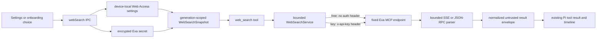

# Web Access Rehaul

Status: Planned

Research date: 2026-08-28

## Goal

Make Aiden's built-in `web_search` tool useful without requiring an API key,
while preserving an optional user-owned Exa API key for higher limits. The
feature must remain explicit, privacy-honest, bounded, cancellable, and available
to every existing Aiden runtime that already has Web Search authority.

This is an Exa integration, not an xAI integration. The current Settings field
and secret are named **Exa API key** / `exa`; references to an “XI API key” in the
request are treated as references to that existing Exa key.

## Scope

This plan covers:

- anonymous, rate-limited Exa MCP search with no account or key;
- an optional encrypted user-owned Exa key on the same fixed MCP transport;
- a new main-owned Web Access configuration and runtime service;
- Settings, onboarding, Bot/subagent availability, migration, and tests; and
- truthful privacy, rate-limit, billing, and failure copy.

This plan does not import the whole `pi-web-access` extension. It deliberately
does not add its browser curator, result cache, page fetcher, GitHub clone path,
PDF/video handling, browser-cookie access, proxy configuration, provider zoo,
deep-research agent, or keyless DuckDuckGo HTML scraper. Those are separate
products and materially larger privacy/security surfaces.

## Audit: Aiden today

The current implementation is a thin direct Exa API adapter:

- `main/services/tools.ts` registers `web_search` only when
  `settings.exaEnabled` is true **and** `secrets.getKey("exa")` returns a key.
- The tool posts directly to `https://api.exa.ai/search` with `x-api-key`, allows
  1–10 results, requests up to 1,200 text characters per result, and returns a
  JSON string.
- `main/handlers/phase2.ts` exposes `exa:get`, `exa:setKey`, and
  `exa:setEnabled`. Removing the key also disables search.
- `renderer/components/settings/web-search-settings.tsx` disables the Web Search
  toggle until a key exists and puts the password field and action button in one
  compact row.
- `settings.exaEnabled` is device-local. The key is encrypted in the existing
  secret store and is never returned to the renderer.
- Foreground chats and ordinary scheduled runs receive the ambient tool when it
  is enabled. Bots expose Web Search only when it is both enabled and
  credentialed. Children use the host web proxy only when the same key check
  passes. Aiden Assistant's positive allowlist intentionally excludes Web Search.
- The onboarding feature tile says users must “choose to connect” live Exa
  search. New users cannot try the feature without first creating an Exa key.

Important weaknesses to repair while changing the transport:

- response bytes are not bounded before `response.json()`;
- raw upstream status text and up to 200 response-body characters can enter an
  error;
- the Web Search mutation handlers are not fenced to the active renderer
  document;
- the setting name encodes a provider rather than the product capability; and
- runtime availability is incorrectly coupled to credential presence.

## Research: how Pi's free Web Access works

The local reference at `/Users/sambitbiswas/projects/opp/pi-web-access` uses two
keyless paths, but only one is part of its automatic default:

1. `exa.ts` always reports Exa as available. With no `exaApiKey`, it sends a
   JSON-RPC `tools/call` to `https://mcp.exa.ai/mcp`, initially using
   `web_search_exa` and using `web_search_advanced_exa` only when richer filters
   need it. A `429` tells the user to add a key.
2. `duckduckgo.ts` scrapes `https://html.duckduckgo.com/html/` without a key, but
   DuckDuckGo is explicit-only and is not in Pi's automatic provider order.
3. With an Exa key, Pi switches to Exa's direct `/answer` or `/search` APIs.
4. Pi also supports many other paid, local, subscription, and browser-cookie
   providers. That breadth is not necessary to give Aiden a dependable free
   first tier.

Current upstream evidence supports adopting the first path:

- Exa's [official MCP documentation](https://exa.ai/docs/reference/exa-mcp)
  says the hosted MCP server's free plan covers casual use, lists
  `web_search_exa` as a default tool, accepts an `x-api-key` header to lift rate
  limits, and returns `429` when the free-plan limit is reached.
- Exa's [official MCP server repository](https://github.com/exa-labs/exa-mcp-server)
  says the hosted endpoint works anonymously with rate limits and recommends
  OAuth or an API key for higher limits. The current server source identifies
  unauthenticated calls as `free_tier` and rate-limits tool calls by source IP.
- Exa's [pricing page](https://exa.ai/pricing) describes its account-based free
  credits and paid per-request API pricing. Those account credits are different
  from anonymous MCP access, so Aiden must not display a numeric anonymous quota
  that Exa has not publicly committed to.
- Exa's [privacy policy](https://exa.ai/privacy-policy) says query fields are not
  intended for personal information and that Query Data may be used to improve
  products and train/fine-tune models. Aiden must disclose this before enabling
  Web Access; an API key changes limits/account billing, not this default privacy
  claim.

A live no-key probe on 2026-08-28 confirmed the exact Pi-style call still works:

- `tools/list` returned one `web_search_exa` schema over an SSE `event: message`
  frame;
- a no-key `tools/call` with one result returned `Title`, `URL`, `Published`,
  `Author`, and `Highlights` text; and
- the request required no MCP session handshake or credential.

This is a vendor-hosted free service, not an offline search engine and not free
in the sense of unlimited capacity. Its availability and anonymous limits can
change. Aiden must fail honestly and retain an immediate off switch.

## Before and proposed after

| Area                | Before                                                                   | Proposed after                                                                                                                                                                  |
| ------------------- | ------------------------------------------------------------------------ | ------------------------------------------------------------------------------------------------------------------------------------------------------------------------------- |
| First use           | Search is unavailable until the user creates and saves an Exa key.       | Search can be enabled with **Free search** and no account or key. It remains off until the user opts in.                                                                        |
| Connection choices  | One implicit direct-API path.                                            | Explicit **Free search** or **Exa API key** connection choice.                                                                                                                  |
| Key field           | Required, compact, and visually coupled to enablement.                   | Optional, full-width, paste-friendly advanced section with separate Save/Replace and Remove actions.                                                                            |
| Transport           | Direct `POST https://api.exa.ai/search`.                                 | Fixed `POST https://mcp.exa.ai/mcp?tools=web_search_exa` JSON-RPC transport for both tiers; `x-api-key` is added only for key mode.                                             |
| Credential handling | Encrypted secret; removing it disables search.                           | Existing encrypted `exa` secret is preserved; removing it selects Free search without changing the user's enable toggle.                                                        |
| Availability        | `enabled && hasKey`.                                                     | `enabled`; the generation snapshot resolves either anonymous or keyed transport.                                                                                                |
| Rate limits         | Upstream errors are generic direct-API failures.                         | Anonymous `429` explains the free limit and offers retry or an optional key; keyed `429` explains account quota/rate limiting.                                                  |
| Privacy copy        | Says queries are sent to Exa when the assistant uses search.             | Adds that no background search occurs, Exa receives query data and source IP on use, queries should not contain private data, and a key may use the user's Exa credits/billing. |
| Request safety      | Abort signal and a result-count cap, but no pre-parse response-byte cap. | Fixed origin, no cross-origin redirects, bounded query/body/SSE/result parsing, closed errors, timeout, cancellation, and untrusted-result labeling.                            |
| IPC/config naming   | Exa-specific renderer API and `exaEnabled`.                              | Product-level `webSearch:*` IPC and versioned Web Access settings; the legacy field is migrated once.                                                                           |
| Bots and children   | Web capability disappears without a key.                                 | Existing grants remain authoritative; free search satisfies service availability, and child calls retain approval and host network budgets.                                     |
| Onboarding          | Tour advertises search only after connecting Exa.                        | Tour explains that search is optional, free to try, off by default, and sends queries to Exa when enabled.                                                                      |

## Product decisions

### 1. Preserve explicit consent

New installs default to:

```ts
{
  version: 1,
  enabled: false,
  connection: "free",
}
```

The Settings read is local-only. Aiden contacts Exa only after the user enables
Web Access and an eligible generation actually calls `web_search`. There is no
startup probe, background quota check, automatic sample search, or onboarding
network request.

### 2. Use one fixed MCP transport for both tiers

Both modes call the allowlisted hosted Exa MCP endpoint and the basic
`web_search_exa` tool. Key mode adds the decrypted user key as an `x-api-key`
header in the main process. Aiden never puts the key in a URL, renderer state,
tool arguments, logs, diagnostics, or persisted result metadata.

Using one response contract avoids separate free/key behavior and parser drift.
It also makes the mode switch a credential decision rather than a different
search product.

### 3. Do not silently fall back across the selected tier

- Free mode has no hidden Aiden-owned key.
- Key mode must fail as keyed mode on invalid credentials, quota, or transport
  failure; it must not silently retry anonymously and misrepresent which privacy
  or billing path was used.
- If a stored key is removed while key mode is selected, the same transaction
  changes the connection to `free`. If that persistence fails, neither half is
  published.
- A `429` never triggers DuckDuckGo scraping or another provider. The model gets
  one closed, actionable failure and may continue without web results.

### 4. Keep the model tool small

The public tool stays named `web_search` so prompts, timelines, child capability
schemas, and persisted tool history remain compatible.

MVP parameters:

```ts
{
  query: string;       // trimmed, 1–2,000 Unicode characters
  numResults?: number; // integer, 1–10, default 5
}
```

Each call represents one query. The model can make multiple calls when research
needs multiple angles; Aiden's existing generation and child network budgets
remain the controlling ceiling. Recency/domain filters and `web_fetch` should be
considered only after the free/basic path ships and has real usage evidence.

### 5. Treat search output as untrusted data

Search titles, URLs, highlights, and snippets are external content, not
instructions. Normalize them into a structured result envelope, label the
payload as untrusted web evidence in the tool description/result preamble, and
never follow returned URLs automatically. Existing file, shell, MCP, Computer
Use, and child approvals remain independent authority checks.

### 6. Do not claim that a saved key is validated

Exa's anonymous MCP fallback makes `tools/list` insufficient to validate an API
key, while a real authenticated search can consume quota or incur cost. Saving a
key is therefore a local configuration action. The first user-requested search
provides real request evidence; Settings says **API key saved**, not **Connected**
or **Verified**.

## Target architecture



### Settings contract

Add a versioned nested setting rather than growing provider-specific flags:

```ts
type WebSearchConnection = "free" | "exa-key";

interface WebSearchSettingsV1 {
  version: 1;
  enabled: boolean;
  connection: WebSearchConnection;
}

interface WebSearchConfigSnapshot {
  settings: WebSearchSettingsV1;
  hasExaKey: boolean;
  effectiveConnection: "disabled" | WebSearchConnection;
}
```

`effectiveConnection` is derived in main and is the only connection fact exposed
to the renderer. No key prefix, suffix, length, hash, revision, account, quota,
or response body is exposed.

### Main service

Create `main/services/web-search-core.ts` for pure parsing, normalization, limits,
and error mapping, plus `main/services/web-search.ts` for configuration,
credentials, fetch, and tool construction. `main/services/tools.ts` asks the
service for a generation-scoped tool rather than reading settings and secrets
itself.

The generation snapshot freezes:

- enabled state;
- selected connection;
- a process-only key reference/value for that generation;
- fixed endpoint/tool identity; and
- parser/strategy version.

A Settings change affects later generations. Existing generation cancellation
semantics continue to own an in-flight request; switching tiers does not mutate
headers midway through a call.

### Transport and parser contract

The client sends one JSON-RPC `tools/call` with a random per-call scalar ID,
`Accept: application/json, text/event-stream`, `Content-Type: application/json`,
and a static `x-exa-source: aiden-agent` header. It sends no stable install ID,
workspace/chat/user identity, model name, prompt, path, or app diagnostics.

Required bounds:

- 30-second request deadline composed with generation cancellation;
- `redirect: "error"` so credentials cannot cross origins;
- 2,000-character normalized query;
- 10 requested and accepted results;
- 1 MiB maximum upstream body before parsing;
- bounded SSE line/event counts and exactly one matching JSON-RPC result;
- HTTP(S)-only result URLs, maximum 2,048 URL characters;
- 300 title characters and 1,600 highlight/snippet characters per result;
- 64 KiB maximum normalized tool text; and
- 2 KiB maximum read of an upstream error body before mapping it to a closed
  category.

The parser accepts Exa's documented JSON response and its current SSE
`event: message` response. It rejects malformed JSON-RPC, multiple conflicting
results, `isError`, non-text content, oversized bodies, invalid URLs, and empty
result envelopes. It never copies raw upstream response text into the model,
renderer, log, or error.

Closed error categories and user-facing intent:

| Category                | Free mode                                                                                              | API-key mode                                                                 |
| ----------------------- | ------------------------------------------------------------------------------------------------------ | ---------------------------------------------------------------------------- |
| `rate_limited`          | “Free search is temporarily rate-limited. Retry later or add an Exa API key in Settings → Web Access.” | “Exa rate-limited this API key. Check its quota or retry later.”             |
| `authentication`        | Treat as a service/configuration fault; never ask for a key as though one were required.               | “Exa did not accept the saved API key. Replace it in Settings → Web Access.” |
| `timeout` / `cancelled` | Preserve existing cancellation semantics and do not retry.                                             | Same.                                                                        |
| `unavailable`           | “Web search is temporarily unavailable.”                                                               | Same, without exposing upstream body/status text.                            |
| `invalid_response`      | “Web search returned an invalid response.”                                                             | Same; retain only categorical diagnostics.                                   |

### IPC and mutation ownership

Replace the renderer-facing `exa:*` channels with:

- `webSearch:get`
- `webSearch:setEnabled`
- `webSearch:setConnection`
- `webSearch:setExaKey`
- `webSearch:removeExaKey`

Every mutation is fenced to the active renderer document, parsed in main,
serialized with other Web Access mutations, and publishes one coherent snapshot.
The renderer sends only a key draft to `setExaKey`; the handler trims and bounds
it, rejects control characters, commits it to encrypted storage, and returns the
redacted snapshot.

Do not retain compatibility aliases after all renderer callers migrate. The
legacy persisted setting and secret ID are migration inputs, not permanent IPC
names.

### Migration

Keep the existing secret ID `exa` so no plaintext migration or renderer round
trip is required. Add one idempotent main-owned reconciliation after settings
and secure storage are ready:

| Legacy state                               | Migrated state                            |
| ------------------------------------------ | ----------------------------------------- |
| `exaEnabled: true`, key present            | `enabled: true`, `connection: "exa-key"`  |
| `exaEnabled: false/undefined`, key present | `enabled: false`, `connection: "exa-key"` |
| no key                                     | `enabled: false`, `connection: "free"`    |

Only remove `exaEnabled` after the nested setting is durably written. A failed or
deferred settings migration leaves the legacy state readable and performs no
network action. Portable configuration continues to exclude the device-local
setting and credential.

### Runtime consumers

Update every existing availability check to consume the same main-owned
snapshot:

- foreground workspace chats and normal scheduled tasks register `web_search`
  when enabled;
- Bot inventory marks Web Search available when enabled, then continues to
  require the Bot's explicit `web` grant;
- child Web Search admission drops the `Boolean(await secrets.getKey("exa"))`
  gate but retains the global enable flag, rollout flag, Bot grant, exact-call
  approval, cancellation, request/response caps, and child network budget;
- Aiden Assistant and Assistant automations remain excluded by their positive
  allowlists; and
- Telegram and paired mobile clients need no wire-contract change because they
  already project the ordinary tool timeline rather than Exa configuration.

The Web Search setting must still trigger Bot runtime-inventory publication so
free/key/disabled changes cannot leave stale capability facts.

## UI plan

The Settings section becomes **Web Access**, while the model tool and activity
label remain **Web Search**.

### Information hierarchy

1. **Enable Web Access** switch with concise network/privacy copy.
2. **Connection** choice using two quiet selectable rows:
   - **Free search** — “No account or key. Exa applies shared anonymous rate
     limits.”
   - **Exa API key** — “Use your encrypted key for higher limits; Exa usage or
     billing may apply.”
3. An expandable **Exa API key** section, open automatically when key mode is
   selected without a stored key.
4. A restrained privacy note with links to Exa MCP documentation and privacy
   policy.

### API-key input rehaul

- Give the password input the full available Settings content width instead of
  sharing a cramped inline row with its action.
- Put Save/Replace and Remove on a separate action row so long pasted values and
  validation/error copy do not collapse the field.
- Use the existing semantic field, button, focus, destructive, reduced-motion,
  and toast primitives. Do not add one-off colors.
- Keep the saved key write-only: render an empty field with “An API key is saved”
  status, never dots that imply key length, a last-four suffix, or a reveal
  control for stored material.
- Bound the draft, disable spellcheck/autocorrect, support paste, keep it only in
  component memory, clear it after any terminal outcome, and clear it on
  unmount/navigation.
- **Save API key** does not enable Web Access implicitly. Selecting key mode with
  no key focuses the input; it does not send a request.
- **Remove API key** is explicit and transactional. It preserves `enabled` and
  switches the connection to Free search, with copy that says subsequent
  searches use the anonymous tier.

### UI states

| State                  | Presentation                                                                                                                     |
| ---------------------- | -------------------------------------------------------------------------------------------------------------------------------- |
| Disabled + free        | Switch off; Free search selected; no network activity.                                                                           |
| Enabled + free         | “Ready · Free search” status; shared rate-limit explanation.                                                                     |
| Disabled + saved key   | Key mode may remain selected; status says the key is saved but Web Access is off.                                                |
| Enabled + key          | “Ready · Exa API key” status; usage/billing caution.                                                                             |
| Key selected, no key   | Enable switch cannot publish an unusable key mode; input opens, receives focus, and explains that Free search remains available. |
| Saving/removing        | Only the relevant controls disable; state geometry remains stable and duplicate mutations are blocked.                           |
| Save/remove failure    | Inline alert retains the previous durable snapshot and gives a retry; no success toast.                                          |
| Free `429` during chat | Tool/timeline failure is actionable and points to Settings; Settings itself does not pretend to know a numeric reset/quota.      |

The layout should follow the reviewed desktop references: one quiet settings
switch row, progressive disclosure for the optional credential, stable geometry,
real focus boundaries, inline durable state, and toasts only for successful local
save/remove completion.

## Onboarding and first-run education

Web Access is optional and must not lengthen the required provider setup path.
Update the final feature-tour tile instead:

- title remains **Web Search**;
- copy says it is free to try, off until enabled, and sends searches to Exa;
- the existing 1024 × 1024 transparent Web Search illustration can remain if its
  visual still matches the new free/key-neutral concept; otherwise replace it
  under the existing asset contract; and
- the onboarding test must assert the new privacy/free-tier copy and the image
  contract.

Do not enable Web Access from the tour, make an example request, require an Exa
account, or treat Web Access as part of authoritative onboarding completion.

## Privacy and security requirements

- No search request before explicit enablement and a model tool call.
- No app-owned, bundled, release-time, environment, or remotely delivered Exa
  credential.
- The user's key remains under Electron `safeStorage` and is attached only to the
  fixed Exa origin as an `x-api-key` header.
- Settings copy states that Exa receives the query and source IP. It directs
  users not to include secrets, personal information, workspace paths, private
  code, or unpublished data in search queries.
- A key changes authentication/limits and may consume credits; it does not imply
  zero data retention or a different privacy contract.
- Aiden adds no separate search history/cache. Existing Pi tool arguments/results
  may remain in the local chat transcript and safe activity timeline under their
  current bounded persistence rules.
- Search results are untrusted external input. They do not widen tool authority,
  approve another action, or become a trusted system/developer instruction.
- No response body, query, URL, title, snippet, key fact, IP, or stable identifier
  enters production diagnostics. Only closed outcome categories and bounded
  latency/count metrics may be considered under the diagnostics plan.
- Cancellation closes the response reader and releases all generation/child
  operation registrations.

## Implementation phases

### Phase 0 — Freeze contracts and fixtures

1. Capture redacted JSON and SSE fixtures for basic success, empty results,
   malformed frames, JSON-RPC error, `isError`, `401`, `429`, timeout, oversize,
   and cancellation.
2. Implement pure setting normalization/migration and MCP response parsing tests
   before production fetch code.
3. Add `test:web-search` to `package.json` and register every new test file there
   so CI cannot miss the feature.

Exit gate: parser and migration tests fail closed for every adversarial fixture.

### Phase 1 — Main-owned service and transport

1. Add the versioned settings types, normalization, legacy reconciliation, and
   encrypted-key mutation transaction.
2. Add the bounded fixed-origin MCP transport and closed error taxonomy.
3. Move tool construction from `tools.ts` into the Web Search service while
   retaining `web_search` schema/name compatibility.
4. Add active-renderer mutation ownership and replace the Exa-specific IPC.

Exit gate: foreground no-key and keyed fixture/integration requests produce the
same normalized result shape; no secret or raw body crosses IPC or errors.

### Phase 2 — Runtime parity

1. Replace key-presence checks in foreground, Bot inventory/publication, and
   child Web Search production wiring.
2. Prove existing Bot grants, child approval, network budgets, cancellation, and
   Assistant exclusions do not change.
3. Verify scheduled foreground/background paths inherit the intended ambient
   tool behavior without adding new scopes.

Exit gate: an enabled free connection has the same authority reach as today's
enabled keyed connection—no more and no less.

### Phase 3 — Settings UI

1. Rename the section to Web Access and implement the switch, connection rows,
   expanded key editor, transaction states, and honest copy.
2. Keep queries local until a real tool call; do not add a test-search button.
3. Verify keyboard order, screen-reader labels/status, focus recovery, narrow
   settings widths, light/dark themes, and Reduce Motion.

Exit gate: a new user can enable Free search without entering a key; an existing
key user migrates with no re-entry and can switch/remove without exposing it.

### Phase 4 — Onboarding, docs, and release gates

1. Update the Web Search feature tile/copy and its contract test.
2. Update `.memory/PROJECT-CONTEXT.md`, `.memory/PLANNED.md`, the plan inventory,
   privacy documentation, and release notes when implementation lands.
3. Run focused suites, `npm run type-check`, `npm run lint`, `npm run test`, and a
   packaged manual acceptance pass on both free and keyed modes.

Exit gate: offline/local-only use still makes zero Web Access requests, and the
packaged app passes the acceptance matrix below.

## Test matrix

### Core and transport

- JSON and SSE success; split chunks; CRLF; multiple data lines; unrelated SSE
  events; exact JSON-RPC ID matching.
- Empty, malformed, duplicate/conflicting, non-text, `isError`, invalid URL,
  oversized upstream body, oversized normalized result, and excessive result
  count.
- Anonymous request contains no authorization header or user/install identity.
- Keyed request uses only `x-api-key` on the fixed origin; redirects fail and the
  key is absent from every thrown error.
- `401`, `403`, `429`, `5xx`, DNS/TLS, timeout, cancellation, and late response.
- Concurrent searches use independent call IDs, signals, and response buffers.

### Settings, migration, and IPC

- Every legacy enabled/key combination maps exactly once as specified.
- A settings migration failure retains readable legacy state and does not delete
  the key.
- Save, replace, remove, tier switch, enable/disable, stale renderer, concurrent
  mutation, key control characters, maximum length, and secure-storage failure.
- Renderer snapshots never include secret-derived material beyond `hasExaKey`.
- Removing a key atomically selects Free search while preserving enablement.

### Runtime authority

- Foreground free/key/disabled registration.
- Scheduled-run behavior and Aiden Assistant exclusion.
- Bot availability + explicit grant join for free/key/disabled transitions.
- Child rollout + grant + approval + request/response/network-budget gates with
  no key requirement in free mode.
- Settings publication invalidates Bot runtime inventory without leaking the
  selected tier into unrelated capability identities unless it affects runtime
  availability.

### Renderer and onboarding

- Free mode can be enabled without a key.
- Key mode with no key expands/focuses the input and cannot publish an unusable
  effective state.
- Save/replace/remove pending, success, failure, and stale-query reconciliation.
- Password draft is cleared and never repopulated from backend state.
- Full-width/narrow-width layout, keyboard and screen-reader behavior, light/dark,
  and reduced motion.
- Onboarding copy says free, optional, off by default, and queries go to Exa;
  illustration remains exactly 1024 × 1024 transparent PNG.

### Manual packaged acceptance

1. Fresh profile, no key: enable Free search, ask a current-information question,
   inspect sources, relaunch, and repeat.
2. Trigger/simulate anonymous `429`: verify actionable free-tier copy and no
   hidden provider fallback.
3. Save a real Exa key: verify the next generation is keyed, then replace it.
4. Remove the key while enabled: verify subsequent search is anonymous and the
   feature stays enabled.
5. Disable Web Access: verify foreground, Bot, child, and scheduled tool
   inventories stop advertising it and no request leaves the Mac.
6. Cancel during an in-flight search and switch workspace/permission: verify the
   request closes and no late result is published.
7. Use a local-only model/session with Web Access disabled and inspect network
   traffic: zero Exa requests.

## Acceptance criteria

The plan is complete when:

1. A fresh user can opt into working Web Search without an account or API key.
2. Existing Exa-key users migrate without re-entering or exposing their key.
3. Free and keyed modes share one bounded result contract and differ only in the
   explicit authentication header and resulting Exa limit/account behavior.
4. No network request occurs from startup, settings reads, migration, onboarding,
   or key save/remove.
5. Anonymous limits are described as shared and variable, never unlimited or a
   guaranteed numeric quota.
6. Privacy copy accurately distinguishes local Aiden state from query data sent
   to Exa.
7. Every existing runtime consumer uses one main-owned availability snapshot and
   retains its current authority gates.
8. All response, secret, renderer-ownership, migration, accessibility,
   onboarding, focused, full, and packaged acceptance gates pass.

## Rollback

The immediate rollback is the existing **Enable Web Access** switch, which
withholds the tool and causes no requests. A release-level rollback may force the
effective connection to disabled through a local feature flag while preserving
the user's setting and encrypted key for a later fixed build. It must not delete
credentials, silently return to the legacy direct API, or activate another search
provider.

## Follow-ons, not dependencies

- Exa OAuth can be evaluated later if Aiden has a user-visible benefit beyond
  the simpler encrypted-key path.
- Recency/domain filters can be added through the advanced MCP tool after its
  free/key behavior and response contract are separately frozen.
- A bounded `web_fetch` tool needs its own SSRF, redirect, content-type, page-size,
  prompt-injection, caching, and copyright plan.
- Self-hosted SearXNG can be considered as an explicit private/local provider,
  not as a silent fallback.
- A multi-provider search router should be driven by product need and independent
  privacy/cost contracts, not copied wholesale from Pi Web Access.
